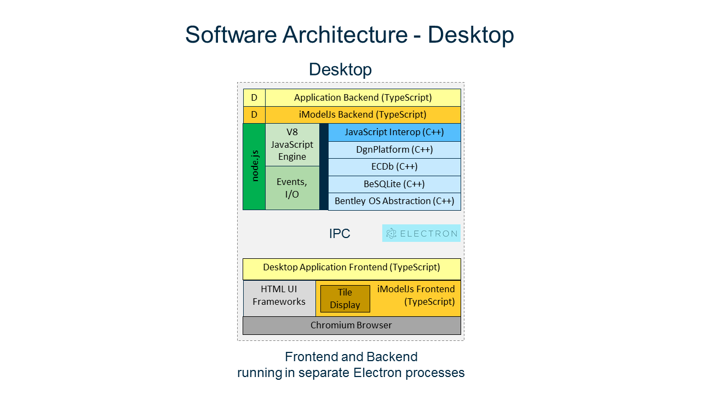
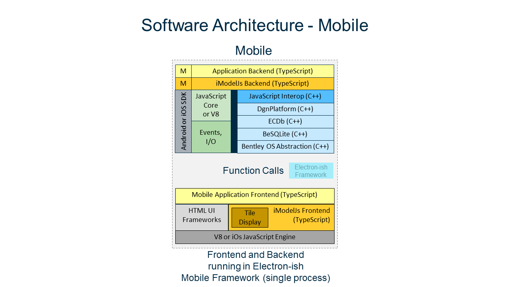

# Software Architecture for iModelJs Apps

The software architecture of iModelJs was driven by the following goals:

- Support iModel-based services running in any cloud or on premises
- Support iModel-based web/desktop/mobile apps
- Re-use business logic across web, desktop, and mobile apps
- Re-use HTML GUI across web, desktop, and mobile apps

Backend Architecture Layers:

- Application Backend (TypeScript)
- iModelJs Backend Framework (TypeScript)
- JavaScript Runtime with C++ Interoperability
- Bentley Native Libraries (C++)

See [the agents overview](./App.md#agents-and-services) for more information in agents and [the app backend overview](./App.md#app-backend) for more information on interactive app backends.

Frontend Architecture Layers:

- Application Frontend (TypeScript)
- iModelJs Frontend Framework (TypeScript)
- HTML GUI
- Web Browser

See [the interactive app frontend overview](./App.md#app-frontend) for more information on frontends.

## Web

iModelJs Web App backends are [Node.js](http://www.nodejs.org) applications.
Node.js provides the [V8 JavaScript Engine](https://developers.google.com/v8/) and the [N-API](https://github.com/nodejs/abi-stable-node) for writing Node Addons in C++.
This is how the Bentley Native Libraries are exposed to the iModelJs backend framework.
Portable application logic is written in TypeScript and calls TypeScript APIs exposed from the `@bentley/imodeljs-backend` package.

Notice that the backend architecture is identical between Agents and interactive Web Applications.

Web App frontends run in a web browser and use HTML GUI for presentation and APIs exposed from the `@bentley/imodeljs-frontend` package for *Remote Procedure Calls* (RPC) into functionality implemented on the backend. See [the RpcInterface overview](./App.md#rpcinterface) for more information.

The frontend --> backend communication is over HTTPS for interactive web applications. See [the cloud RPC configuration overview](./App.md#cloud-rpc-configuration) for more information.

See [the agents overview](./App.md#agents-and-services) and [the Web app overview](./App.md#web-apps) for more information on Web app architecture.

## Desktop

iModelJs desktop applications use the [Electron](https://electronjs.org/) Framework.
The backend architecture is the same as with iModelJs Web Apps because Electron also uses Node.js.
The only difference in the frontend architecture is that an embedded [Chromium Browser](https://www.chromium.org/Home) replaces a standalone Web Browser.

The frontend --> backend communication is over *Inter Process Communication* (IPC) as provided by Electron. See [the desktop RPC configuration overview](./App.md#desktop-rpc-configuration) for more information.

See [the desktop app overview](./App.md#desktop-apps) for more information on desktop app architecture.

## Mobile

iModelJs mobile applications use the JavaScript Engine and Web Browser GUI controls built into the Android SDK and iOS SDK.

The frontend --> backend communication is over function calls and messages between two separate JavaScript contexts. See [the mobile RPC configuration overview](./App.md#in-process-rpc-configuration) for more information.

See [the mobile app overview](./App.md#mobile-apps) for more information on mobile app architecture.

## Comparison

The following diagram compares the architecture of web, desktop, and mobile applications and shows how the goals of portability and reuse are accomplished.

