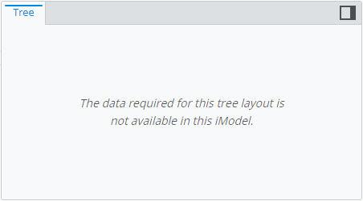
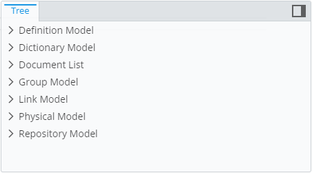
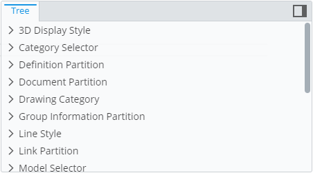
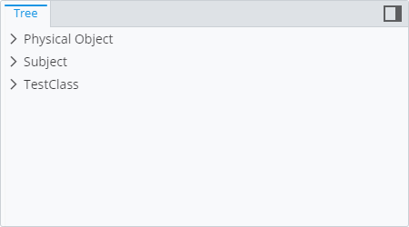
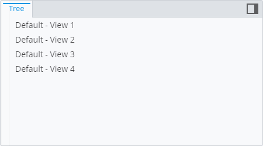
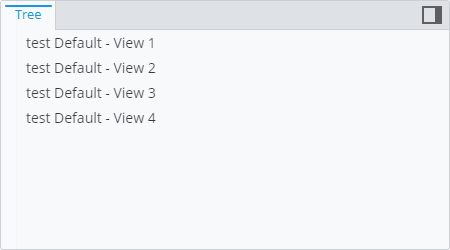

# Ruleset Variables

> Ruleset Variables is a new name for now deprecated *User Settings* concept.

Presentation rulesets have a concept called *ruleset variables* whose purpose is to allow modifying ruleset behavior during the session without having to change
the ruleset itself. The values of ruleset variables can be accessed using [ECExpressions](./ECExpressions.md#ruleset-variables-user-settings) in:

- Rule conditions ([example](#using-variables-in-rule-condition)).
- Instance filters ([example](#using-variables-in-instance-filter)).
- ECExpressions-based values, like [LabelOverride.label]($presentation-common) ([example](#using-variables-in-ecexpression-based-value)).

The advantages of using ruleset variables over values hardcoded into the ruleset are:

- When used for creating a hierarchy, changing a ruleset variable causes only affected parts of the hierarchy to be re-created. Changing a rule in a ruleset causes the whole hierarchy to be re-created.

- It's much more convenient and effective to pass a large number of IDs through a ruleset variable than it is to hardcode them into a ruleset. Ruleset variables are sent to the backend separately from the ruleset and that allows us to compress them when needed.

## Using Variables in Rule Condition

Using a ruleset variable in rule condition allows enabling and disabling specific rules based on something that can't be determined at the point of creating the ruleset, e.g. a user action.

The below example creates either a models' or an elements' hierarchy based on the value of ruleset variable.

By default the ruleset value is not set, which means neither of the two root node rules pass the condition. The result is empty hierarchy:

```ts
[[include:RulesetVariables.InRuleCondition.Ruleset]]
```



Setting the ruleset value to `models` creates a models' hierarchy:

```ts
[[include:RulesetVariables.InRuleCondition.SetToModels]]
```



Setting the ruleset value to `elements` creates an elements' hierarchy:

```ts
[[include:RulesetVariables.InRuleCondition.SetToElements]]
```



## Using Variables in Instance Filter

Using a ruleset variable in instance filter allows filtering instances at query time. This is useful when the filtering criteria depends on user actions.

The below example shows a hierarchy of elements grouped by class. When the `element-ids` variable is not set, the whole hierarchy is displayed. When the value is set to specific element IDs, the hierarchy is created only for those elements.

By default the ruleset value is not set - a hierarchy for all elements is created:

```ts
[[include:RulesetVariables.InInstanceFilter.Ruleset]]
```


Setting the ruleset value to specific IDs creates the hierarchy only for specific elements:

```ts
[[include:RulesetVariables.InInstanceFilter.SetIds]]
```



Clearing the ruleset value brings us back to the initial unfiltered view:

```ts
[[include:RulesetVariables.InInstanceFilter.Unset]]
```


## Using Variables in ECExpression-based Value

Using a ruleset variable in ECExpression-based value makes the value customizable by users.

The below example shows a hierarchy that loads *Spatial View Definition* elements as root nodes. By default, when `prefix` variable is not set, node labels are created from `CodeValue` property of the element. When the `prefix` variable is set, it's value is used as a prefix for node labels.

By default the ruleset value is not set - *CodeValue* property value is used as the label:

```ts
[[include:RulesetVariables.InCustomizationRuleValueExpression.Ruleset]]
```



Setting the ruleset variable value makes it appear in front of every node's label:

```ts
[[include:RulesetVariables.InCustomizationRuleValueExpression.SetValue]]
```


