# ContentInstancesOfSpecificClasses Specification

> TypeScript type: [ContentInstancesOfSpecificClassesSpecification]($presentation-common).

Specification which allows targeting content instances based on their ECClass.

## Attributes

| Name                                                                            | Required? | Type                                                                                                                          | Default |
| ------------------------------------------------------------------------------- | --------- | ----------------------------------------------------------------------------------------------------------------------------- | ------- |
| *Filtering*                                                                     |
| [`classes`](#attribute-classes)                                                 | Yes       | [`MultiSchemaClassesSpecification \| MultiSchemaClassesSpecification[]`](../Common-Rules/MultiSchemaClassesSpecification.md)  | `[]`    |
| [`handleInstancesPolymorphically`](#attribute-handleinstancespolymorphically)   | No        | `boolean`                                                                                                                     | `false` |
| [`handlePropertiesPolymorphically`](#attribute-handlepropertiespolymorphically) | No        | `boolean`                                                                                                                     | `false` |
| [`instanceFilter`](#attribute-instancefilter)                                   | No        | [ECExpression](./ECExpressions.md#instance-filter)                                                                            | `""`    |
| [`onlyIfNotHandled`](#attribute-onlyifnothandled)                               | No        | boolean                                                                                                                       | `false` |
| *Ordering*                                                                      |
| [`priority`](#attribute-priority)                                               | No        | `number`                                                                                                                      | `1000`  |
| *Content Modifiers*                                                             |
| [`relatedProperties`](#attribute-relatedproperties)                             | No        | `RelatedPropertiesSpecification[]`                                                                                            | `[]`    |
| [`calculatedProperties`](#attribute-calculatedproperties)                       | No        | `CalculatedPropertiesSpecification[]`                                                                                         | `[]`    |
| [`propertyCategories`](#attribute-propertycategories)                           | No        | `PropertyCategorySpecification[]`                                                                                             | `[]`    |
| [`propertyOverrides`](#attribute-propertyoverrides)                             | No        | `PropertySpecification[]`                                                                                                     | `[]`    |
| [`showImages`](#attribute-showimages)                                           | No        | `boolean`                                                                                                                     | `false` |
| *Misc.*                                                                         |
| [`relatedInstances`](#attribute-relatedinstances)                               | No        | [`RelatedInstanceSpecification[]`](../Common-Rules/RelatedInstanceSpecification.md)                                           | `[]`    |

### Attribute: `classes`

Defines a single or an array of [multi schema classes](../Common-Rules/MultiSchemaClassesSpecification.md) which will specify what and how the classes need to be selected to form result content.

```ts
[[include:ContentInstancesOfSpecificClasses.Classes.Ruleset]]
```

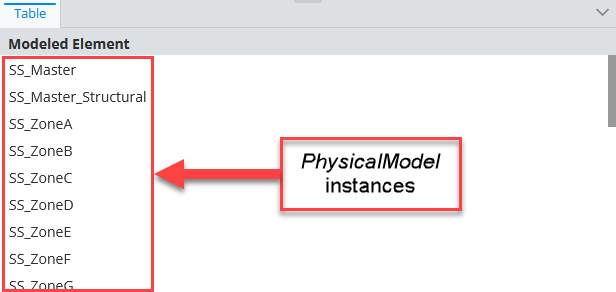

### Attribute: `handlePropertiesPolymorphically`

> **Default value:** `false`

Defines the default value whether the properties of derived `classes` should be included in the content.

```ts
[[include:ContentInstancesOfSpecificClasses.Classes.Ruleset]]
```

  | handlePropertiesPolymorphically | Result                                                                                                                                      |
  | ------------------------------- | ------------------------------------------------------------------------------------------------------------------------------------------- |
  | `false`  | 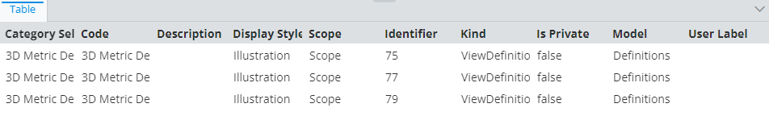 |
  | `true`    | 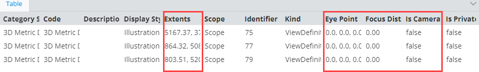     |

### Attribute: `instanceFilter`

Allows defining additional conditions when filtering result target class instances. More information found [here](./ECExpressions.md#instance-filter).

```ts
[[include:ContentInstancesOfSpecificClasses.InstanceFilter.Ruleset]]
```

  |  | Result                                                                                                                                      |
  | ------------------------------- | ------------------------------------------------------------------------------------------------------------------------------------------- |
  | without filter |  |
  | with filter  |      |

### Attribute: `onlyIfNotHandled`

> **Default value:** `false`

Identifies whether we should ignore this specification if another specification was already handled (based on rule priorities and definition order). Should be used when defining a fallback specification.

```ts
[[include:ContentInstancesOfSpecificClasses.OnlyIfNotHandled.Ruleset]]
```

  | onlyIfNotHandled | Result                                                                                                                                      |
  | ------------------------------- | ------------------------------------------------------------------------------------------------------------------------------------------- |
  | true  | 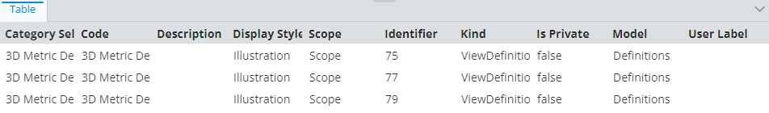 |
  | false    | 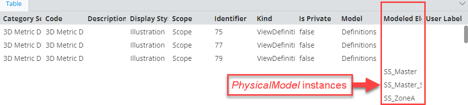     |

### Attribute: `priority`

> **Default value:** `1000`

Defines the order in which specifications are handled - higher priority means the specifications is handled first. If priorities are equal, the specifications are handled in the order they're defined.

```ts
[[include:ContentInstancesOfSpecificClasses.Priority.Ruleset]]
```

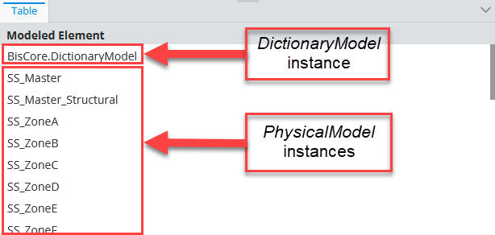

### Attribute: `relatedProperties`

Specifications of [related properties](./Terminology.md#related-properties) which are included in the generated content. *See [this page](./RelatedPropertiesSpecification.md) for more details.*

```ts
[[include:ContentInstancesOfSpecificClasses.RelatedProperties.Ruleset]]
```

  |  | Result                                                                                                                                      |
  | ------------------------------- | ------------------------------------------------------------------------------------------------------------------------------------------- |
  | without  |  |
  | with    | 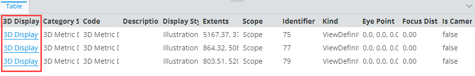     |

### Attribute: `calculatedProperties`

Specifications of calculated properties whose values are generated using provided ECExpressions. *See [this page](./CalculatedPropertiesSpecification.md) for more details.*

```ts
[[include:ContentInstancesOfSpecificClasses.CalculatedProperties.Ruleset]]
```

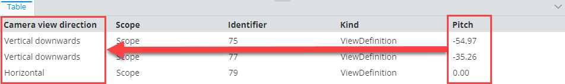

### Attribute: `propertyCategories`

Specifications for custom categories. Simply defining the categories does nothing - they have to be referenced from `PropertySpecification` defined in `propertyOverrides` by `id`. *See [this page](./PropertyCategorySpecification.md) for more details.*

```ts
[[include:ContentInstancesOfSpecificClasses.PropertyCategories.Ruleset]]
```

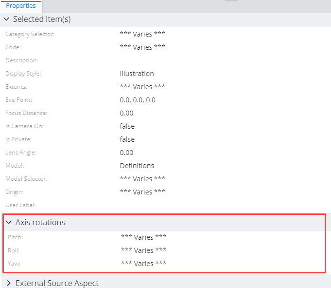

### Attribute: `propertyOverrides`

Specifications for various property overrides. *See [this page](./PropertySpecification.md) for more details.*

```ts
[[include:ContentInstancesOfSpecificClasses.PropertyOverrides.Ruleset]]
```

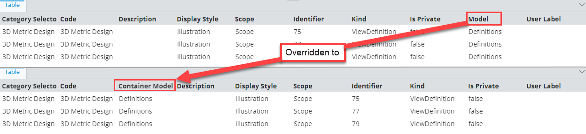

### Attribute: `showImages`

> **Default value:** `false`

Should image IDs be calculated for the returned instances. When `true`, [ImageIdOverride](../customization/ImageIdOverride.md) rules get applied when creating.

### Attribute: `relatedInstances`

Joining [related instances](../Common-Rules/RelatedInstanceSpecification.md) allows performing advanced filtering, grouping, labeling.

```ts
[[include:ContentInstancesOfSpecificClasses.RelatedInstances.Ruleset]]
```

  |  | Result                                                                                                                                      |
  | ------------------------------- | ------------------------------------------------------------------------------------------------------------------------------------------- |
  | SpatialViewDefinitions  |  |
  | ModelSelectors  | 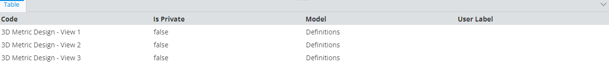 |
  | ModelSelectors filtered by SpatialViewDefinition Yaw    | 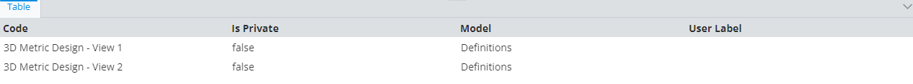     |

## Deprecated Attributes

### Attribute: `handleInstancesPolymorphically`

> **Default value:** `false`

Defines default `classes` polymorphism value. If set to true, all target classes by default will include also include derived class instances. This value is overriden by the `classes`.[`arePolymorphic`](../Common-Rules/MultiSchemaClassesSpecification.md#attribute-arepolymorphic) value.
