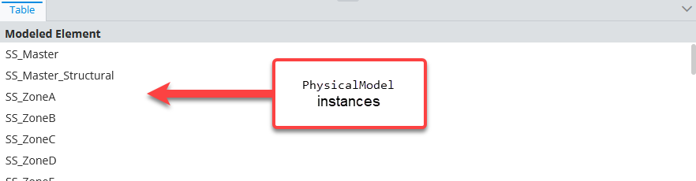
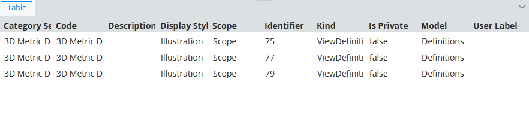
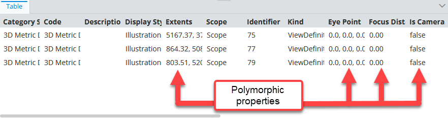

# Content Instances Of Specific Classes Specification

> TypeScript type: [ContentInstancesOfSpecificClassesSpecification]($presentation-common).

A specification that creates content for  instances of specific ECClasses.

## Attributes

| Name                                                                            | Required? | Type                                                                                                                         | Default |
| ------------------------------------------------------------------------------- | --------- | ---------------------------------------------------------------------------------------------------------------------------- | ------- |
| *Filtering*                                                                     |
| [`classes`](#attribute-classes)                                                 | Yes       | [`MultiSchemaClassesSpecification \| MultiSchemaClassesSpecification[]`](../Common-Rules/MultiSchemaClassesSpecification.md) | `[]`    |
| [`handlePropertiesPolymorphically`](#attribute-handlepropertiespolymorphically) | No        | `boolean`                                                                                                                    | `false` |
| [`instanceFilter`](#attribute-instancefilter)                                   | No        | [ECExpression](./ECExpressions.md#instance-filter)                                                                           | `""`    |
| [`onlyIfNotHandled`](#attribute-onlyifnothandled)                               | No        | boolean                                                                                                                      | `false` |
| *Ordering*                                                                      |
| [`priority`](#attribute-priority)                                               | No        | `number`                                                                                                                     | `1000`  |
| *Content Modifiers*                                                             |
| [`relatedProperties`](#attribute-relatedproperties)                             | No        | `RelatedPropertiesSpecification[]`                                                                                           | `[]`    |
| [`calculatedProperties`](#attribute-calculatedproperties)                       | No        | `CalculatedPropertiesSpecification[]`                                                                                        | `[]`    |
| [`propertyCategories`](#attribute-propertycategories)                           | No        | `PropertyCategorySpecification[]`                                                                                            | `[]`    |
| [`propertyOverrides`](#attribute-propertyoverrides)                             | No        | `PropertySpecification[]`                                                                                                    | `[]`    |
| [`showImages`](#attribute-showimages)                                           | No        | `boolean`                                                                                                                    | `false` |
| *Misc.*                                                                         |
| [`relatedInstances`](#attribute-relatedinstances)                               | No        | [`RelatedInstanceSpecification[]`](../Common-Rules/RelatedInstanceSpecification.md)                                          | `[]`    |

### Attribute: `classes`

Defines a set of [multi schema classes](../Common-Rules/MultiSchemaClassesSpecification.md) that specify which ECClasses need to be selected to form the result.

```ts
[[include:ContentInstancesOfSpecificClasses.Classes.Ruleset]]
```



### Attribute: `handlePropertiesPolymorphically`

> **Default value:** `false`

Specifies whether properties of derived `classes` should be included in the content.

```ts
[[include:ContentInstancesOfSpecificClasses.HandlePropertiesPolymorphically.Ruleset]]
```

  | handlePropertiesPolymorphically | Result                                                                                                                                            |
  | ------------------------------- | ------------------------------------------------------------------------------------------------------------------------------------------------- |
  | `false`                         |    |
  | `true`                          |  |

### Attribute: `instanceFilter`

Specifies an [ECExpression](./ECExpressions.md#instance-filter) for filtering instances of ECClasses specified through the [`classes` attribute](#attribute-classes).

```ts
[[include:ContentInstancesOfSpecificClasses.InstanceFilter.Ruleset]]
```

  |                | Result                                                                                                       |
  | -------------- | ------------------------------------------------------------------------------------------------------------ |
  | without filter |  |
  | with filter    |      |

### Attribute: `onlyIfNotHandled`

> **Default value:** `false`

Identifies whether we should ignore this specification if another specification was already handled (based on rule priorities and definition order). Should be used when defining a fallback specification.

```ts
[[include:ContentInstancesOfSpecificClasses.OnlyIfNotHandled.Ruleset]]
```

  | onlyIfNotHandled | Result                                                                                                                      |
  | ---------------- | --------------------------------------------------------------------------------------------------------------------------- |
  | `true`           |                  |
  | `false`          |  |

### Attribute: `priority`

> **Default value:** `1000`

Defines the order in which specifications are handled - higher priority means the specifications is handled first. If priorities are equal, the specifications are handled in the order they're defined.

```ts
[[include:ContentInstancesOfSpecificClasses.Priority.Ruleset]]
```


### Attribute: `relatedProperties`

Specifications of [related properties](./RelatedPropertiesSpecification.md) which are included in the generated content.

```ts
[[include:ContentInstancesOfSpecificClasses.RelatedProperties.Ruleset]]
```

  | without related properties                                                                                           | with related properties                                                                                                   |
  | -------------------------------------------------------------------------------------------------------------------- | ------------------------------------------------------------------------------------------------------------------------- |
  |  |  |

### Attribute: `calculatedProperties`

Specifications of [calculated properties](./CalculatedPropertiesSpecification.md) whose values are generated using provided [ECExpressions](../Advanced/ECExpressions.md#ecinstance).

```ts
[[include:ContentInstancesOfSpecificClasses.CalculatedProperties.Ruleset]]
```


### Attribute: `propertyCategories`

Specifications of [custom categories](PropertyCategorySpecification.md).

Simply defining the categories does nothing - they have to be referenced through [`PropertySpecification.categoryId`](./PropertySpecification.md) specified in [`propertyOverrides`](#attribute-propertyoverrides) list.

```ts
[[include:ContentInstancesOfSpecificClasses.PropertyCategories.Ruleset]]
```


### Attribute: `propertyOverrides`

Specifications of various [property overrides](./PropertySpecification.md) that allow customizing individual properties display.

```ts
[[include:ContentInstancesOfSpecificClasses.PropertyOverrides.Ruleset]]
```

  |        | Result                                                                                                                    |
  | ------ | ------------------------------------------------------------------------------------------------------------------------- |
  | before |       |
  | after  |  |


### Attribute: `showImages`

> **Default value:** `false`

Should image IDs be calculated for the returned instances. When `true`, [ImageIdOverride](../customization/ImageIdOverride.md) rules get applied when creating the content.

### Attribute: `relatedInstances`

Specifications of [related instances](../Common-Rules/RelatedInstanceSpecification.md) that can be used when creating the content. There are several use cases when this is useful:

- When there's a need to only load instances that have a related instance. Providing a [related instance](../Common-Rules/RelatedInstanceSpecification.md)
  specification with [isRequired](../Common-Rules/RelatedInstanceSpecification.md) set to `true` filters-out the instances that don't have the related instance.

- When there's a need to filter instances by a related instance value. The [alias](../Common-Rules/RelatedInstanceSpecification.md) attribute may then be used
  in the [`instanceFilter` attribute](#attribute-instancefilter) to reference related instance property values.

- When there's a need to customize content based on related instance property values. Related instance classes are included when looking for [customization rules](../Customization/index.md),
  which allows referencing related instances and their properties in [customization rule ECExpressions](../Customization/ECExpressions.md#override-value) by their
  [alias](../Common-Rules/RelatedInstanceSpecification.md).

```ts
[[include:ContentInstancesOfSpecificClasses.RelatedInstances.Ruleset]]
```

  |                                                                   | Result                                                                                                                                                 |
  | ----------------------------------------------------------------- | ------------------------------------------------------------------------------------------------------------------------------------------------------ |
  | `SpatialViewDefinition` instances                                 |                                            |
  | `ModelSelector` instances                                         |                                                     |
  | `ModelSelector` instances filtered by `SpatialViewDefinition.Yaw` |  |

## Deprecated Attributes

### Attribute: `handleInstancesPolymorphically`

> **Default value:** `false`

Tells whether selecting instances from ECClasses specified in [`classes`](#attribute-classes) and [`excludedClasses`](#attribute-excludedclasses) attributes should be polymorphic or not.

The attribute was replaced by [MultiSchemaClasses.arePolymorphic](../Common-Rules/MultiSchemaClassesSpecification.md#attribute-arepolymorphic) attribute specified individually for each class definition under [`classes`](#attribute-classes) and [`excludedClasses`](#attribute-excludedclasses) attributes. At the moment, to keep backwards compatibility, this attribute acts as a fallback value in case the flag is not specified individually for a class definition.
