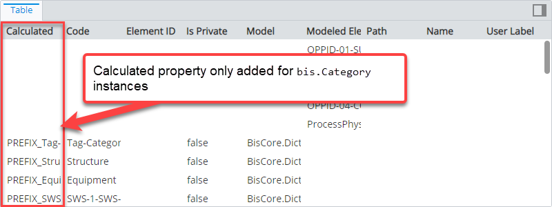
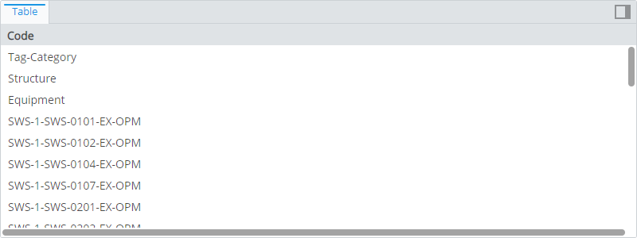
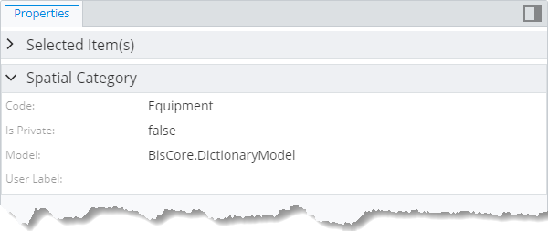
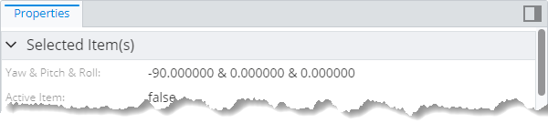
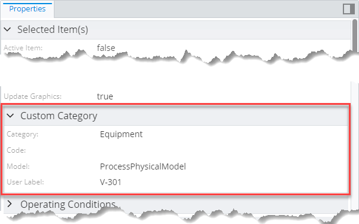
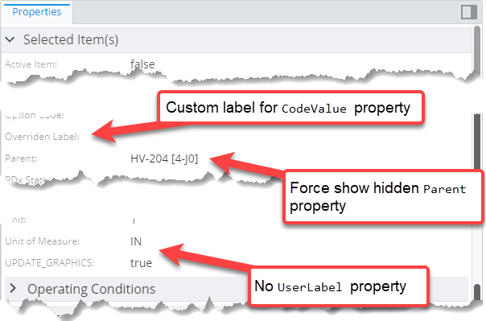

# Content Modifier Rule

> TypeScript type: [ContentModifier]($presentation-common).

Content modifiers are used to modify how instances of specified ECClasses are displayed in content which is produced using [content rules](./ContentRule.md). They do not produce any content by themselves.

## Attributes

| Name                                                      | Required? | Type                                  | Default |
| --------------------------------------------------------- | --------- | ------------------------------------- | ------- |
| *Picking attributes*                                      |
| [`requiredSchemas`](#attribute-requiredschemas)           | No        | `RequiredSchemaSpecification[]`       | `[]`    |
| [`class`](#attribute-class)                               | No        | `SingleSchemaClassSpecification`      | ``      |
| [`priority`](#attribute-priority)                         | No        | `number`                              | `1000`  |
| *Content Modifiers*                                       |
| [`relatedProperties`](#attribute-relatedproperties)       | No        | `RelatedPropertiesSpecification[]`    | `[]`    |
| [`calculatedProperties`](#attribute-calculatedproperties) | No        | `CalculatedPropertiesSpecification[]` | `[]`    |
| [`propertyCategories`](#attribute-propertycategories)     | No        | `PropertyCategorySpecification[]`     | `[]`    |
| [`propertyOverrides`](#attribute-propertyoverrides)       | No        | `PropertySpecification[]`             | `[]`    |

### Attribute: `class`

Specification of ECClass whose content should be modified. The modifier is applied to all content if this attribute is not specified.

```ts
[[include:ContentModifier.Class.Ruleset]]
```



### Attribute: `requiredSchemas`

A list of ECSchema requirements that need to be met for the rule to be used. See more details in [Defining ECSchema Requirements for Presentation Rules](../Advanced/SchemaRequirements.md).

```ts
[[include:ContentModifier.RequiredSchemas.Ruleset]]
```

### Attribute: `priority`

Defines the order in which rules are handled, higher number means the rule is handled first. If priorities are equal, the rules are handled in the order they're defined.

```ts
[[include:ContentModifier.Priority.Ruleset]]
```



### Attribute: `relatedProperties`

Specifications of [related properties](./RelatedPropertiesSpecification.md) which are included in the generated content.

```ts
[[include:ContentModifier.RelatedProperties.Ruleset]]
```



### Attribute: `calculatedProperties`

Specifications of [calculated properties](./CalculatedPropertiesSpecification.md) whose values are generated using provided ECExpressions.

```ts
[[include:ContentModifier.CalculatedProperties.Ruleset]]
```



### Attribute: `propertyCategories`

Specifications for [custom categories](./PropertyCategorySpecification.md). Simply defining the categories does nothing - they have to be referenced from [PropertySpecification]($presentation-common) defined in [propertyOverrides](#attribute-propertyoverrides) by `id`.

```ts
[[include:ContentModifier.PropertyCategories.Ruleset]]
```



### Attribute: `propertyOverrides`

Specifications for various [property overrides](./PropertySpecification.md) that allow customizing property display.

```ts
[[include:ContentModifier.PropertyOverrides.Ruleset]]
```


