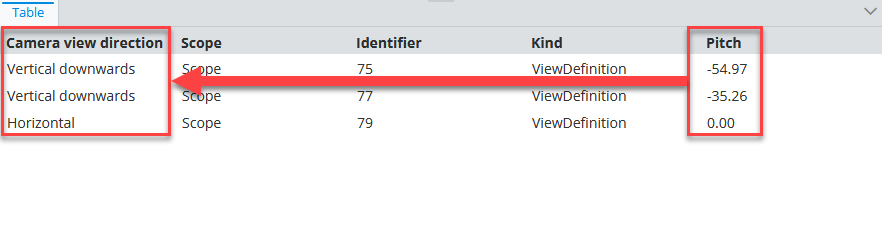
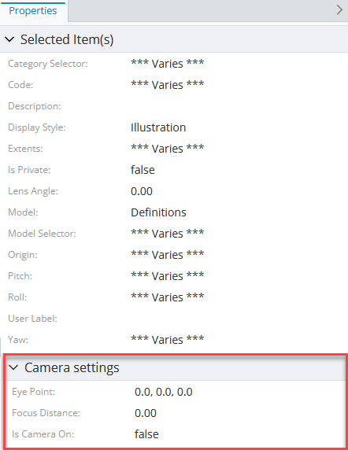

# Content Related Instances Specification

> TypeScript type: [ContentRelatedInstancesSpecification]($presentation-common).

Returns content for instances related to the selected (input) instances.

## Attributes

| Name                                                      | Required? | Type                                                                                  | Default |
| --------------------------------------------------------- | --------- | ------------------------------------------------------------------------------------- | ------- |
| *Filtering*                                               |
| [`relationshipPaths`](#attribute-relationshippaths)       | Yes       | [`RelationshipPathSpecification[]`](../Common-Rules/RelationshipPathSpecification.md) |
| [`instanceFilter`](#attribute-instancefilter)             | No        | [ECExpression](./ECExpressions.md#instance-filter)                                    | `""`    |
| [`onlyIfNotHandled`](#attribute-onlyifnothandled)         | No        | `boolean`                                                                             | `false` |
| *Ordering*                                                |
| [`priority`](#attribute-priority)                         | No        | `number`                                                                              | `1000`  |
| *Content Modifiers*                                       |
| [`relatedProperties`](#attribute-relatedproperties)       | No        | `RelatedPropertiesSpecification[]`                                                    | `[]`    |
| [`calculatedProperties`](#attribute-calculatedproperties) | No        | `CalculatedPropertiesSpecification[]`                                                 | `[]`    |
| [`propertyCategories`](#attribute-propertycategories)     | No        | `PropertyCategorySpecification[]`                                                     | `[]`    |
| [`propertyOverrides`](#attribute-propertyoverrides)       | No        | `PropertySpecification[]`                                                             | `[]`    |
| [`showImages`](#attribute-showimages)                     | No        | `boolean`                                                                             | `false` |
| *Misc.*                                                   |
| [`relatedInstances`](#attribute-relatedinstances)         | No        | [`RelatedInstanceSpecification[]`](../Common-Rules/RelatedInstanceSpecification.md)   | `[]`    |

### Attribute: `relationshipPaths`

Specifies a chain of [relationship path specifications](../Common-Rules/RelationshipPathSpecification.md) that forms a path from an input instance to the output instances. When this array is empty, the specification produces no results.

```ts
[[include:ContentRelatedInstances.RelationshipPaths.Ruleset]]
```

The following is a result of selecting one instance of `bis.Model` as input for the ruleset above:


### Attribute: `instanceFilter`

Specifies an [ECExpression](./ECExpressions.md#instance-filter) for filtering instances of ECClasses targeted through the [`relationshipPaths` attribute](#attribute-relationshippaths).

```ts
[[include:ContentRelatedInstances.InstanceFilter.Ruleset]]
```

  |                | Result                                                                                      |
  | -------------- | ------------------------------------------------------------------------------------------- |
  | without filter |  |
  | with filter    |      |

### Attribute: `onlyIfNotHandled`

> **Default value:** `false`

Identifies whether we should ignore this specification if another specification was already handled (based on rule priorities and definition order). Should be used when defining a fallback specification.

```ts
[[include:SharedAttributes.OnlyIfNotHandled.Ruleset]]
```

  | onlyIfNotHandled | Result                                                                                                     |
  | ---------------- | ---------------------------------------------------------------------------------------------------------- |
  | `true`           |                  |
  | `false`          |  |

### Attribute: `priority`

> **Default value:** `1000`

Controls the order in which specifications are handled — specification with higher priority value is handled first. If priorities are equal, the specifications are handled in the order they appear in the ruleset.

```ts
[[include:SharedAttributes.Priority.Ruleset]]
```


### Attribute: `relatedProperties`

Specifications of [related properties](./RelatedPropertiesSpecification.md) which are included in the generated content.

```ts
[[include:SharedAttributes.RelatedProperties.Ruleset]]
```

  | without related properties                                                                          | with related properties                                                                                    |
  | --------------------------------------------------------------------------------------------------- | ---------------------------------------------------------------------------------------------------------- |
  |  |  |

### Attribute: `calculatedProperties`

Specifications of [calculated properties](./CalculatedPropertiesSpecification.md) whose values are generated using provided [ECExpressions](../Advanced/ECExpressions.md#ecinstance).

```ts
[[include:SharedAttributes.CalculatedProperties.Ruleset]]
```



### Attribute: `propertyCategories`

Defines a list of [custom categories](PropertyCategorySpecification.md).

Custom categories are not present in the result unless they contain at least one property. To assign a property to the category, reference its `id` in [`PropertySpecification.categoryId`](./PropertySpecification.md) when defining [`propertyOverrides`](#attribute-propertyoverrides).

```ts
[[include:SharedAttributes.PropertyCategories.Ruleset]]
```



### Attribute: `propertyOverrides`

Specifications of various [property overrides](./PropertySpecification.md) that allow customizing individual properties display.

```ts
[[include:SharedAttributes.PropertyOverrides.Ruleset]]
```

  |        | Result                                                                                                     |
  | ------ | ---------------------------------------------------------------------------------------------------------- |
  | before |         |
  | after  |  |

### Attribute: `showImages`

> **Default value:** `false`

Should image IDs be calculated for the returned instances. When `true`, [ImageIdOverride](../customization/ImageIdOverride.md) rules get applied when creating the content.

### Attribute: `relatedInstances`

Specifications of [related instances](../Common-Rules/RelatedInstanceSpecification.md) that can be used when creating the content. There are several use cases when this is useful:

- When there's a need to only load instances that have a related instance. Providing a [related instance](../Common-Rules/RelatedInstanceSpecification.md)
  specification with [isRequired](../Common-Rules/RelatedInstanceSpecification.md) set to `true` filters-out the instances that don't have the related instance.

- When there's a need to filter instances by a related instance value. The [alias](../Common-Rules/RelatedInstanceSpecification.md) attribute may then be used
  in the [`instanceFilter` attribute](#attribute-instancefilter) to reference related instance property values.

- When there's a need to customize content based on related instance property values. Related instance classes are included when looking for [customization rules](../Customization/index.md),
  which allows referencing related instances and their properties in [customization rule ECExpressions](../Customization/ECExpressions.md#override-value) by their
  [alias](../Common-Rules/RelatedInstanceSpecification.md).

```ts
[[include:SharedAttributes.RelatedInstances.Ruleset]]
```

  |                                                                   | Result                                                                                                                                |
  | ----------------------------------------------------------------- | ------------------------------------------------------------------------------------------------------------------------------------- |
  | `SpatialViewDefinition` instances                                 |                                            |
  | `ModelSelector` instances                                         |                                                     |
  | `ModelSelector` instances filtered by `SpatialViewDefinition.Yaw` |  |
