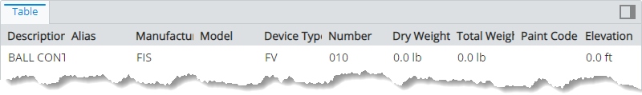
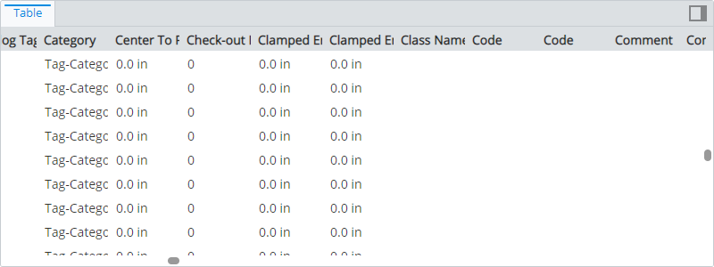
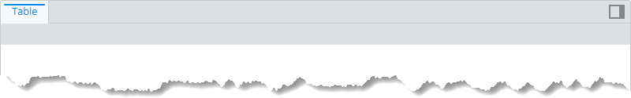
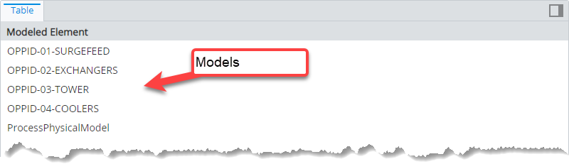
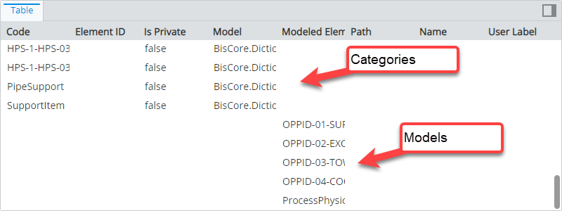
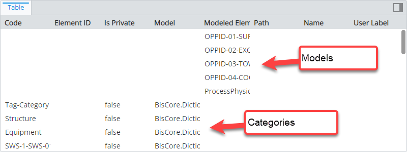
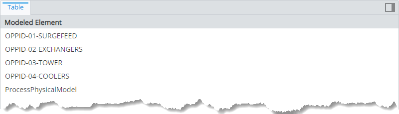

# Content Rule

> TypeScript type: [ContentRule]($presentation-common).

Content rules are used to define content that is displayed for specific type of [input](./Terminology.md#input-instance). Input consists of either ECInstances or [nodes](../Hierarchies/Terminology.md#node) and to make things simpler everything is considered a [node](../Hierarchies/Terminology.md#node) - instances get converted to *ECInstance nodes* (thus the `SelectedNode` symbol in [`condition` ECExpression](./ECExpressions.md#rule-condition)).

## Attributes

| Name                                              | Required? | Type                                              | Default |
| ------------------------------------------------- | --------- | ------------------------------------------------- | ------- |
| *Picking attributes*                              |
| [`requiredSchemas`](#attribute-requiredschemas)   | No        | `RequiredSchemaSpecification[]`                   | `[]`    |
| [`condition`](#attribute-condition)               | No        | [ECExpression](./ECExpressions.md#rule-condition) | `""`    |
| [`priority`](#attribute-priority)                 | No        | `number`                                          | `1000`  |
| [`onlyIfNotHandled`](#attribute-onlyifnothandled) | No        | `boolean`                                         | `false` |
| *Content attributes*                              |
| [`specifications`](#attribute-specifications)     | Yes       | `ContentSpecification[]`                          |         |

### Attribute: `condition`

Defines a condition which needs to be met in order for the rule to be used. The condition is an [ECExpression](./ECExpressions.md#rule-condition) which has to evaluate to a boolean value.

The most commonly used symbols are:

- `SelectedNode` to define which type of [input](./Terminology.md#input-instance) this rule is creating content for.

  ```ts
  [[include:ContentRule.Condition.SelectedNodeSymbol]]
  ```

  | Input instance | Result                                                                                                                                       |
  | -------------- | -------------------------------------------------------------------------------------------------------------------------------------------- |
  | `bis.Element`  |  |
  | `bis.Model`    |      |

- [Ruleset variables](../Advanced/RulesetVariables.md#using-variables-in-rule-condition) to dynamically enable / disable the rule.

  ```ts
  [[include:ContentRule.Condition.RulesetVariables.Ruleset]]
  ```

  | Ruleset variable values                                    | Result                                                                                                                         |
  | ---------------------------------------------------------- | ------------------------------------------------------------------------------------------------------------------------------ |
  | `DISPLAY_CATEGORIES = false`<br />`DISPLAY_MODELS = false` |                                        |
  | `DISPLAY_CATEGORIES = false`<br />`DISPLAY_MODELS = true`  |  |
  | `DISPLAY_CATEGORIES = true`<br />`DISPLAY_MODELS = true`   |      |

### Attribute: `requiredSchemas`

A list of ECSchema requirements that need to be met for the rule to be used. See more details in [Defining ECSchema Requirements for Presentation Rules](../Advanced/SchemaRequirements.md).

```ts
[[include:ContentRule.RequiredSchemas.Ruleset]]
```

### Attribute: `priority`

Defines the order in which rules are handled - higher priority means the rule is handled first. If priorities are equal, the rules are handled in the order they're defined. The attribute may be especially useful when combined with [`onlyIfNotHandled` attribute](#attribute-onlyifnothandled).

```ts
[[include:ContentRule.Priority.Ruleset]]
```



### Attribute: `onlyIfNotHandled`

Tells the library that the rule should only be handled if no other rule of the same type was handled previously (based on rule priorities and definition order). This allows adding fallback rules which can be overriden by higher-priority rules.

```ts
[[include:ContentRule.OnlyIfNotHandled.Ruleset]]
```



### Attribute: `specifications`

A list of content specifications that define what content is going to be returned. This is the most important attribute which is responsible for defining what instances' properties are included in the returned content. There are 4 types of specifications:

- [Selected node instances](./SelectedNodeInstances.md) specification returns properties of the [input instance](./Terminology.md#input-instance).
- [Content instances of specific classes](./ContentInstancesOfSpecificClasses.md) specification returns properties of instances of given classes. The returned content doesn't depend on the [input](./Terminology.md#input-instance).
- [Content related instances](./ContentRelatedInstances.md) specification returns properties of instances that are related to [input instances](./Terminology.md#input-instance) through given relationship(s).

Multiple specifications can contribute to the resulting content by specifying multiple specifications in a single [content rule](./ContentRule.md) or specifying multiple rules that match the same input.
