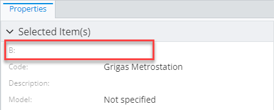
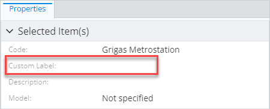
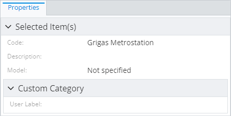
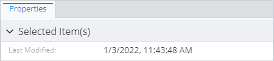
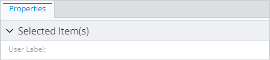
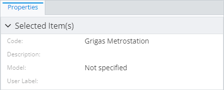

# Property Specification

> TypeScript type: [PropertySpecification]($presentation-common).

This specification allows overriding some attributes of specific ECProperty or define how it's displayed.

## Attributes

| Name                                                                                                | Required? | Type                                                              | Default     |
| --------------------------------------------------------------------------------------------------- | --------- | ----------------------------------------------------------------- | ----------- |
| [`name`](#attribute-name)                                                                           | Yes       | `string`                                                          |             |
| [`overridesPriority`](#attribute-overridespriority)                                                 | No        | `number`                                                          | `1000`      |
| [`labelOverride`](#attribute-labeloverride)                                                         | No        | `string`                                                          | `undefined` |
| [`categoryId`](#attribute-categoryid)                                                               | No        | `string \| CategoryIdentifier`                                    | `undefined` |
| [`isDisplayed`](#attribute-isdisplayed)                                                             | No        | `boolean`                                                         | `undefined` |
| [`doNotHideOtherPropertiesOnDisplayOverride`](#attribute-donothideotherpropertiesondisplayoverride) | No        | `boolean`                                                         | `false`     |
| [`renderer`](#attribute-renderer)                                                                   | No        | [`RendererSpecification`](./RendererSpecification.md)             | `undefined` |
| [`editor`](#attribute-editor)                                                                       | No        | [`PropertyEditorSpecification`](./PropertyEditorSpecification.md) | `undefined` |

### Attribute: `name`

Name of the ECProperty to apply overrides to. A `"*"` may be specified to match all properties in current context. The current context is determined based on where the override is specified:

- When used in a [content modifier](./ContentModifier.md#attribute-propertyoverrides), the properties of the ECClass specified by the [`class` attribute](./ContentModifier.md#attribute-class) are used.
- When used in one of the [content specifications](./ContentRule.md#attribute-specifications), properties produced by that specification are used.

### Attribute: `overridesPriority`

> **Default value:** `1000`

There may be multiple property specifications that apply to a single property and there may be conflicts between different attributes. The `overridesPriority` attribute is here to help
solve the problem - if multiple specifications attempt to override the same attribute, the override of specification with highest `overridesPriority` value is used. The order of overrides
from specification with the same `overridesPriority` is undefined.

```ts
[[include:Content.Customization.PropertySpecification.OverridesPriority.Ruleset]]
```



### Attribute: `labelOverride`

> **Default value:** `undefined`

This is an attribute that allows overriding the property label. May be [localized](../Advanced/Localization.md).

```ts
[[include:Content.Customization.PropertySpecification.LabelOverride.Ruleset]]
```



### Attribute: `categoryId`

> **Default value:** `undefined`

The attribute allows moving the property into a different category. There are several options:

- Reference a category by ID used in [`PropertyCategorySpecification`](./PropertyCategorySpecification.md) in the current context.
  The current context contains categories specified in the same [content specification](./index.md#specifications) or the same
  [content modifier](./ContentModifier.md), depending on where the property override is used.

- Move to `DefaultParent` category. This is useful when using with [related properties](./RelatedPropertiesSpecification.md), to
  avoid putting them inside a special related class category and instead show them next to properties of the source class.

- Move to `Root` category. This is useful when using with [related properties](./RelatedPropertiesSpecification.md), to
  avoid putting them inside a special related class category and instead show them in the root category.

See [property categorization page](./PropertyCategorization.md) for more details.

```ts
[[include:Content.Customization.PropertySpecification.CategoryId.Ruleset]]
```



### Attribute: `isDisplayed`

> **Default value:** `undefined`

This attribute allows showing or hiding a property, even when it's hidden at ECSchema level using a custom attribute:

- `undefined` means the property is loaded as requested by the ECSchema.
- `true` force displays the property, even when hidden through ECSchema. **Warning:** setting this to `true` automatically
  hides all other properties of the same class, unless [`doNotHideOtherPropertiesOnDisplayOverride` attribute](#attribute-donothideotherpropertiesondisplayoverride)
  tells otherwise.
- `false` force hides the property, even when it's not hidden through ECSchema.

```ts
[[include:Content.Customization.PropertySpecification.IsDisplayed.Ruleset]]
```



### Attribute: `doNotHideOtherPropertiesOnDisplayOverride`

> **Default value:** `undefined`

This is a flag to control behavior of `isDisplayed` override when it's set to `true`. By default, forcing property display hides all other properties. Setting `doNotHideOtherPropertiesOnDisplayOverride` to `true` disables that behavior and prevents forcing property display of one property from hiding other properties.

```ts
[[include:Content.Customization.PropertySpecification.DoNotHideOtherPropertiesOnDisplayOverride.Ruleset]]
```

| `doNotHideOtherPropertiesOnDisplayOverride: false`                                                                                                                                                | `doNotHideOtherPropertiesOnDisplayOverride: true`                                                                                                                                               |
| ------------------------------------------------------------------------------------------------------------------------------------------------------------------------------------------------- | ----------------------------------------------------------------------------------------------------------------------------------------------------------------------------------------------- |
|  |  |

### Attribute: `renderer`

> **Default value:** `undefined`

Custom property [renderer specification](./RendererSpecification.md) that allows assigning a custom value renderer to be used in UI. The
specification is used to set up [Field.renderer]($presentation-common) for this property and it's up to the UI component to make sure
appropriate renderer is used to render the property.

See [Custom property value renderers](../Customization/PropertyValueRenderers.md) page for a list of available renderers or how to register a custom one.

```ts
[[include:Content.Customization.PropertySpecification.Renderer.Ruleset]]
```

```ts
[[include:Content.Customization.PropertySpecification.Renderer.Result]]
```

### Attribute: `editor`

> **Default value:** `undefined`

Custom [property editor specification](./PropertyEditorSpecification) that allows assigning a custom value editor
to be used in UI.

```ts
[[include:Content.Customization.PropertySpecification.Editor.Ruleset]]
```

```ts
[[include:Content.Customization.PropertySpecification.Editor.Result]]
```
