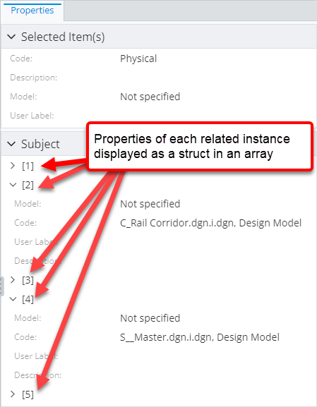

# Related Properties Specification

> TypeScript type: [RelatedPropertiesSpecification]($presentation-common).

This specification allows including related instance properties into the content.

## Attributes

| Name                                                                              | Required? | Type                                                                    | Default             |
| --------------------------------------------------------------------------------- | --------- | ----------------------------------------------------------------------- | ------------------- |
| [`propertiesSource`](#attribute-propertiessource)                                 | Yes       | [`RelationshipPathSpecification`](../RelationshipPathSpecification.md)  |                     |
| [`handleTargetClassPolymorphically`](#attribute-handletargetclasspolymorphically) | No        | `boolean`                                                               | `false`             |
| [`relationshipMeaning`](#attribute-relationshipmeaning)                           | No        | `"SameInstance" \| "RelatedInstance"`                                   | `"RelatedInstance"` |
| [`properties`](#attribute-properties)                                             | No        | `Array<string \| PropertySpecification> \| "_none_" \| "*"`             | `"*"`               |
| [`autoExpand`](#attribute-autoexpand)                                             | No        | `boolean`                                                               | `false`             |
| [`skipIfDuplicate`](#attribute-skipifduplicate)                                   | No        | `boolean`                                                               | `false`             |
| [`nestedRelatedProperties`](#attribute-nestedrelatedproperties)                   | No        | [`RelatedPropertiesSpecification[]`](#related-properties-specification) | `[]`                |

### Attribute: `propertiesSource`

Specifies a chain of [relationship path specifications](../RelationshipPathSpecification.md) that forms a path from the content instance to the related instance(s) whose properties should additionally be loaded.

The path may point to more than one related instance, so the result always stores related properties in a form of a struct-array, where each struct represents a single related instance. However, often there's only one related instance and in that case a UI component displaying the result may choose to "destructure" the struct-array. An example of such component is the Property Grid:

```ts
[[include:Content.Customization.RelatedPropertiesSpecification.PropertiesSource.Ruleset]]
```


Here's how the result looks like if there's more than one related instance:



### Attribute: `handleTargetClassPolymorphically`

> **Default value:** `false`

The attribute tells whether the target class specified through [`propertiesSource` attribute](#attribute-propertiessource) should be handled
polymorphically. This means properties of the concrete class are loaded in addition to properties of the target class itself.

```ts
[[include:Content.Customization.RelatedPropertiesSpecification.HandleTargetClassPolymorphically.Ruleset]]
```

| `handleTargetClassPolymorphically: false`                                                                                                                                            | `handleTargetClassPolymorphically: true`                                                                                                                                           |
| ------------------------------------------------------------------------------------------------------------------------------------------------------------------------------------ | ---------------------------------------------------------------------------------------------------------------------------------------------------------------------------------- |
|  |  |

### Attribute: `relationshipMeaning`

> **Default value:** `"RelatedInstance"`

The attribute describes what the related properties mean to the [primary instance](./Terminology.md#primary-instance) whose properties are
displayed. There are two possible options:

- `RelatedInstance` means that the properties should be distinguished from properties of the [primary instance](./Terminology.md#primary-instance)
  and shown separately to make it clear they belong to another instance. Generally that means they're assigned a separate root category.

- `SameInstance` means that the properties should be displayed as if they belonged to the [primary instance](./Terminology.md#primary-instance). Generally
  that means they assigned a category, that's nested under the default category.

See [property categorization page](./PropertyCategorization.md) page for more details.

```ts
[[include:Content.Customization.RelatedPropertiesSpecification.RelationshipMeaning.Ruleset]]
```

| `relationshipMeaning: "RelatedInstance"`                                                                                                                                      | `relationshipMeaning: "SameInstance"`                                                                                                                                   |
| ----------------------------------------------------------------------------------------------------------------------------------------------------------------------------- | ----------------------------------------------------------------------------------------------------------------------------------------------------------------------- |
|  |  |

### Attribute: `properties`

> **Default value:** `"*"`

List of names or definitions of related class properties that should be included in the content. In addition, a couple of special values are allowed:

- `"_none_"` means none of the properties should be picked up. Generally this is used in combination with the [`nestedRelatedProperties` attribute](#attribute-nestedrelatedproperties).
- `"*"` means all properties should be picked up.

```ts
[[include:Content.Customization.RelatedPropertiesSpecification.Properties.Ruleset]]
```


### Attribute: `autoExpand`

> **Default value:** `false`

The attribute specifies whether the field containing related properties should be assigned the [NestedContentField.autoExpand]($presentation-common)
attribute. The attribute tells UI components showing the properties that they should be initially displayed in the expanded state.

```ts
[[include:Content.Customization.RelatedPropertiesSpecification.AutoExpand.Ruleset]]
```

| `autoExpand: false`                                                                                                                    | `autoExpand: true`                                                                                                                   |
| -------------------------------------------------------------------------------------------------------------------------------------- | ------------------------------------------------------------------------------------------------------------------------------------ |
|  |  |

### Attribute: `skipIfDuplicate`

> **Default value:** `false`

Specifies whether the specification should be ignored if another higher priority specification for the same relationship already exists.

```ts
[[include:Content.Customization.RelatedPropertiesSpecification.SkipIfDuplicate.Ruleset]]
```

| `skipIfDuplicate: false`                                                                                                                          | `skipIfDuplicate: true`                                                                                                                         |
| ------------------------------------------------------------------------------------------------------------------------------------------------- | ----------------------------------------------------------------------------------------------------------------------------------------------- |
|  |  |

### Attribute: `nestedRelatedProperties`

> **Default value:** `[]`

The attribute allows loading additional related properties that are related to the target instance of this specification.

```ts
[[include:Content.Customization.RelatedPropertiesSpecification.NestedRelatedProperties.Ruleset]]
```


