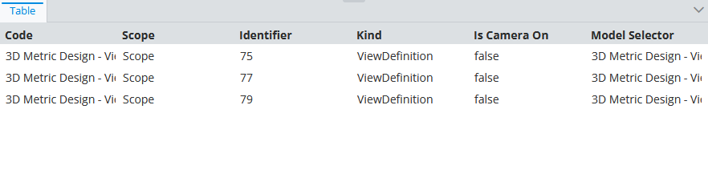
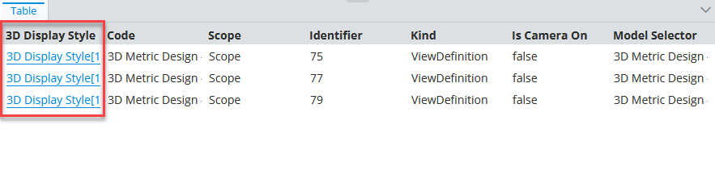
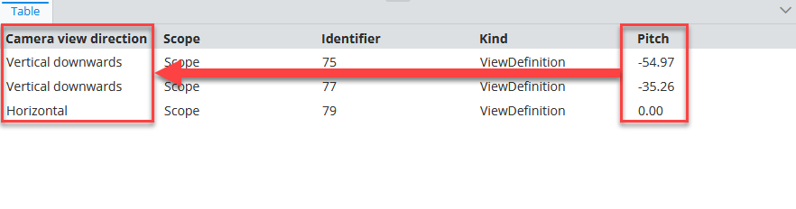
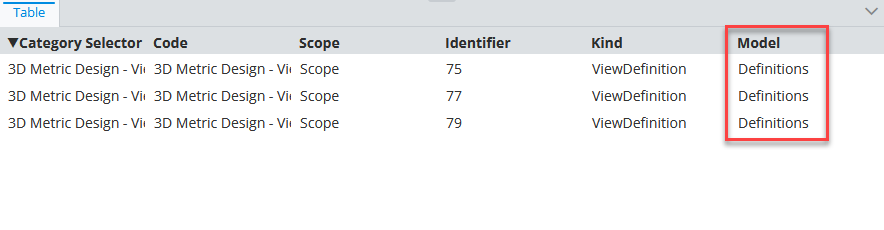
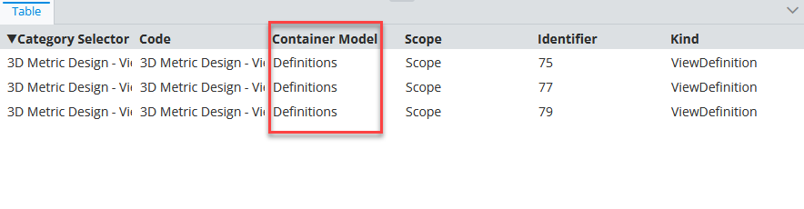
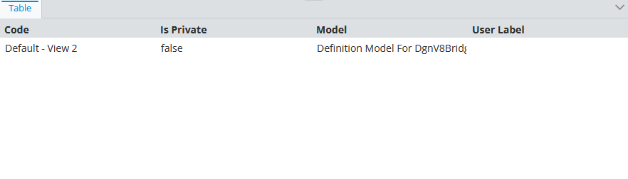

# Selected Node Instances Specification

> TypeScript type: [SelectedNodeInstancesSpecification]($presentation-common).

Returns content for selected (input) instances.

## Attributes

| Name                                                                | Required? | Type                                                                                | Default |
| ------------------------------------------------------------------- | --------- | ----------------------------------------------------------------------------------- | ------- |
| *Filtering*                                                         |
| [`acceptableSchemaName`](#attribute-acceptableschemaname)           | No        | `string`                                                                            | `""`    |
| [`acceptableClassNames`](#attribute-acceptableclassnames)           | No        | `string[]`                                                                          | `[]`    |
| [`acceptablePolymorphically`](#attribute-acceptablepolymorphically) | No        | `boolean`                                                                           | `false` |
| [`onlyIfNotHandled`](#attribute-onlyifnothandled)                   | No        | boolean                                                                             | `false` |
| *Ordering*                                                          |
| [`priority`](#attribute-priority)                                   | No        | `number`                                                                            | `1000`  |
| *Content Modifiers*                                                 |
| [`relatedProperties`](#attribute-relatedproperties)                 | No        | `RelatedPropertiesSpecification[]`                                                  | `[]`    |
| [`calculatedProperties`](#attribute-calculatedproperties)           | No        | `CalculatedPropertiesSpecification[]`                                               | `[]`    |
| [`propertyCategories`](#attribute-propertycategories)               | No        | `PropertyCategorySpecification[]`                                                   | `[]`    |
| [`propertyOverrides`](#attribute-propertyoverrides)                 | No        | `PropertySpecification[]`                                                           | `[]`    |
| [`showImages`](#attribute-showimages)                               | No        | `boolean`                                                                           | `false` |
| *Misc.*                                                             |
| [`relatedInstances`](#attribute-relatedinstances)                   | No        | [`RelatedInstanceSpecification[]`](../Common-Rules/RelatedInstanceSpecification.md) | `[]`    |

### Attribute: `acceptableSchemaName`

Filter selected nodes by specified schema name. All schemas are accepted if not specified.

```ts
[[include:SelectedNodeInstances.AcceptableSchemaName.Ruleset]]
```

  | Selected input                  | Result                                                                                                          |
  | ------------------------------- | --------------------------------------------------------------------------------------------------------------- |
  | `BisCore.SpatialViewDefinition` |  |
  | `Generic.GroupModel`            |                                          |


### Attribute: `acceptableClassNames`

Filter selected nodes by specified class names. All classes are accepted if not specified.

```ts
[[include:SelectedNodeInstances.AcceptableClassNames.Ruleset]]
```

  | Selected input                  | Result                                                                                                          |
  | ------------------------------- | --------------------------------------------------------------------------------------------------------------- |
  | `BisCore.SpatialViewDefinition` |  |
  | `BisCore.DictionaryModel`       |                                     |

### Attribute: `acceptablePolymorphically`

Should `acceptableClassNames` property be checked polymorphically. If true, all derived classes are accepted as well.

```ts
[[include:SelectedNodeInstances.AcceptablePolymorphically.Ruleset]]
```

  | Selected input                  | Result                                                                                                        |
  | ------------------------------- | ------------------------------------------------------------------------------------------------------------- |
  | `BisCore.DictionaryModel`       |  |
  | `BisCore.SpatialViewDefinition` |                             |

### Attribute: `onlyIfNotHandled`

> **Default value:** `false`

Identifies whether we should ignore this specification if another specification was already handled (based on rule priorities and definition order). Should be used when defining a fallback specification.

```ts
[[include:SharedAttributes.OnlyIfNotHandled.Ruleset]]
```

  | onlyIfNotHandled | Result                                                                                                         |
  | ---------------- | -------------------------------------------------------------------------------------------------------------- |
  | `true`           |  |
  | `false`          |      |

### Attribute: `priority`

> **Default value:** `1000`

Defines the order in which specifications are handled - higher priority means the specifications is handled first. If priorities are equal, the specifications are handled in the order they're defined.

```ts
[[include:SharedAttributes.Priority.Ruleset]]
```


### Attribute: `relatedProperties`

Specifications of [related properties](./RelatedPropertiesSpecification.md) which are included in the generated content.

```ts
[[include:SharedAttributes.RelatedProperties.Ruleset]]
```

  | without related properties                                                                                           | with related properties                                                                                              |
  | -------------------------------------------------------------------------------------------------------------------- | -------------------------------------------------------------------------------------------------------------------- |
  |  |  |

### Attribute: `calculatedProperties`

Specifications of [calculated properties](./CalculatedPropertiesSpecification.md) whose values are generated using provided [ECExpressions](../Advanced/ECExpressions.md#ecinstance).

```ts
[[include:SharedAttributes.CalculatedProperties.Ruleset]]
```



### Attribute: `propertyCategories`

Specifications of [custom categories](PropertyCategorySpecification.md).

Simply defining the categories does nothing - they have to be referenced through [`PropertySpecification.categoryId`](./PropertySpecification.md) specified in [`propertyOverrides`](#attribute-propertyoverrides) list.

```ts
[[include:SharedAttributes.PropertyCategories.Ruleset]]
```


### Attribute: `propertyOverrides`

Specifications of various [property overrides](./PropertySpecification.md) that allow customizing individual properties display.

```ts
[[include:SharedAttributes.PropertyOverrides.Ruleset]]
```

  |        | Result                                                                                                                    |
  | ------ | ------------------------------------------------------------------------------------------------------------------------- |
  | before |       |
  | after  |  |

### Attribute: `showImages`

> **Default value:** `false`

Should image IDs be calculated for the returned instances. When `true`, [ImageIdOverride](../customization/ImageIdOverride.md) rules get applied when creating the content.

### Attribute: `relatedInstances`

Specifications of [related instances](../Common-Rules/RelatedInstanceSpecification.md) that can be used when creating the content. There are several use cases when this is useful:

- When there's a need to only load instances that have a related instance. Providing a [related instance](../Common-Rules/RelatedInstanceSpecification.md)
  specification with [isRequired](../Common-Rules/RelatedInstanceSpecification.md) set to `true` filters-out the instances that don't have the related instance.

- When there's a need to filter instances by a related instance value. The [alias](../Common-Rules/RelatedInstanceSpecification.md) attribute may then be used
  in the [`instanceFilter` attribute](#attribute-instancefilter) to reference related instance property values.

- When there's a need to customize content based on related instance property values. Related instance classes are included when looking for [customization rules](../Customization/index.md),
  which allows referencing related instances and their properties in [customization rule ECExpressions](../Customization/ECExpressions.md#override-value) by their
  [alias](../Common-Rules/RelatedInstanceSpecification.md).

```ts
[[include:SharedAttributes.RelatedInstances.Ruleset]]
```

  |                                                                   | Result                                                                                                                                                 |
  | ----------------------------------------------------------------- | ------------------------------------------------------------------------------------------------------------------------------------------------------ |
  | `SpatialViewDefinition` instances                                 |                                            |
  | `ModelSelector` instances                                         |                                                     |
  | `ModelSelector` instances filtered by `SpatialViewDefinition.Yaw` |  |

## Example

```JSON
{
  "specType": "SelectedNodeInstances",
  "acceptableSchemaName": "MySchema",
  "acceptableClassNames": ["MyClass1", "MyClass2"],
  "acceptablePolymorphically": true
}
```
