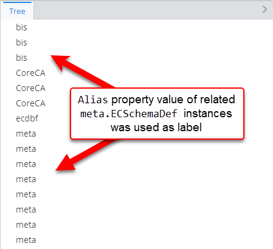

# InstanceLabelOverride Customization Rule

> TypeScript type: [InstanceLabelOverride]($presentation-common).

Instance label override rule provides a way to set instance label to one of its property values, other attributes and/or combination of them.

## Attributes

| Name                                              | Required? | Type                                                                 | Default |
| ------------------------------------------------- | --------- | -------------------------------------------------------------------- | ------- |
| *Filtering*                                       |
| [`requiredSchemas`](#attribute-requiredschemas)   | No        | [`RequiredSchemaSpecification[]`](../Advanced/SchemaRequirements.md) | `[]`    |
| [`priority`](#attribute-priority)                 | No        | `number`                                                             | `1000`  |
| [`onlyIfNotHandled`](#attribute-onlyifnothandled) | No        | `boolean`                                                            | `false` |
| [`class`](#attribute-class)                       | Yes       | `SingleSchemaClassSpecification`                                     |         |
| *Overrides*                                       |
| [`values`](#attribute-values)                     | Yes       | `InstanceLabelOverrideValueSpecification[]`                          |         |

### Attribute: `requiredSchemas`

> **Default value:** `[]`
>
A list of ECSchema requirements that need to be met for the rule to be used. See more details in [Defining ECSchema Requirements for Presentation Rules](../Advanced/SchemaRequirements.md).

```ts
[[include:InstanceLabelOverride.RequiredSchemas.Ruleset]]
```

### Attribute: `priority`

> **Default value:** `1000`

Defines the order in which rules are handled - higher priority means the rule is handled first. If priorities are equal, the rules are handled in the order they're defined. The attribute may be especially useful when combined with [`onlyIfNotHandled` attribute](#attribute-onlyifnothandled).

```ts
[[include:InstanceLabelOverride.Priority.Ruleset]]
```


### Attribute: `onlyIfNotHandled`

> **Default value:** `false`

Tells the library that the rule should only be handled if no other rule of the same type was handled previously (based on rule priorities and definition order). This allows adding fallback rules which can be overriden by higher-priority rules.

```ts
[[include:InstanceLabelOverride.OnlyIfNotHandled.Ruleset]]
```


### Attribute: `class`

Specifies the ECClass to apply this rule to.

```ts
[[include:InstanceLabelOverride.Class.Ruleset]]
```


### Attribute: `values`

Specifications of values used to override label. The first non-empty value is used as the actual label. There are 8 types of supported value specifications:

- [Composite value specification](#composite-value-specification)
- [Property value specification](#property-value-specification)
- [String value specification](#string-value-specification)
- [Class name value specification](#class-name-value-specification)
- [Class label value specification](#class-label-value-specification)
- [BriefcaseId value specification](#briefcaseid-value-specification)
- [LocalId value specification](#localid-value-specification)
- [Related instance label value specification](#related-instance-label-value-specification)

#### Composite value specification

Specification allows creating a label value composited using multiple other specifications.

| Name        | Required? | Type                                                                             | Default         | Meaning                                                                                                                                               |
| ----------- | --------- | -------------------------------------------------------------------------------- | --------------- | ----------------------------------------------------------------------------------------------------------------------------------------------------- |
| `parts`     | Yes       | `Array<{ spec: InstanceLabelOverrideValueSpecification; isRequired?: boolean }>` |                 | Parts of the value. If any of the parts with `isRequired` flag evaluate to an empty string, the result of this specification is also an empty string. |
| `separator` | No        | `string`                                                                         | Space character | Separator to use when joining the parts.                                                                                                              |

```ts
[[include:InstanceLabelOverride.CompositeValueSpecification.Ruleset]]
```


#### Property value specification

Specification uses property value as the label content.

| Name             | Required? | Type                                                                   | Default    | Meaning                                                                                                                                    |
| ---------------- | --------- | ---------------------------------------------------------------------- | ---------- | ------------------------------------------------------------------------------------------------------------------------------------------ |
| `propertyName`   | Yes       | `string`                                                               |            | Name of the property whose value should be used.                                                                                           |
| `propertySource` | No        | [`RelationshipPathSpecification`](../RelationshipPathSpecification.md) | Empty path | [Specification of the relationship path](../RelationshipPathSpecification.md) from `InstanceLabelOverride.class` to class of the property. |

Two types of properties can be used to override label:

- Direct instance properties.

  ```ts
  [[include:InstanceLabelOverride.PropertyValueSpecification.Ruleset]]
  ```

  

- Properties of related instance.

  ```ts
  [[include:InstanceLabelOverride.RelatedPropertyValueSpecification.Ruleset]]
  ```

  

#### String value specification

Specification uses the specified value as the label content.

| Name    | Required? | Type     | Default | Meaning                                |
| ------- | --------- | -------- | ------- | -------------------------------------- |
| `value` | Yes       | `string` |         | The value to use as the label content. |

```ts
[[include:InstanceLabelOverride.StringValueSpecification.Ruleset]]
```


#### Class name value specification

Specification uses ECClass name as the label content.

| Name   | Required? | Type      | Default | Meaning                                                      |
| ------ | --------- | --------- | ------- | ------------------------------------------------------------ |
| `full` | No        | `boolean` | `false` | Should full (`{schemaName}.{className}`) class name be used. |

```ts
[[include:InstanceLabelOverride.ClassNameValueSpecification.Ruleset]]
```

| `full` values    | Result                                                                                                     |
| ---------------- | ---------------------------------------------------------------------------------------------------------- |
| `full = true`    |  |
| `full = false`   |       |

#### Class label value specification

Specification uses ECClass display label as the label content. It has no additional attributes.

```ts
[[include:InstanceLabelOverride.ClassLabelValueSpecification.Ruleset]]
```


#### BriefcaseId value specification

Specification returns ECInstance's briefcase ID in base36 format. It has no additional attributes.

```ts
[[include:InstanceLabelOverride.BriefcaseIdValueSpecification.Ruleset]]
```


#### LocalId value specification

Specification returns ECInstance's local ID in base36 format. It has no additional attributes.

```ts
[[include:InstanceLabelOverride.LocalIdValueSpecification.Ruleset]]
```


#### Related instance label value specification

Specification uses label of another related instance as the label content.

| Name                    | Required? | Type                                                                   | Default | Meaning                                                                                                                                            |
| ----------------------- | --------- | ---------------------------------------------------------------------- | ------- | -------------------------------------------------------------------------------------------------------------------------------------------------- |
| `pathToRelatedInstance` | Yes       | [`RelationshipPathSpecification`](../RelationshipPathSpecification.md) |         | [Specification of the relationship path](../RelationshipPathSpecification.md) from `InstanceLabelOverride.class` to class of the related instance. |

```ts
[[include:InstanceLabelOverride.RelatedInstanceLabelValueSpecification.Ruleset]]
```


