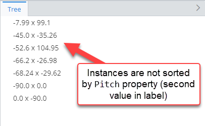

# Sorting Customization Rule

> TypeScript type: [SortingRule]($presentation-common).

Sorting rules provide a way to either disable sorting or sort instances by specific properties. There are 2 types of sorting rules for both of these scenarios.

## Property Sorting Rule

Rule to configure sorting for certain ECInstances in the hierarchy and/or content. It is possible to configure different sorting for different types of ECInstances.

Multiple sorting rules may be applied for the same instances - in this case the
instances are first sorted by the highest priority rule and then the lower priority ones.

> **Note:** This rule is not meant to be used to sort grouping nodes, custom nodes or other non ECInstance type of nodes.

### Attributes

| Name                                            | Required? | Type                                                                 | Default                        |
| ----------------------------------------------- | --------- | -------------------------------------------------------------------- | ------------------------------ |
| *Filtering*                                     |
| [`requiredSchemas`](#attribute-requiredschemas) | No        | [`RequiredSchemaSpecification[]`](../Advanced/SchemaRequirements.md) | `[]`                           |
| [`priority`](#attribute-priority)               | No        | `number`                                                             | `1000`                         |
| [`condition`](#attribute-condition)             | No        | [ECExpression](../hierarchies/ECExpressions.md#rule-condition)       | `""`                           |
| [`class`](#attribute-class)                     | No        | `SingleSchemaClassSpecification`                                     | All classes in current context |
| [`isPolymorphic`](#attribute-ispolymorphic)     | No        | `boolean`                                                            | `false`                        |
| *Sorting*                                       |
| [`propertyName`](#attribute-propertyname)       | Yes       | `string`                                                             |                                |
| [`sortAscending`](#attribute-sortascending)     | No        | `boolean`                                                            | `true`                         |

### Attribute: `requiredSchemas`

> **Default value:** `[]`

A list of ECSchema requirements that need to be met for the rule to be used. See more details in [Defining ECSchema Requirements for Presentation Rules](../Advanced/SchemaRequirements.md).

```ts
[[include:Sorting.RequiredSchemas.Ruleset]]
```

| `minVersion` value   | Result                                                                             |
| -------------------- | ---------------------------------------------------------------------------------- |
| `minVersion = 1.0.2` |  |
| `minVersion = 2.0.2` |    |

### Attribute: `priority`

> **Default value:** `1000`

Defines the order in which rules are handled - higher priority means the rule is handled first. If priorities are equal, the rules are handled in the order they're defined.

```ts
[[include:PropertySortingRule.Priority.Ruleset]]
```


### Attribute: `condition`

> **Default value:** `""`

Defines a condition which needs to be met in order for the rule to be used. The condition is an [ECExpression](./ECExpressions.md#rule-condition) which has to evaluate to a boolean value.

```ts
[[include:PropertySortingRule.Condition.Ruleset]]
```

| Condition evaluation result | Result                                                                 |
| --------------------------- | ---------------------------------------------------------------------- |
| `TRUE`                      |  |
| `FALSE`                     |    |

### Attribute: `class`

Specifies ECClass whose ECInstances should be sorted.

```ts
[[include:PropertySortingRule.Class.Ruleset]]
```


### Attribute: `isPolymorphic`

> **Default value:** `false`

Specifies that `class` attribute defined in this rule should be handled polymorphically.

```ts
[[include:PropertySortingRule.IsPolymorphic.Ruleset]]
```

| `isPolymorphic` values    | Result                                                                          |
| ------------------------- | ------------------------------------------------------------------------------- |
| `isPolymorphic = true`    |  |
| `isPolymorphic = false`   |    |

### Attribute: `propertyName`

Specifies name of the property which should be used for sorting.

```ts
[[include:PropertySortingRule.PropertyName.Ruleset]]
```


### Attribute: `sortAscending`

> **Default value:** `true`

Specifies whether instances should be sorted in ascending order or descending.

```ts
[[include:PropertySortingRule.SortAscending.Ruleset]]
```

| `sortAscending` values    | Result                                                                           |
| ------------------------- | -------------------------------------------------------------------------------- |
| `sortAscending = true`    |   |
| `sortAscending = false`   |  |

## Disabled Sorting Rule

Rule to disable sorting for certain ECInstances in the hierarchy and/or content.

> **Note:** Disabling sorting increases performance

### Attributes

| Name                                            | Required? | Type                                                                 | Default                        |
| ----------------------------------------------- | --------- | -------------------------------------------------------------------- | ------------------------------ |
| *Filtering*                                     |
| [`requiredSchemas`](#attribute-requiredschemas-1) | No        | [`RequiredSchemaSpecification[]`](../Advanced/SchemaRequirements.md) | `[]`                           |
| [`priority`](#attribute-priority-1)               | No        | `number`                                                             | `1000`                         |
| [`condition`](#attribute-condition-1)             | No        | [ECExpression](../hierarchies/ECExpressions.md#rule-condition)       | `""`                           |
| [`class`](#attribute-class-1)                     | No        | `SingleSchemaClassSpecification`                                     | All classes in current context |
| [`isPolymorphic`](#attribute-ispolymorphic-1)     | No        | `boolean`                                                            | false                          |

### Attribute: `requiredSchemas`

> **Default value:** `[]`

A list of ECSchema requirements that need to be met for the rule to be used. See more details in [Defining ECSchema Requirements for Presentation Rules](../Advanced/SchemaRequirements.md).

```ts
[[include:Sorting.RequiredSchemas.Ruleset]]
```

| `minVersion` value   | Result                                                                             |
| -------------------- | ---------------------------------------------------------------------------------- |
| `minVersion = 1.0.2` |  |
| `minVersion = 2.0.2` |    |

### Attribute: `priority`

> **Default value:** `1000`

Defines the order in which rules are handled - higher priority means the rule is handled first. If priorities are equal, the rules are handled in the order they're defined.

```ts
[[include:DisabledSortingRule.Priority.Ruleset]]
```


### Attribute: `condition`

> **Default value:** `""`

Defines a condition which needs to be met in order for the rule to be used. The condition is an [ECExpression](./ECExpressions.md#rule-condition) which has to evaluate to a boolean value.

```ts
[[include:DisabledSortingRule.Condition.Ruleset]]
```

| Condition evaluation result | Result                                                                                    |
| --------------------------- | ----------------------------------------------------------------------------------------- |
| `TRUE`                      |   |
| `FALSE`                     |  |

### Attribute: `class`

Specifies ECClass whose instances should not be sorted.

```ts
[[include:DisabledSortingRule.Class.Ruleset]]
```


### Attribute: `isPolymorphic`

> **Default value:** `false`

Specifies that `class` attribute defined in this rule should be handled polymorphically.

```ts
[[include:DisabledSortingRule.IsPolymorphic.Ruleset]]
```

| `isPolymorphic` values    | Result                                                                          |
| ------------------------- | ------------------------------------------------------------------------------- |
| `isPolymorphic = true`    |  |
| `isPolymorphic = false`   |    |
