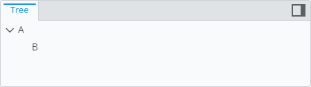

# Child Node Rule

> TypeScript type: [ChildNodeRule]($presentation-common).

Child node rules are used to define child nodes in a hierarchy.

The rules have two types of attributes: for defining *placement* and for defining *branch content*. *Placement* attributes can make the whole rule return no nodes (e.g. when [condition](#attribute-condition) evaluates to `false`). In that case *branch content* attributes have no effect.

## Attributes

| Name                                                        | Required? | Type                                              | Default |
| ----------------------------------------------------------- | --------- | ------------------------------------------------- | ------- |
| *Placement attributes*                                      |
| [`condition`](#attribute-condition)                         | No        | [ECExpression](./ECExpressions.md#rule-condition) | `""`    |
| [`requiredSchemas`](#attribute-requiredschemas)             | No        | `RequiredSchemaSpecification[]`                   | `[]`    |
| [`priority`](#attribute-priority)                           | No        | `number`                                          | `1000`  |
| [`onlyIfNotHandled`](#attribute-onlyifnothandled)           | No        | `boolean`                                         | `false` |
| [`stopFurtherProcessing`](#attribute-stopfurtherprocessing) | No        | `boolean`                                         | `false` |
| *Branch content attributes*                                 |
| [`specifications`](#attribute-specifications)               | No        | `ChildNodeSpecification[]`                        | `[]`    |
| [`customizationRules`](#attribute-customizationrules)       | No        | `CustomizationRule[]`                             | `[]`    |
| [`subConditions`](#attribute-subconditions)                 | No        | `SubCondition[]`                                  | `[]`    |

### Attribute: `condition`

Defines a condition which needs to be met in order for the rule to be used. The condition is an [ECExpression](./ECExpressions.md#rule-condition) which has to evaluate to a boolean value.

The most commonly used symbols are:

- `ParentNode` — refers to the parent node. This is often used to create child nodes under specific parents.

  ```ts
  [[include:Hierarchies.Condition.ParentNodeSymbol]]
  ```

  

- [Ruleset variables](../Advanced/RulesetVariables.md#using-variables-in-rule-condition) — values that can be set and changed at runtime to affect rule outcomes.

  ```ts
  [[include:Hierarchies.Condition.RulesetVariables.Ruleset]]
  ```

  | Ruleset variable values                                  | Result                                                                                                                           |
  | -------------------------------------------------------- | -------------------------------------------------------------------------------------------------------------------------------- |
  | `DISPLAY_A_NODES = false`<br />`DISPLAY_B_NODES = false` |       |
  | `DISPLAY_A_NODES = false`<br />`DISPLAY_B_NODES = true`  |  |
  | `DISPLAY_A_NODES = true`<br />`DISPLAY_B_NODES = true`   |        |

### Attribute: `requiredSchemas`

A list of ECSchema requirements that need to be met for the rule to be used. See more details in [Defining ECSchema Requirements for Presentation Rules](../Advanced/SchemaRequirements.md).

```ts
[[include:Hierarchies.RequiredSchemas.Ruleset]]
```

### Attribute: `priority`

Defines the order in which rules are handled, higher number means the rule is handled first. If priorities are equal, the rules are handled in the order they're defined. The attribute may be especially useful when combined with [`onlyIfNotHandled` attribute](#attribute-onlyifnothandled).

```ts
[[include:Hierarchies.Priority.Ruleset]]
```


### Attribute: `onlyIfNotHandled`

Tells the library that the rule should only be handled if no other rule of the same `ruleType` was handled previously (based on rule priorities and definition order). This allows adding fallback rules which can be overriden by higher-priority rules.

```ts
[[include:Hierarchies.OnlyIfNotHandled.Ruleset]]
```


### Attribute: `stopFurtherProcessing`

Stop processing rules that have lower priority. Used in cases when recursion suppression is needed.

> **Note:** If this flag is set, `specifications` and `subConditions` are not processed.

### Attribute: `specifications`

A list of hierarchy specifications that define what nodes are going to be returned. There are 4 types of specifications:

- [Instance nodes of specific classes](./InstanceNodesOfSpecificClasses.md) specification returns nodes for instances of given ECClass(-es) without attempting to join them to the parent node using some relationship or attribute. This is mostly useful when specifying root nodes.
- [Related instance nodes](./RelatedInstanceNodes.md) specification returns nodes for instances that are related to the parent instance node through given ECRelationship. This is the most commonly used specification to create child nodes.
- [Custom query instance nodes](./CustomQueryInstanceNodes.md) specification returns nodes for instances based on a given ECSQL query. Generally, this specification is rarely needed as majority of cases can be handled by [Instance nodes of specific classes specification](./InstanceNodesOfSpecificClasses.md) which is more performant and easier to set up.
- [Custom node](./CustomNode.md) specification returns a single node that's not based on data in the iModel. Instead, the specification itself specifies all the attributes (type, label, description, image, etc.) of the node.

Multiple specifications can contribute to the same branch by specifying multiple specifications in a single rule or specifying multiple rules that match the same parent node.

> **Note:** grouping and sorting is done at specification level which means nodes generated from different specifications do not get grouped and sorted together.

### Attribute: `customizationRules`

A list of [customization rules](./index.md#hierarchy-customization) that apply only to nodes produced by this rule. Specifying customization rules at this level (as opposed to specifying them at ruleset root level) helps them isolate from other rules, which is useful when same type of nodes need to be customized differently based on what rule creates them.

```ts
[[include:Hierarchies.CustomizationRules.Ruleset]]
```


### Attribute: `subConditions`

A list of sub-rules which share [placement attributes](#placement-attributes) and [nested customization rules](#attribute-customizationrules) of the hierarchy rule. This means the attributes of hierarchy rule are still in effect and the sub-rules can add additional condition of their own.

```ts
[[include:Hierarchies.SubConditions.Ruleset]]
```


