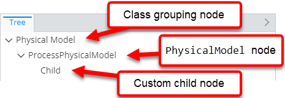

# Custom Node

> TypeScript type: [CustomNodeSpecification]($presentation-common).

Returns a static custom-defined node that's not based on an ECInstance.

## Attributes

| Name                                                      | Required? | Type                                             | Default     |
| --------------------------------------------------------- | --------- | ------------------------------------------------ | ----------- |
| *Node values*                                             |
| [`type`](#attribute-type)                                 | Yes       | `string`                                         |             |
| [`label`](#attribute-label)                               | Yes       | `string`                                         |             |
| [`description`](#attribute-description)                   | No        | `string`                                         | `""`        |
| [`imageId`](#attribute-imageid)                           | No        | `string`                                         | `""`        |
| *Filtering*                                               |
| [`hideExpression`](#attribute-hideexpression)             | No        | [ECExpression](./ECExpressions.md#specification) | `""`        |
| [`hideIfNoChildren`](#attribute-hideifnochildren)         | No        | `boolean`                                        | `false`     |
| [`hideNodesInHierarchy`](#attribute-hidenodesinhierarchy) | No        | `boolean`                                        | `false`     |
| *Ordering*                                                |
| [`priority`](#attribute-priority)                         | No        | `number`                                         | `1000`      |
| *Misc.*                                                   |
| [`hasChildren`](#attribute-haschildren)                   | No        | `"Always" \| "Never" \| "Unknown"`               | `"Unknown"` |
| [`nestedRules`](#attribute-nestedrules)                   | No        | [`ChildNodeRule[]`](./ChildNodeRule.md)          | `[]`        |

### Attribute: `type`

Specifies node type, which is assigned to node's key. The type can be used:

- In [ECExpressions](../Advanced/ECExpressions.md) by using the [NavNode.Type](../Advanced/ECExpressions.md#navnode) symbol.
- In code through [NodeKey.type]($presentation-common).

Generally this attribute is used to assign some unique identifier and use it in [condition](./ChildNodeRule.md#attribute-condition) of
another [child node rule](./ChildNodeRule.md) to assign children to this node.

```ts
[[include:Hierarchies.CustomNodeSpecification.Type.Ruleset]]
```


### Attribute: `label`

Specifies node label. This is a string value that may be [localized](../Advanced/Localization.md).

```ts
[[include:Hierarchies.CustomNodeSpecification.Label.Ruleset]]
```


### Attribute: `description`

> **Default value:** `""`

Specifies node's description. This is a string that may be [localized](../Advanced/Localization.md). If set, the description is
assigned to [Node.description]($presentation-common) and it's up to the UI component to decide what to do with it.

```ts
[[include:Hierarchies.CustomNodeSpecification.Description.Ruleset]]
```


### Attribute: `imageId`

> **Default value:** `""`

Specifies node's image ID. If set, the ID is assigned to [Node.imageId]($presentation-common) and it's up to the UI component
to decide what to do with it.

```ts
[[include:Hierarchies.CustomNodeSpecification.ImageId.Ruleset]]
```


### Attribute: `hideNodesInHierarchy`

> **Default value:** `false`

Specifies whether the node created through this specification should be hidden and instead its children should be returned.

```ts
[[include:Hierarchies.Specification.HideNodesInHierarchy.Ruleset]]
```


### Attribute: `hideIfNoChildren`

> **Default value:** `false`

Specifies whether the node created through this specification should be hidden if it has no child nodes.

```ts
[[include:Hierarchies.Specification.HideIfNoChildren.Ruleset]]
```



### Attribute: `hideExpression`

> **Default value:** `""`

Specifies an [ECExpression](./ECExpressions.md#specification) whose evaluation result tells whether node should be displayed or hidden (and its children showed instead).

```ts
[[include:Hierarchies.Specification.HideExpression.Ruleset]]
```


### Attribute: `priority`

> **Default value:** `1000`

Changes the order of specifications. Higher number means the specification is handled first. If priorities are equal, the specifications are handled in the order they're defined.

```ts
[[include:Hierarchies.Specification.Priority.Ruleset]]
```


### Attribute: `hasChildren`

> **Default value:** `"Unknown"`

> **Performance note:** Setting the attribute to `Always` or `Never` may substantially improve performance of creating nodes in cases when
> getting child nodes is expensive.

Generally, when a node is created, the rules engine has to determine whether it has children before returning it. This requires
evaluating child node rules and, usually, executing additional queries. This attribute allows telling the engine that nodes created
by this specification always or never have children.

In case when the attribute value "lies":

- When set to `Always`, the returned nodes always have `hasChildren` flag set to `true`. Requesting children for such nodes returns
empty list. It's up to the UI component to handle the case of parent node saying it has children but data source not returning any.

- When set to `Never`, the returned nodes always have `hasChildren` set to `false`. Requesting children for such nodes returns empty
list even if there are child node rules that define children for it.

```ts
[[include:Hierarchies.Specification.HasChildren.Ruleset]]
```


### Attribute: `nestedRules`

> **Default value:** `[]`

Specifications of [nested child node rules](./Terminology.md#nested-rule) that allow creating child nodes without the need of supplying a condition to
match the parent node.

This is useful when the same instance node at different hierarchy levels needs to have different child nodes. Specifying a [child node rule](./ChildNodeRule.md)
at the root level with condition to match the instance ECClass makes the rule create children for all nodes of that ECClass. When that's not desired, different
[child node rules](./ChildNodeRule.md) may be specified as nested rules for specifications that return instance nodes of the same ECClass - that makes them have
different children.

```ts
[[include:Hierarchies.Specification.NestedRules.Ruleset]]
```


