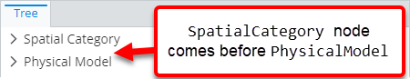
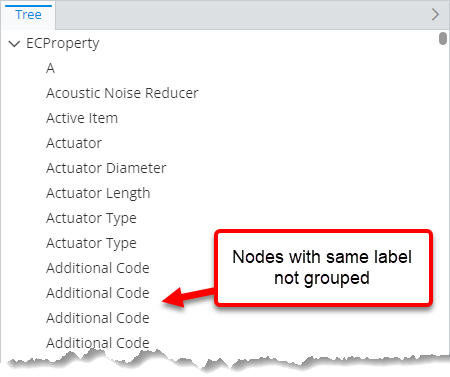
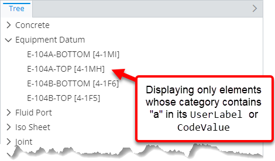

# Custom Query Instance Nodes

> TypeScript type: [CustomQueryInstanceNodesSpecification]($presentation-common).

Returns nodes for instances returned by a provided ECSQL query.

## Attributes

| Name                                                                        | Required? | Type                                                                                | Default     |
| --------------------------------------------------------------------------- | --------- | ----------------------------------------------------------------------------------- | ----------- |
| *Filtering*                                                                 |
| [`queries`](#attribute-queries)                                             | No        | [`QuerySpecification[]`](#string-query-specification)                               | `[]`        |
| [`hideNodesInHierarchy`](#attribute-hideNodesInHierarchy)                   | No        | `boolean`                                                                           | `false`     |
| [`hideIfNoChildren`](#attribute-hideIfNoChildren)                           | No        | `boolean`                                                                           | `false`     |
| [`hideExpression`](#attribute-hideExpression)                               | No        | [ECExpression](./ECExpressions.md#specification)                                    | `""`        |
| [`suppressSimilarAncestorsCheck`](#attribute-suppressSimilarAncestorsCheck) | No        | `boolean`                                                                           | `false`     |
| *Ordering*                                                                  |
| [`priority`](#attribute-priority)                                           | No        | `number`                                                                            | `1000`      |
| [`doNotSort`](#attribute-doNotSort)                                         | No        | `boolean`                                                                           | `false`     |
| *Grouping*                                                                  |
| [`groupByClass`](#attribute-groupByClass)                                   | No        | `boolean`                                                                           | `true`      |
| [`groupByLabel`](#attribute-groupByLabel)                                   | No        | `boolean`                                                                           | `true`      |
| *Misc.*                                                                     |
| [`hasChildren`](#attribute-hasChildren)                                     | No        | `"Always" \| "Never" \| "Unknown"`                                                  | `"Unknown"` |
| [`relatedInstances`](#attribute-relatedInstances)                           | No        | [`RelatedInstanceSpecification[]`](../Common-Rules/RelatedInstanceSpecification.md) | `[]`        |
| [`nestedRules`](#attribute-nestedRules)                                     | No        | [`ChildNodeRule[]`](./ChildNodeRule.md)                                             | `[]`        |

### Attribute: `queries`

> **Default value:** `[]`

Specifications of queries used to create the content.  Query specifications define the actual results of the specification. There
are 2 types of supported query specifications:

- [String query specification](#string-query-specification)
- [ECProperty value query specification](#ecproperty-value-query-specification).

> The queries used in the specifications **must** return `ECClassId` and `ECInstanceId` columns, e.g.:
>
> ```SQL
> SELECT [e].[ECClassId], [e].[ECInstanceId]
>   FROM [bis].[Element] e
>  WHERE [e].[Parent].[Id] = 0x123
> ```
>
> **Note:** sorting and grouping happens **after** results of multiple query specifications are aggregated.

#### String Query Specification

The specification contains an ECSQL query which is used to query for instances.

| Name    | Required? | Type                             | Meaning                                                     |
| ------- | --------- | -------------------------------- | ----------------------------------------------------------- |
| `class` | Yes       | `SingleSchemaClassSpecification` | Specification of ECClass whose instances the query returns. |
| `query` | Yes       | `string`                         | Specifies the search ECSQL query.                           |

```ts
[[include:Hierarchies.CustomQueryInstanceNodesSpecification.StringQuerySpecification.Ruleset]]
```


#### ECProperty Value Query Specification

The specification specifies the name of the parent node instance property whose value is the ECSQL used to query for instances.

**Precondition:** can be used only if parent node is ECInstance node. If there is no immediate parent instance node, the rules engine walks
up the hierarchy until it finds one. If that fails, this specification has no effect.

| Name                 | Required? | Type                             | Meaning                                                                                                                                                        |
| -------------------- | --------- | -------------------------------- | -------------------------------------------------------------------------------------------------------------------------------------------------------------- |
| `class`              | Yes       | `SingleSchemaClassSpecification` | Specification of ECClass whose instances the query returns.                                                                                                    |
| `parentPropertyName` | Yes       | `string`                         | Specifies name of the parent instance property whose value contains the ECSQL query. **Warning:** the property whose name is specified must be of string type. |

```ts
[[include:Hierarchies.CustomQueryInstanceNodesSpecification.ECPropertyValueQuerySpecification.Ruleset]]
```

### Attribute: `hideNodesInHierarchy`

> **Default value:** `false`

Specifies whether instance nodes created through this specification should be hidden and instead their children should be returned.

```ts
[[include:Hierarchies.Specification.HideNodesInHierarchy.Ruleset]]
```


### Attribute: `hideIfNoChildren`

> **Default value:** `false`

Specifies whether nodes created through this specification should be hidden if they have no child nodes.

```ts
[[include:Hierarchies.Specification.HideIfNoChildren.Ruleset]]
```


### Attribute: `hideExpression`

> **Default value:** `""`

Specifies an [ECExpression](./ECExpressions.md#specification) whose evaluation result tells whether node should be displayed or hidden (and its children showed instead).

```ts
[[include:Hierarchies.Specification.HideExpression.Ruleset]]
```


### Attribute: `suppressSimilarAncestorsCheck`

> **Default value:** `false`

Specifies whether similar ancestor nodes' checking should be suppressed when creating nodes based on this specification. [See more](./InfiniteHierarchiesPrevention.md).

```ts
[[include:Hierarchies.Specification.SuppressSimilarAncestorsCheck.Ruleset]]
```


### Attribute: `priority`

> **Default value:** `1000`

Changes the order of specifications. Higher number means the specification is handled first. If priorities are equal, the specifications are handled in the order they're defined.

```ts
[[include:Hierarchies.Specification.Priority.Ruleset]]
```



### Attribute: `doNotSort`

> **Default value:** `false`

> **Performance note:** Setting the attribute may substantially improve performance when creating large numbers of nodes.

Suppress sorting of nodes returned by this specification. With this attribute set to `true`, the order of returned nodes is undefined.

```ts
[[include:Hierarchies.Specification.DoNotSort.Ruleset]]
```

### Attribute: `groupByClass`

> **Default value:** `true`

Controls whether returned instances should be grouped by ECClass.

```ts
[[include:Hierarchies.Specification.GroupByClass.Ruleset]]
```


### Attribute: `groupByLabel`

> **Default value:** `true`

Controls whether returned instances should be grouped by label.

Label grouping node is created only if all of these conditions match:

- There are at least two nodes with the same label.
- There's at least one sibling node with a different label.

```ts
[[include:Hierarchies.Specification.GroupByLabel.Ruleset]]
```



### Attribute: `hasChildren`

> **Default value:** `"Unknown"`

> **Performance note:** Setting the attribute to `Always` or `Never` may substantially improve performance of creating nodes in cases when
> getting child nodes is expensive.

Generally, when a node is created, the rules engine has to determine whether it has children before returning it. This requires
evaluating child node rules and, usually, executing additional queries. This attribute allows telling the engine that nodes created
by this specification always or never have children.

In case when the attribute value "lies":

- When set to `Always`, the returned nodes always have `hasChildren` flag set to `true`. Requesting children for such nodes returns
empty list. It's up to the UI component to handle the case of parent node saying it has children but data source not returning any.

- When set to `Never`, the returned nodes always have `hasChildren` set to `false`. Requesting children for such nodes returns empty
list even if there are child node rules that define children for it.

```ts
[[include:Hierarchies.Specification.HasChildren.Ruleset]]
```


### Attribute: `relatedInstances`

> **Default value:** `[]`

Specifications of [related instances](../Common-Rules/RelatedInstanceSpecification.md) that can be used when creating the nodes. There
are several use cases when this is useful:

- When there's a need to only load instances that have a related instance. Providing a [related instance](../Common-Rules/RelatedInstanceSpecification.md)
  specification with [isRequired](../Common-Rules/RelatedInstanceSpecification.md) set to `true` filters-out the instances that don't have the related instance.

- When there's a need to filter instances by a related instance value. The [alias](../Common-Rules/RelatedInstanceSpecification.md) attribute may then be used
  in the [`instanceFilter` attribute](#attribute-instancefilter) to reference related instance property values.

- When there's a need to group by related instance property values. Related instance classes are included when looking for [grouping rules](./GroupingRule.md), which allows
  using related instance values for [property grouping](./GroupingRule.md#property-grouping).

- When there's a need to customize nodes based on related instance property values. Related instance classes are included when looking for [customization rules](../Customization/index.md),
  which allows referencing related instances and their properties in [customization rule ECExpressions](../Customization/ECExpressions.md#override-value) by their
  [alias](../Common-Rules/RelatedInstanceSpecification.md).

```ts
[[include:Hierarchies.Specification.RelatedInstances.Ruleset]]
```



### Attribute: `nestedRules`

> **Default value:** `[]`

Specifications of [nested child node rules](./Terminology.md#nested-rule) that allow creating child nodes without the need of supplying a condition to
match the parent node.

This is useful when the same instance node at different hierarchy levels needs to have different child nodes. Specifying a [child node rule](./ChildNodeRule.md)
at the root level with condition to match the instance ECClass makes the rule create children for all nodes of that ECClass. When that's not desired, different
[child node rules](./ChildNodeRule.md) may be specified as nested rules for specifications that return instance nodes of the same ECClass - that makes them have
different children.

```ts
[[include:Hierarchies.Specification.NestedRules.Ruleset]]
```


## Example

```JSON
{
  "specType": "CustomQueryInstanceNodes",
  "groupByClass": false,
  "groupByLabel": false,
  "queries": [{
    "specType": "String",
    "class": {"schemaName": "BisCore", "className": "Element"},
    "query": "SELECT ECClassId, ECInstanceId FROM [bis].[Element] e WHERE e.ParentId = 10"
  }, {
    "specType": "ECPropertyValue",
    "class": {"schemaName": "BisCore", "className": "GeometricElement3d"},
    "parentPropertyName": "ChildrenQuery"
  }]
}
```
