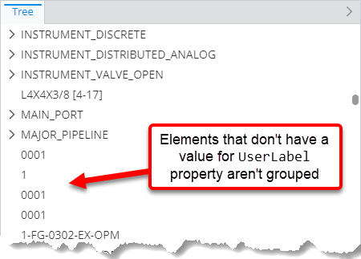
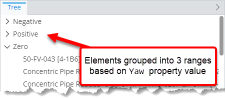

# Grouping Customization Rule

> TypeScript type: [GroupingRule]($presentation-common).

Grouping rules provide advanced ways to group instances when creating hierarchies.

It allows to define these types of groupings:

- Group by base class.
- Group by any property of the class by a common value or a range of values.
- Group multiple instances with the same label in to one ECInstance node. This can be used in cases when these instances represent the same object for the user.

The rule works in conjunction with other grouping options available in [hierarchy specifications](./ChildNodeRule.md#attribute-specifications): `groupByClass` and `groupByLabel`. All grouping rules are
applied in this priority:

1. [Base class grouping](#base-class-grouping) specified using [base class grouping specification](#base-class-grouping) through a grouping rule.
2. Direct class grouping specified using `groupByClass` attribute at specification level.
3. [Property grouping](#property-grouping) specified using [property grouping specification](#property-grouping) through a grouping rule.
4. Display label grouping specified using `groupByLabel` attribute at specification level.
5. [Same label grouping](#same-label-instance-grouping) specified using [same label instance grouping specification](#same-label-instance-grouping) through a grouping rule.

The rule itself works in a similar way as hierarchy rules - *rule* identifies *what* to group and it has *specifications* which tell *how* the grouping should be done.

## Attributes

| Name                                              | Required? | Type                                                                 | Default |
| ------------------------------------------------- | --------- | -------------------------------------------------------------------- | ------- |
| *Filtering*                                       |
| [`class`](#attribute-class)                       | Yes       | `SingleSchemaClassSpecification`                                     |         |
| [`requiredSchemas`](#attribute-requiredschemas)   | No        | [`RequiredSchemaSpecification[]`](../Advanced/SchemaRequirements.md) | `[]`    |
| [`condition`](#attribute-condition)               | No        | [ECExpression](./ECExpressions.md#rule-condition)                    | `""`    |
| [`priority`](#attribute-priority)                 | No        | `number`                                                             | `1000`  |
| [`onlyIfNotHandled`](#attribute-onlyifnothandled) | No        | `boolean`                                                            | `false` |
| *Grouping*                                        |
| [`groups`](#attribute-groups)                     | Yes       | `GroupingSpecification[]`                                            |         |

### Attribute: `class`

Specification of ECClass which should be grouped using this rule.

### Attribute: `condition`

> **Default value:** `""`

Specifies an ECExpression that allows applying grouping based on evaluation result, e.g. by some property of the parent node.

```ts
[[include:Hierarchies.Grouping.Condition.Ruleset]]
```


### Attribute: `requiredSchemas`

> **Default value:** `[]`

A list of ECSchema requirements that need to be met for the rule to be used. See more details in [Defining ECSchema Requirements for Presentation Rules](../Advanced/SchemaRequirements.md).

```ts
[[include:Hierarchies.RequiredSchemas.Ruleset]]
```

### Attribute: `priority`

> **Default value:** `1000`

Defines the order in which rules are handled, higher number means the rule is handled first. If priorities are equal, the rules are handled in the order they're defined. The attribute may be especially useful when combined with [`onlyIfNotHandled` attribute](#attribute-onlyifnothandled).

```ts
[[include:Hierarchies.Priority.Ruleset]]
```


### Attribute: `onlyIfNotHandled`

> **Default value:** `false`

Tells the library that the rule should only be handled if no other grouping rule was handled previously (based on rule priorities and definition order). This allows adding fallback rules which can be overriden by higher-priority rules.

```ts
[[include:Hierarchies.OnlyIfNotHandled.Ruleset]]
```


### Attribute: `groups`

Specifies a list of [grouping specifications](#grouping-specifications) which describe the kind of grouping that should be applied. There are 3 types of supported grouping:

- [Base class grouping](#base-class-grouping)
- [Property grouping](#property-grouping)
- [Same label instance grouping](#same-label-instance-grouping)

## Grouping Specifications

### Base Class Grouping

Base class grouping allows grouping ECInstance nodes by their base class (as opposed to the hierarchy specifications' `groupByClass` attribute, which
always groups by direct class).

Multiple levels of base class grouping may be constructed by specifying multiple rules for ECClasses in the same class hierarchy. In that case
the order of the rules has to match the order of the class hierarchy - from the most base class to the most derived one. If the rules can't be
defined in required order, the actual order may be adjusted using the [`priority` attribute](#attribute-priority).

| Name                                                              | Required? | Type                             | Default        |
| ----------------------------------------------------------------- | --------- | -------------------------------- | -------------- |
| [`baseClass`](#attribute-baseclass)                               | No        | `SingleSchemaClassSpecification` | Rule's `class` |
| [`createGroupForSingleItem`](#attribute-creategroupforsingleitem) | No        | `boolean`                        | `false`        |

#### Attribute: `baseClass`

> **Default value:** Value of [rule's `class` attribute](#attribute-class).

Specification of the base ECClass to group by. If specified, allows grouping by a subclass of the class specified by [rule's `class` attribute](#attribute-class).

```ts
[[include:Hierarchies.Grouping.ClassGroup.BaseClass.Ruleset]]
```

#### Attribute: `createGroupForSingleItem`

> **Default value:** `false`

Specifies whether a grouping node should be created if there is only one item in that group.

```ts
[[include:Hierarchies.Grouping.Specification.CreateGroupForSingleItem.Ruleset]]
```


### Property Grouping

Property grouping allows grouping by a property of the instance by value or by given ranges of values.

Property grouping nodes always appear under class grouping nodes (if any).

Multiple levels of property grouping may be constructed by specifying multiple rules. The order of grouping matches the order of grouping rules.
If the rules can't be defined in required order, the actual order may be adjusted using the [`priority` attribute](#attribute-priority).

| Name                                                                            | Required? | Type                                                                               | Default          |
| ------------------------------------------------------------------------------- | --------- | ---------------------------------------------------------------------------------- | ---------------- |
| [`propertyName`](#attribute-propertyname)                                       | Yes       | `string`                                                                           |                  |
| [`createGroupForSingleItem`](#attribute-creategroupforsingleitem)               | No        | `boolean`                                                                          | `false`          |
| [`createGroupForUnspecifiedValues`](#attribute-creategroupforunspecifiedvalues) | No        | `boolean`                                                                          | `true`           |
| [`imageId`](#attribute-imageid)                                                 | No        | `string`                                                                           | `""`             |
| [`groupingValue`](#deprecated-attribute-groupingvalue)                          | No        | `"PropertyValue" \| "DisplayLabel"`                                                | `"DisplayLabel"` |
| [`sortingValue`](#deprecated-attribute-sortingvalue)                            | No        | `"PropertyValue" \| "DisplayLabel"`                                                | `"DisplayLabel"` |
| [`ranges`](#attribute-ranges)                                                   | No        | [`PropertyRangeGroupSpecification[]`](#propertyrangegroupspecification-attributes) | `[]`             |

#### Attribute: `propertyName`

Name of the ECProperty which is used for grouping. The property must exist on the ECClass specified by the [rule's `class` attribute](#attribute-class) and it must be
of either a primitive or a navigation type.

#### Attribute: `createGroupForSingleItem`

> **Default value:** `false`

Specifies whether a grouping node should be created if there is only one item in that group.

```ts
[[include:Hierarchies.Grouping.Specification.CreateGroupForSingleItem.Ruleset]]
```


#### Attribute: `createGroupForUnspecifiedValues`

> **Default value:** `true`

Should a separate grouping node be created for nodes whose grouping value is not set or is set to an empty string.

```ts
[[include:Hierarchies.Grouping.PropertyGroup.CreateGroupForUnspecifiedValues.Ruleset]]
```

| `createGroupForUnspecifiedValues: false`                                                                                                                          | `createGroupForUnspecifiedValues: true`                                                                                                                                  |
| ----------------------------------------------------------------------------------------------------------------------------------------------------------------- | ------------------------------------------------------------------------------------------------------------------------------------------------------------------------ |
|  |  |

#### Attribute: `imageId`

> **Default value:** `""`

Specifies grouping node's image ID. If set, the ID is assigned to [Node.imageId]($presentation-common) and it's up to the UI component
to decide what to do with it.

```ts
[[include:Hierarchies.Grouping.PropertyGroup.ImageId.Ruleset]]
```

```ts
[[include:Hierarchies.Grouping.PropertyGroup.ImageId.Result]]
```

#### Attribute: `ranges`

> **Default value:** `[]`

Ranges into which the grouping values are divided. Instances are grouped by value if no ranges are specified.

| Name        | Required? | Type     | Default                                                             | Meaning                                                                 |
| ----------- | --------- | -------- | ------------------------------------------------------------------- | ----------------------------------------------------------------------- |
| `fromValue` | Yes       | `string` |                                                                     | Value that defines the range start (inclusive)                          |
| `toValue`   | Yes       | `string` |                                                                     | Value that defines the range end (inclusive)                            |
| `imageId`   | No        | `string` | [`imageId` of the property group specification](#attribute-imageid) | Identifier of an image to use for the grouping node.                    |
| `label`     | No        | `string` | `"{from value} - {to value}"`                                       | Grouping node's label. May be [localized](../Advanced/Localization.md). |

Both `fromValue` and `toValue` are inclusive, but a single value never falls into more than 2 ranges - the first range that fits the value is assigned to it and no other
range is used, even if it matches the value. The ranges are evaluated at the order of their definition.

```ts
[[include:Hierarchies.Grouping.PropertyGroup.Ranges.Ruleset]]
```



#### Deprecated Attribute: `groupingValue`

> **Default value:** `"DisplayLabel"`

Specifies whether instances should be grouped using property's display or raw value.

> **Note:** Grouping by property value is required if the display label is overridden to display grouped instances count.
>
> **Warning:** Grouping by label and sorting by property value is not possible.

Display value should always be used for grouping. In cases when there's a need to show grouped instances count suffix, that
can be achieved at the UI component layer by composing UI node's label from node's display label and [GroupingNodeKey.groupedInstancesCount]($presentation-common).

#### Deprecated Attribute: `sortingValue`

> **Default value:** `"DisplayLabel"`

Specifies whether nodes should be sorted by their display label or the grouping property's value. In most cases the result is the same,
unless a [label override rule](../Customization/LabelOverride.md) is used to change node's display label.

> **Note:** Sorting by property value only makes sense when instances are grouped by property value as well.
>
> **Warning:** Grouping by label and sorting by property value is not possible.

### Same Label Instance Grouping

Allows grouping multiple instances with the same label into one ECInstances type of node. Similar to display label grouping, but instead of showing a grouping
node with multiple grouped ECInstance nodes, it shows a single ECInstances node which represents multiple ECInstances.

| Name                                              | Required? | Type                       | Default   |
| ------------------------------------------------- | --------- | -------------------------- | --------- |
| [`applicationStage`](#attribute-applicationstage) | No        | `"Query" \| "PostProcess"` | `"Query"` |

#### Attribute: `applicationStage`

> **Default value:** `"Query"`

> **Performance note:** Grouping at post-processing step requires loading the whole hierarchy level before
> returning even the first node - avoid using with large numbers of nodes.

Stage of hierarchy creation at which the rule is applied.

- `Query` groups instances during the query, which can often make use of database indexes and is generally fairly quick. This
  also means that instances are grouped at the level of a single hierarchy specification and doesn't work when a hierarchy
  level is built from classes without common base class, using multiple specifications or is merged from multiple nested
  hierarchy levels using the [`hideNodesInHierarchy` attribute](./InstanceNodesOfSpecificClasses.md#attribute-hidenodesinhierarchy).

  ```ts
  [[include:Hierarchies.Grouping.SameLabelInstanceGroup.ApplicationStage.Query.Ruleset]]
  ```

  ```ts
  [[include:Hierarchies.Grouping.SameLabelInstanceGroup.ApplicationStage.Query.Result]]
  ```

- `PostProcess` groups instances after the whole hierarchy level is built. This is generally useful when the hierarchy level
  is built from classes without common base class, using multiple specifications or is merged from multiple nested hierarchy levels using the
  [`hideNodesInHierarchy` attribute](./InstanceNodesOfSpecificClasses.md#attribute-hidenodesinhierarchy). The downside is that
  the whole hierarchy level needs to be created before showing even the first node - using this way of grouping may
  cause bad performance for large hierarchy levels.

  ```ts
  [[include:Hierarchies.Grouping.SameLabelInstanceGroup.ApplicationStage.PostProcess.Ruleset]]
  ```

  ```ts
  [[include:Hierarchies.Grouping.SameLabelInstanceGroup.ApplicationStage.PostProcess.Result]]
  ```
