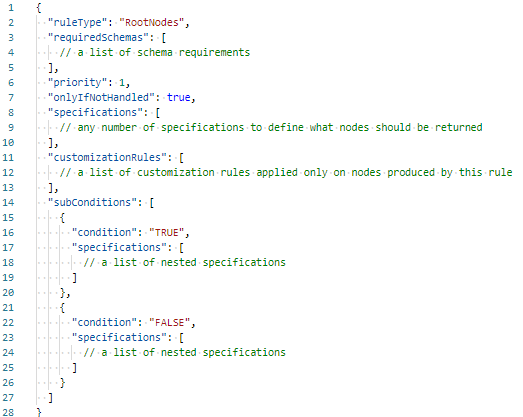

# Hierarchies

The Presentation library provides a declarative way to create hierarchies based on iModel data.

## Reference

There are 2 primary concepts for creating hierarchies: [rules](#rules) and [specifications](#specifications).

### Rules

Hierarchy presentation rule is a top level concept for defining hierarchies. There are two types of hierarchy rules:

- [Root node rule](./RootNodeRule.md) is for creating nodes at the root level.
- [Child node rule](./ChildNodeRule.md) is for creating child nodes.

The only difference between those two rules is that we're looking for root node rules when creating root level nodes and for child node rules otherwise.

Both kinds of rules have two types of attributes - for defining [placement](#placement-attributes) and for defining [branch content](#branch-content-attributes). The latter attributes only get used if the rule does get used after evaluating the former.

#### Placement Attributes

Placement attributes define **if** the rule should be used and **where** the nodes appear if it is.

#### Branch Content Attributes

Branch content attributes define **result of the rule** if it does get used after evaluating [placement attributes](#placement-attributes). The primary branch content attribute is `specifications`, which defines what content is going to be created. There are 4 types of specifications:

- [Instance nodes of specific classes](./InstanceNodesOfSpecificClasses.md) specification returns nodes for instances of given ECClass(-es) without attempting to join them to the parent node using some relationship or attribute. This is mostly useful when specifying root nodes.
- [Related instance nodes](./RelatedInstanceNodes.md) specification returns nodes for instances that are related to the parent instance node through given ECRelationship. This is the most commonly used specification to create child nodes.
- [Custom query instance nodes](./CustomQueryInstanceNodes.md) specification returns nodes for instances based on a given ECSQL query. Generally, this specification is rarely needed as majority of cases can be handled by [Instance nodes of specific classes specification](./InstanceNodesOfSpecificClasses.md) which is more performant and easier to set up.
- [Custom node](./CustomNode.md) specification returns a single node that's not based on data in the iModel. Instead, the specification itself specifies all the attributes (type, label, description, image, etc.) of the node.

### Hierarchy Customization

All [general use customization rules](../Customization/index.md#rules) can be applied to hierarchies. In addition, there are some hierarchy-specific customization rules:

- [Grouping rule](./GroupingRule.md) for advanced grouping.
- [Node artifacts rule](./NodeArtifactsRule.md) to help customize produced nodes based on child nodes deeper in the hierarchy.

### Related Topics

- [Infinite hierarchies prevention](./InfiniteHierarchiesPrevention.md)
- [ECExpressions](./ECExpressions.md)
- [Terminology](./Terminology.md)
