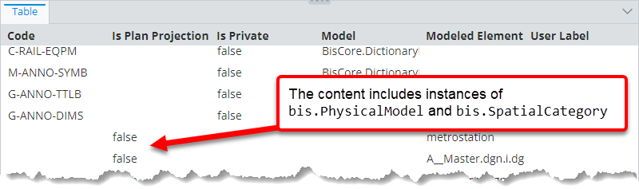

# Multi schema classes specification

> TypeScript type: [MultiSchemaClassesSpecification]($presentation-common).

This specification lists ECClasses which should be targeted when creating content or hierarchy nodes.

## Attributes

| Name                                          | Required? | Type       | Default |
| --------------------------------------------- | --------- | ---------- | ------- |
| [`schemaName`](#attribute-schemaname)         | Yes       | `string`   |         |
| [`classNames`](#attribute-classnames)         | Yes       | `string[]` |         |
| [`arePolymorphic`](#attribute-arepolymorphic) | No        | `boolean`  | `false` |

### Attribute: `schemaName`

Specifies the schema which contains the target classes.

|                 |          |
| --------------- | -------- |
| **Type**        | `string` |
| **Is Required** | Yes      |

### Attribute: `classNames`

An array of target ECClass names.

|                 |            |
| --------------- | ---------- |
| **Type**        | `string[]` |
| **Is Required** | Yes        |

### Attribute: `arePolymorphic`

Defines whether the derived ECClasses should be included in the result.

|                   |           |
| ----------------- | --------- |
| **Type**          | `boolean` |
| **Is Required**   | No        |
| **Default Value** | `false`   |

## Example

```ts
[[include:Presentation.MultiSchemaClasses.Ruleset]]
```


