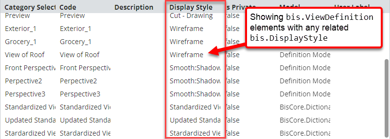
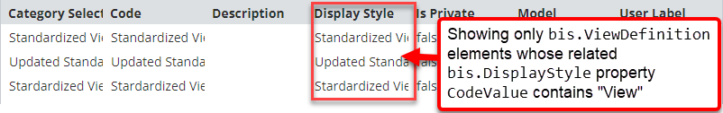
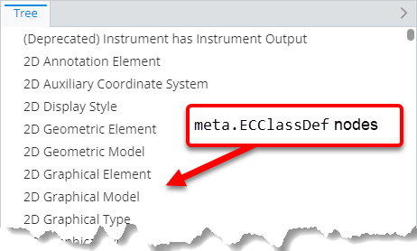
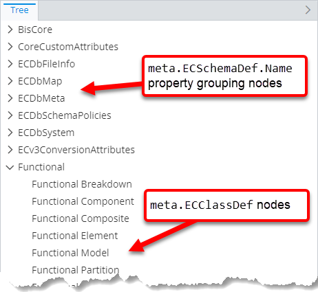

# Related instance specification

> TypeScript type: [RelatedInstanceSpecification]($presentation-common).

Related instance specification is used in [content](../content/contentRule.md#attribute-specifications) and
[hierarchy](../hierarchies/ChildNodeRule.md#attribute-specifications) specifications to "join" the primary instance
with its related instance and allow using the related instance for:

- [Filtering](#using-related-instances-in-instance-filter), when used in `instanceFilter`.
- [Customization](#using-related-instances-for-customizing), when used in [customization rules](../customization/index.md).
- [Grouping](#using-related-instances-for-grouping), when used in [grouping rules](../hierarchies/GroupingRule.md).

## Attributes

| Name                                             | Required? | Type                                                                  | Default |
| ------------------------------------------------ | --------- | --------------------------------------------------------------------- | ------- |
| [`relationshipPath`](#attribute-relationshipath) | Yes       | [`RelationshipPathSpecification`](./RelationshipPathSpecification.md) |         |
| [`alias`](#attribute-alias)                      | Yes       | `string`                                                              |         |
| [`isRequired`](#attribute-isrequired)            | No        | `boolean`                                                             | `false` |

### Attribute: `relationshipPath`

Specifies a chain of [relationship path specifications](./RelationshipPathSpecification.md) that forms a path from the primary instance to the related instances.

|                 |                                                                       |
| --------------- | --------------------------------------------------------------------- |
| **Type**        | [`RelationshipPathSpecification`](./RelationshipPathSpecification.md) |
| **Is Required** | Yes                                                                   |

### Attribute: `alias`

Specifies an an alias that given to the related instance. The alias can be used to reference the instance in instance filter and customization rules.

> **Note:** The value must be unique per hierarchy specification. If there are multiple related instance specifications using the same alias, the
> library uses the first one and ignores the rest of them.

|                 |          |
| --------------- | -------- |
| **Type**        | `string` |
| **Is Required** | Yes      |

### Attribute: `isRequired`

Specifies whether to omit the primary instance from the result if the other end of [`relationshipPath`](#attribute-relationshipath) does not yield any related instances.

|                   |           |
| ----------------- | --------- |
| **Type**          | `boolean` |
| **Is Required**   | No        |
| **Default Value** | `false`   |

## Examples

### Using related instances in instance filter

```ts
[[include:Presentation.RelatedInstanceSpecification.UsingInInstanceFilter.Ruleset]]
```

|                         | Result                                                                                                 |
| ----------------------- | ------------------------------------------------------------------------------------------------------ |
| Without instance filter |  |
| With instance filter    |     |

### Using related instances for customization

```ts
[[include:Presentation.RelatedInstanceSpecification.UsingForCustomization.Ruleset]]
```

```ts
[[include:Presentation.RelatedInstanceSpecification.UsingForCustomization.Result]]
```

### Using related instances for grouping

```ts
[[include:Presentation.RelatedInstanceSpecification.UsingForGrouping.Ruleset]]
```

|                                        | Result                                                                                                           |
| -------------------------------------- | ---------------------------------------------------------------------------------------------------------------- |
| Without related instance specification |  |
| With related instance specification    |     |
