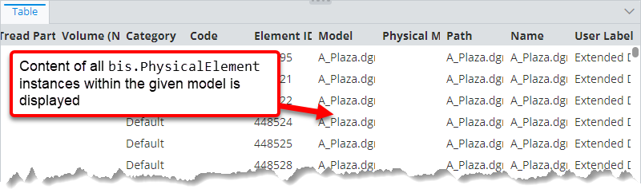
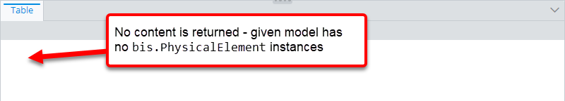
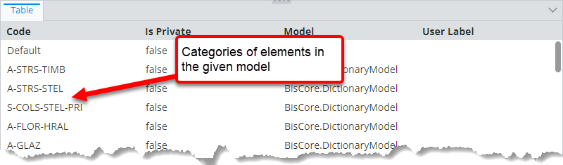

# Relationship path specification

> TypeScript type: [RelationshipPathSpecification]($presentation-common).

Relationship path specification is used to define a relationship path to an ECClass.

The specification is always used in a context where source class already exists, so it only requires the relationship and direction. The
target class can be inferred from the two required attributes or specified with the [`targetClass` attribute](#attribute-targetclass). In case of a
multi-step path, target of the current step is used as the source of the next step.

## Attributes

| Name                                      | Required? | Type                                                                    | Default                       |
| ----------------------------------------- | --------- | ----------------------------------------------------------------------- | ----------------------------- |
| [`relationship`](#attribute-relationship) | Yes       | [`SingleSchemaClassSpecification`](./SingleSchemaClassSpecification.md) |                               |
| [`direction`](#attribute-direction)       | Yes       | `"Forward" \| "Backward"`                                               |                               |
| [`targetClass`](#attribute-targetclass)   | No        | [`SingleSchemaClassSpecification`](./SingleSchemaClassSpecification.md) | Other end of the relationship |

### Attribute: `relationship`

This attribute specifies the ECRelationship that should be used to traverse to target class.

|                 |                                                                         |
| --------------- | ----------------------------------------------------------------------- |
| **Type**        | [`SingleSchemaClassSpecification`](./SingleSchemaClassSpecification.md) |
| **Is Required** | Yes                                                                     |

### Attribute: `direction`

This attribute specifies the direction in which the [relationship](#attribute-relationship) should be followed:

- `"Forward"` - the relationship is traversed from source to target of the relationship.
- `"Backward"` - the relationship is traversed from target to source of the relationship.

|                 |                           |
| --------------- | ------------------------- |
| **Type**        | `"Forward" \| "Backward"` |
| **Is Required** | Yes                       |

### Attribute: `targetClass`

This attribute may be used to specialize the target of the relationship. E.g. when relationship points to a class like `bis.Element`, this
attribute allows specializing it to `bis.PhysicalElement` or some other `bis.Element` subclass.

|                   |                                                                                                                                                                                                  |
| ----------------- | ------------------------------------------------------------------------------------------------------------------------------------------------------------------------------------------------ |
| **Type**          | [`SingleSchemaClassSpecification`](./SingleSchemaClassSpecification.md)                                                                                                                          |
| **Is Required**   | No                                                                                                                                                                                               |
| **Default Value** | Target ECClass of the [relationship](#attribute-relationship) if the [direction](#attribute-direction) is `"Forward"` or source ECClass if the [direction](#attribute-direction) is `"Backward"` |

## Examples

### Using single-step relationship path

```ts
[[include:Presentation.RelationshipPathSpecification.SingleStep.Ruleset]]
```

| Input                          | Result                                                                                                                                |
| ------------------------------ | ------------------------------------------------------------------------------------------------------------------------------------- |
| `bis.PhysicalModel` instance   |         |
| `bis.DefinitionModel` instance |  |

### Using multi-step relationship path

```ts
[[include:Presentation.RelationshipPathSpecification.MultiStep.Ruleset]]
```


