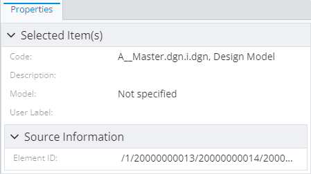
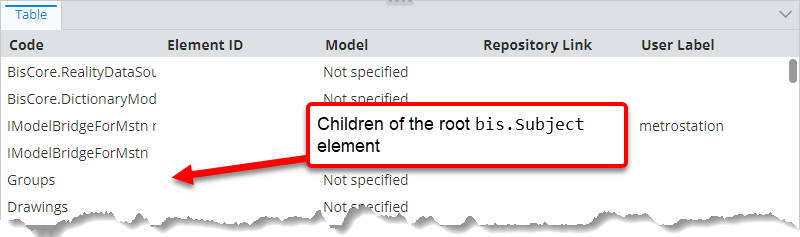
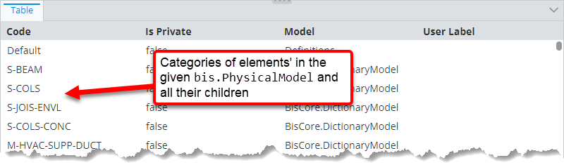
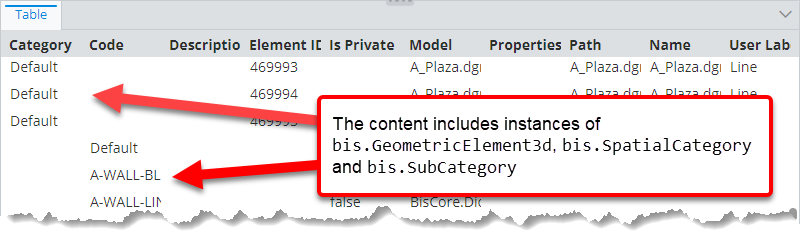

# Repeatable relationship path specification

> TypeScript type: [RepeatableRelationshipPathSpecification]($presentation-common).

This specification declares a step in a relationship path between a source and target ECInstances. A step can optionally be repeated a number of times to traverse the same relationship recursively. Multiple specifications of this type can be chained together to express complex indirect relationships.

The specification is always used in a context where source class already exists, so it only requires the relationship and direction. The
target class can be inferred from the two required attributes or specified with the [`targetClass` attribute](#attribute-targetclass). In case of a
multi-step path, target of the current step is used as the source of the next step.

## Attributes

| Name                                      | Required? | Type                                                                    | Default                       |
| ----------------------------------------- | --------- | ----------------------------------------------------------------------- | ----------------------------- |
| [`relationship`](#attribute-relationship) | Yes       | [`SingleSchemaClassSpecification`](./SingleSchemaClassSpecification.md) |                               |
| [`direction`](#attribute-direction)       | Yes       | `"Forward" \| "Backward"`                                               |                               |
| [`targetClass`](#attribute-targetclass)   | No        | [`SingleSchemaClassSpecification`](./SingleSchemaClassSpecification.md) | Other end of the relationship |
| [`count`](#attribute-count)               | No        | `number \| "*"`                                                         | `1`                           |

### Attribute: `relationship`

This attribute specifies the ECRelationship that should be used to traverse to target class.

|                 |                                                                         |
| --------------- | ----------------------------------------------------------------------- |
| **Type**        | [`SingleSchemaClassSpecification`](./SingleSchemaClassSpecification.md) |
| **Is Required** | Yes                                                                     |

### Attribute: `direction`

This attribute specifies the direction in which the [relationship](#attribute-relationship) should be followed:

- `"Forward"` - the relationship is traversed from source to target of the relationship.
- `"Backward"` - the relationship is traversed from target to source of the relationship.

|                 |                           |
| --------------- | ------------------------- |
| **Type**        | `"Forward" \| "Backward"` |
| **Is Required** | Yes                       |

### Attribute: `targetClass`

This attribute may be used to specialize the target of the relationship. E.g. when relationship points to a class like `bis.Element`, this
attribute allows specializing it to `bis.PhysicalElement` or some other `bis.Element` subclass.

|                   |                                                                                                                                                                                                  |
| ----------------- | ------------------------------------------------------------------------------------------------------------------------------------------------------------------------------------------------ |
| **Type**          | [`SingleSchemaClassSpecification`](./SingleSchemaClassSpecification.md)                                                                                                                          |
| **Is Required**   | No                                                                                                                                                                                               |
| **Default Value** | Target ECClass of the [relationship](#attribute-relationship) if the [direction](#attribute-direction) is `"Forward"` or source ECClass if the [direction](#attribute-direction) is `"Backward"` |

### Attribute: `count`

When a number is specified, the relationship is traversed recursively the specified number of times.

When it is set to a special value `"*"`, the same relationship is traversed recursively unbounded number of times, starting from zero (the relationship is not followed). On each traversal iteration, Presentation rules engine accumulates all indirectly related ECInstances as defined by the remaining relationship path.

|                   |                 |
| ----------------- | --------------- |
| **Type**          | `number \| "*"` |
| **Is Required**   | No              |
| **Default Value** | `1`             |

## Examples

When the [`count` attribute](#attribute-count) is omitted or set to `1`, the specification works similarly to [RelationshipPathSpecification](./RelationshipPathSpecification.md). See its [examples section](./RelationshipPathSpecification.md#examples) for those simpler cases.

### Jumping through the same relationship recursively fixed number of times

```ts
[[include:Presentation.RepeatableRelationshipPathSpecification.SingleStepWithCount.Ruleset]]
```



### Jumping through the relationship recursively unbounded number of times

```ts
[[include:Presentation.RepeatableRelationshipPathSpecification.RecursiveSingleStep.Ruleset]]
```

When the root subject is provided as input, content for all its child elements is returned:



### Combining recursive and non-recursive steps

```ts
[[include:Presentation.RepeatableRelationshipPathSpecification.RecursiveAndNonRecursiveSpecificationsCombination.Ruleset]]
```

When a physical model is provided as input, categories' content of all its elements and their children is returned:



### Combining multiple unbounded recursive steps

```ts
[[include:Presentation.RepeatableRelationshipPathSpecification.MultipleRecursiveSpecificationsCombination.Ruleset]]
```


