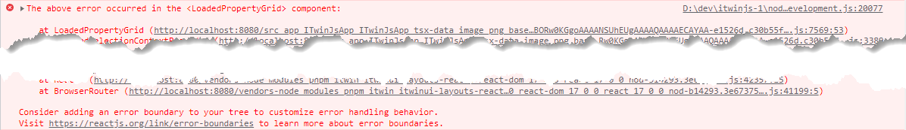
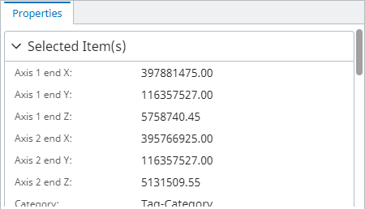
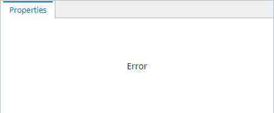
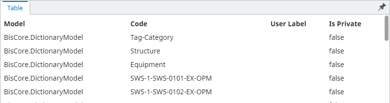
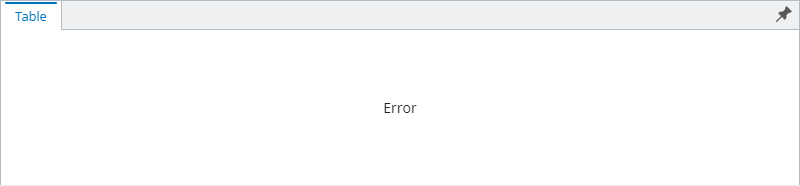
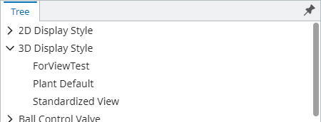
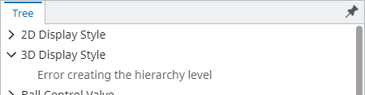
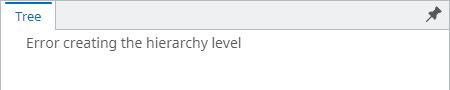

# Handling errors within Presentation components

Presentation rules - driven components get their data by making Presentation RPC requests, which may fail due to unexpected issues like network problems. Such failures, generally, result in an error being thrown in the frontend code, and, if not handled appropriately, may result in the whole application crash. For example, in such situation React applications render nothing and log something like this into browser's console:



As stated in the above error message, React suggests using [error boundaries](https://reactjs.org/link/error-boundaries) to handle such errors. A very simplistic error boundary component used in the below examples looks like this:

```ts
[[include:Presentation.Components.SampleErrorBoundary]]
```

## Handling errors in property grid

Capturing property grid errors is as simple as wrapping rendering of the component with an error boundary:

```ts
[[include:Presentation.Components.PropertyGrid.ErrorHandling]]
```

Result when there's no error:



Result when there's an error getting data for the property grid:



## Handling errors in table

For the Table component, all requests are made by the [usePresentationTable]($presentation-components) hook (or [usePresentationTableWithUnifiedSelection]($presentation-components) when using it with Unified Selection). That means the hook needs to be used within the error boundary for it's errors to be captured. For that we use 2 components: one is responsible for rendering the table, the other - for wrapping it with an error boundary.

```ts
[[include:Presentation.Components.Table.ErrorHandling]]
```

Result when there's no error:



Result when there's an error getting data for the table:



## Handling errors in tree

Tree component is slightly different from the above components, because it runs different queries to get data for different hierarchy levels. It's possible that we successfully get response for some of the requests, but fail for only one of them. In such situations, we want to show an error only where it happened, while still showing information that we successfully received.

At the moment this complexity is handled by [PresentationTreeRenderer]($presentation-components), which renders an "error node" for the whole hierarchy level upon an error, so there's no need to use an error boundary:

```ts
[[include:Presentation.Components.Tree.ErrorHandling]]
```

Result when there's no error:



Result when an error occurs requesting child nodes:



Result when an error occurs requesting root nodes:


