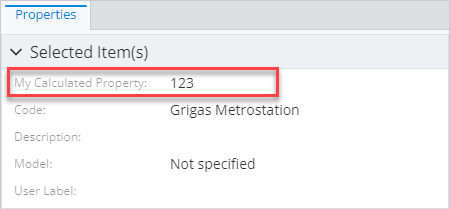
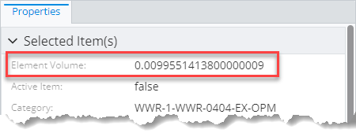
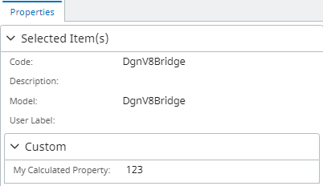
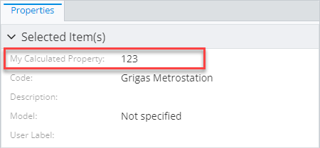
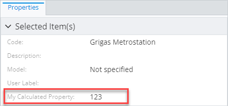

# Calculated properties specification

> TypeScript type: [CalculatedPropertiesSpecification]($presentation-common).

This content modifier allows including additional calculated properties into the content.

## Attributes

| Name                                  | Required? | Type                                                              | Default     |
| ------------------------------------- | --------- | ----------------------------------------------------------------- | ----------- |
| [`label`](#attribute-label)           | Yes       | `string`                                                          |             |
| [`value`](#attribute-value)           | Yes       | [ECExpression](../advanced/ECExpressions.md)                      |             |
| [`categoryId`](#attribute-categoryid) | No        | `string \| CategoryIdentifier`                                    | No override |
| [`renderer`](#attribute-renderer)     | No        | [`RendererSpecification`](./RendererSpecification.md)             | No override |
| [`editor`](#attribute-editor)         | No        | [`PropertyEditorSpecification`](./PropertyEditorSpecification.md) | No override |
| [`priority`](#attribute-priority)     | No        | `number`                                                          | `1000`      |

### Attribute: `label`

Specifies label of the calculated property. Supports [localization](../advanced/Localization.md).

|                 |          |
| --------------- | -------- |
| **Type**        | `string` |
| **Is Required** | Yes      |

```ts
[[include:Presentation.Content.Customization.CalculatedPropertiesSpecification.Label.Ruleset]]
```



### Attribute: `value`

Defines an expression to calculate the value. The expression can use [ECInstance](../advanced/ECExpressions.md#ecinstance)
and [Ruleset Variables](../advanced/ECExpressions.md#ruleset-variables-user-settings) symbol contexts.

|                 |                                              |
| --------------- | -------------------------------------------- |
| **Type**        | [ECExpression](../advanced/ECExpressions.md) |
| **Is Required** | Yes                                          |

```ts
[[include:Presentation.Content.Customization.CalculatedPropertiesSpecification.Value.Ruleset]]
```



### Attribute: `categoryId`

The attribute allows moving the property into a different category. There are several options:

- Reference a category by ID used in [`PropertyCategorySpecification`](./PropertyCategorySpecification.md) in the current context.
  The current context contains categories specified in the same [content specification](./index.md#specifications) or
  [content modifiers](./contentModifier.md) that are applied on the same or base ECClass as this property specification.

- Move to `DefaultParent` category. This is useful when using with [related properties](./RelatedPropertiesSpecification.md), to
  avoid putting them inside a special related class category and instead show them next to properties of the source class.

- Move to `Root` category. This is useful when using with [related properties](./RelatedPropertiesSpecification.md), to
  avoid putting them inside a special related class category and instead show them in the root category.

See [property categorization page](./PropertyCategorization.md) for more details.

|                   |                                |
| ----------------- | ------------------------------ |
| **Type**          | `string \| CategoryIdentifier` |
| **Is Required**   | No                             |
| **Default Value** | No override                    |

```ts
[[include:Presentation.Content.Customization.CalculatedPropertiesSpecification.CategoryId.Ruleset]]
```



### Attribute: `renderer`

Custom property [renderer specification](./RendererSpecification.md) that allows assigning a custom value renderer to be used in UI. The
specification is used to set up [Field.renderer]($presentation-common) for this property and it's up to the UI component to make sure
appropriate renderer is used to render the property.

See [Custom property value renderers](./PropertyValueRenderers.md) page for a list of available renderers or how to register a custom one.

|                   |                                                       |
| ----------------- | ----------------------------------------------------- |
| **Type**          | [`RendererSpecification`](./RendererSpecification.md) |
| **Is Required**   | No                                                    |
| **Default Value** | No override                                           |

```ts
[[include:Presentation.Content.Customization.CalculatedPropertiesSpecification.Renderer.Ruleset]]
```

```ts
[[include:Presentation.Content.Customization.CalculatedPropertiesSpecification.Renderer.Result]]
```

### Attribute `editor`

Custom [property editor specification](./PropertyEditorSpecification) that allows assigning a custom value editor
to be used in UI.

|                   |                                                                   |
| ----------------- | ----------------------------------------------------------------- |
| **Type**          | [`PropertyEditorSpecification`](./PropertyEditorSpecification.md) |
| **Is Required**   | No                                                                |
| **Default Value** | No override                                                       |

```ts
[[include:Presentation.Content.Customization.CalculatedPropertiesSpecification.Editor.Ruleset]]
```

```ts
[[include:Presentation.Content.Customization.CalculatedPropertiesSpecification.Editor.Result]]
```

### Attribute: `priority`

Assign a custom [Field.priority]($presentation-common) to the property. It's up to the UI component to make sure that priority
is respected - properties with higher priority should appear before or above properties with lower priority.

|                   |          |
| ----------------- | -------- |
| **Type**          | `number` |
| **Is Required**   | No       |
| **Default Value** | `1000`   |

```ts
[[include:Presentation.Content.Customization.CalculatedPropertiesSpecification.Priority.Ruleset]]
```

| `priority: 9999`                                                                                                                 | `priority: -9999`                                                                                                                |
| -------------------------------------------------------------------------------------------------------------------------------- | -------------------------------------------------------------------------------------------------------------------------------- |
|  |  |
