# Content instances of specific classes specification

> TypeScript type: [ContentInstancesOfSpecificClassesSpecification]($presentation-common).

This specification creates content for all instances of specific ECClasses.

## Attributes

| Name                                                                            | Required? | Type                                                                                                            | Default |
| ------------------------------------------------------------------------------- | --------- | --------------------------------------------------------------------------------------------------------------- | ------- |
| *Filtering*                                                                     |
| [`classes`](#attribute-classes)                                                 | Yes       | [`MultiSchemaClassesSpecification \| MultiSchemaClassesSpecification[]`](../MultiSchemaClassesSpecification.md) |         |
| [`excludedClasses`](#attribute-excludedclasses)                                 | No        | [`MultiSchemaClassesSpecification \| MultiSchemaClassesSpecification[]`](../MultiSchemaClassesSpecification.md) | `[]`    |
| [`handlePropertiesPolymorphically`](#attribute-handlepropertiespolymorphically) | No        | `boolean`                                                                                                       | `false` |
| [`instanceFilter`](#attribute-instancefilter)                                   | No        | [ECExpression](./ECExpressions.md#instance-filter)                                                              | `""`    |
| [`onlyIfNotHandled`](#attribute-onlyifnothandled)                               | No        | `boolean`                                                                                                       | `false` |
| *Ordering*                                                                      |
| [`priority`](#attribute-priority)                                               | No        | `number`                                                                                                        | `1000`  |
| *Content Modifiers*                                                             |
| [`relatedProperties`](#attribute-relatedproperties)                             | No        | [`RelatedPropertiesSpecification[]`](./RelatedPropertiesSpecification.md)                                       | `[]`    |
| [`calculatedProperties`](#attribute-calculatedproperties)                       | No        | [`CalculatedPropertiesSpecification[]`](./CalculatedPropertiesSpecification.md)                                 | `[]`    |
| [`propertyCategories`](#attribute-propertycategories)                           | No        | [`PropertyCategorySpecification[]`](./PropertyCategorySpecification.md)                                         | `[]`    |
| [`propertyOverrides`](#attribute-propertyoverrides)                             | No        | [`PropertySpecification[]`](./PropertySpecification.md)                                                         | `[]`    |
| *Misc.*                                                                         |
| [`relatedInstances`](#attribute-relatedinstances)                               | No        | [`RelatedInstanceSpecification[]`](../RelatedInstanceSpecification.md)                                          | `[]`    |

### Attribute: `classes`

Defines a set of [multi schema classes](../MultiSchemaClassesSpecification.md) that specify which ECClasses need to be selected to form the result.

|                 |                                                                                                                 |
| --------------- | --------------------------------------------------------------------------------------------------------------- |
| **Type**        | [`MultiSchemaClassesSpecification \| MultiSchemaClassesSpecification[]`](../MultiSchemaClassesSpecification.md) |
| **Is Required** | Yes                                                                                                             |

```ts
[[include:Presentation.ContentInstancesOfSpecificClasses.Classes.Ruleset]]
```

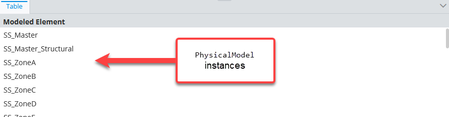

### Attribute: `excludedClasses`

Defines a set of [multi schema classes](../MultiSchemaClassesSpecification.md) that prevents specified ECClasses and subclasses from being selected by [`classes` attribute](#attribute-classes).

|                   |                                                                                                                 |
| ----------------- | --------------------------------------------------------------------------------------------------------------- |
| **Type**          | [`MultiSchemaClassesSpecification \| MultiSchemaClassesSpecification[]`](../MultiSchemaClassesSpecification.md) |
| **Is Required**   | No                                                                                                              |
| **Default Value** | `[]`                                                                                                            |

```ts
[[include:Presentation.ContentInstancesOfSpecificClasses.ExcludedClasses.Ruleset]]
```

|                                                   | Result                                                                                                                               |
| ------------------------------------------------- | ------------------------------------------------------------------------------------------------------------------------------------ |
| `excludedClasses: []`                             | 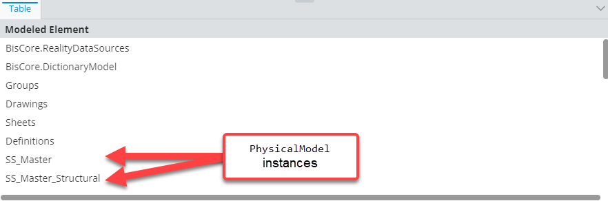       |
| `excludedClasses` as defined in the above ruleset | 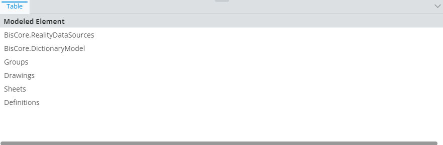 |

### Attribute: `handlePropertiesPolymorphically`

Specifies whether properties of derived [classes](#attribute-classes) should be included in the content.

|                   |           |
| ----------------- | --------- |
| **Type**          | `boolean` |
| **Is Required**   | No        |
| **Default Value** | `false`   |

```ts
[[include:Presentation.ContentInstancesOfSpecificClasses.HandlePropertiesPolymorphically.Ruleset]]
```

|                                          | Result                                                                                                                                            |
| ---------------------------------------- | ------------------------------------------------------------------------------------------------------------------------------------------------- |
| `handlePropertiesPolymorphically: false` | 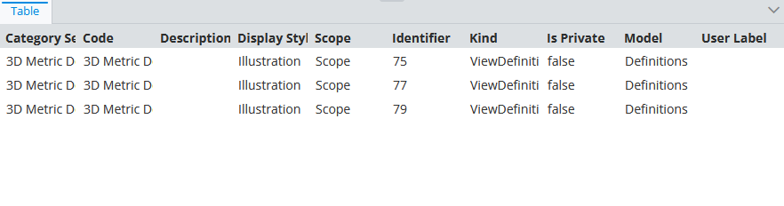   |
| `handlePropertiesPolymorphically: true`  | 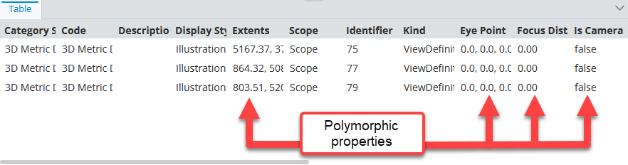 |

### Attribute: `instanceFilter`

Specifies an [ECExpression](./ECExpressions.md#instance-filter) for filtering instances of ECClasses specified through the [`classes` attribute](#attribute-classes).

|                   |                                                    |
| ----------------- | -------------------------------------------------- |
| **Type**          | [ECExpression](./ECExpressions.md#instance-filter) |
| **Is Required**   | No                                                 |
| **Default Value** | `""`                                               |

```ts
[[include:Presentation.ContentInstancesOfSpecificClasses.InstanceFilter.Ruleset]]
```

|                                                  | Result                                                                                      |
| ------------------------------------------------ | ------------------------------------------------------------------------------------------- |
| `instanceFilter: ""`                             | 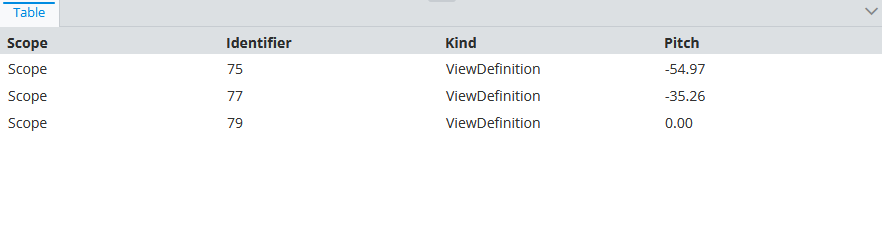 |
| `instanceFilter` as defined in the above ruleset | 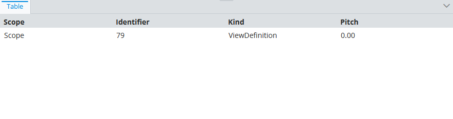     |

### Attribute: `onlyIfNotHandled`

When `true`, the specification takes effect only when all other specifications with higher priority are ruled out. This attribute is most useful for defining fallback specifications.

|                   |           |
| ----------------- | --------- |
| **Type**          | `boolean` |
| **Is Required**   | No        |
| **Default Value** | `false`   |

```ts
[[include:Presentation.SharedAttributes.OnlyIfNotHandled.Ruleset]]
```

|                           | Result                                                                                                     |
| ------------------------- | ---------------------------------------------------------------------------------------------------------- |
| `onlyIfNotHandled: true`  |                  |
| `onlyIfNotHandled: false` | 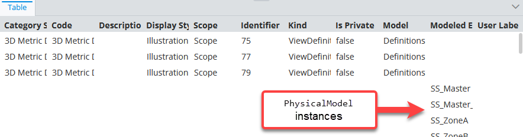 |

### Attribute: `priority`

Controls the order in which specifications are handled — specification with higher priority value is handled first. If priorities are equal, the specifications are handled in the order they appear in the ruleset.

|                   |          |
| ----------------- | -------- |
| **Type**          | `number` |
| **Is Required**   | No       |
| **Default Value** | `1000`   |

```ts
[[include:Presentation.SharedAttributes.Priority.Ruleset]]
```

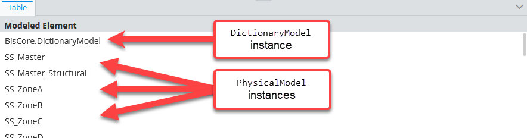

### Attribute: `relatedProperties`

Specifications of [related properties](./RelatedPropertiesSpecification.md) which are included in the generated content.

|                   |                                                                           |
| ----------------- | ------------------------------------------------------------------------- |
| **Type**          | [`RelatedPropertiesSpecification[]`](./RelatedPropertiesSpecification.md) |
| **Is Required**   | No                                                                        |
| **Default Value** | `[]`                                                                      |

```ts
[[include:Presentation.SharedAttributes.RelatedProperties.Ruleset]]
```

| `relatedProperties: []`                                                                             | `relatedProperties` as defined in the above ruleset                                                        |
| --------------------------------------------------------------------------------------------------- | ---------------------------------------------------------------------------------------------------------- |
| 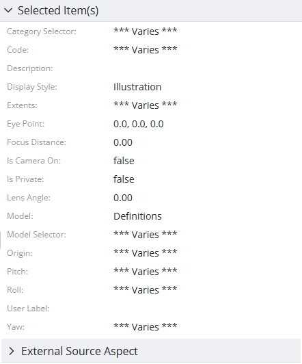 | 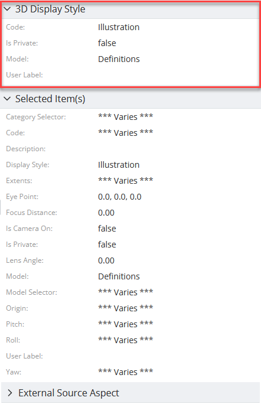 |

### Attribute: `calculatedProperties`

Specifications of [calculated properties](./CalculatedPropertiesSpecification.md) whose values are generated using provided [ECExpressions](../advanced/ECExpressions.md#ecinstance).

|                   |                                                                                 |
| ----------------- | ------------------------------------------------------------------------------- |
| **Type**          | [`CalculatedPropertiesSpecification[]`](./CalculatedPropertiesSpecification.md) |
| **Is Required**   | No                                                                              |
| **Default Value** | `[]`                                                                            |

```ts
[[include:Presentation.SharedAttributes.CalculatedProperties.Ruleset]]
```


### Attribute: `propertyCategories`

Defines a list of [custom categories](PropertyCategorySpecification.md).

Custom categories are not present in the result unless they contain at least one property. To assign a property to the category, reference its `id` in [`PropertySpecification.categoryId`](./PropertySpecification.md) when defining [`propertyOverrides`](#attribute-propertyoverrides).

|                   |                                                                         |
| ----------------- | ----------------------------------------------------------------------- |
| **Type**          | [`PropertyCategorySpecification[]`](./PropertyCategorySpecification.md) |
| **Is Required**   | No                                                                      |
| **Default Value** | `[]`                                                                    |

```ts
[[include:Presentation.SharedAttributes.PropertyCategories.Ruleset]]
```

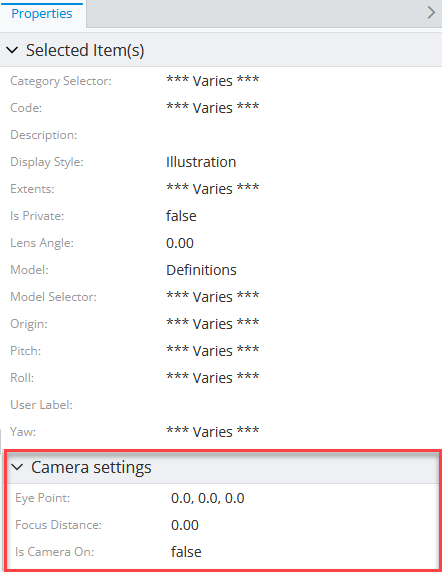

### Attribute: `propertyOverrides`

Specifications of various [property overrides](./PropertySpecification.md) that allow customizing individual properties display.

|                   |                                                         |
| ----------------- | ------------------------------------------------------- |
| **Type**          | [`PropertySpecification[]`](./PropertySpecification.md) |
| **Is Required**   | No                                                      |
| **Default Value** | `[]`                                                    |

```ts
[[include:Presentation.SharedAttributes.PropertyOverrides.Ruleset]]
```

|                                                     | Result                                                                                                     |
| --------------------------------------------------- | ---------------------------------------------------------------------------------------------------------- |
| `propertyOverrides: []`                             | 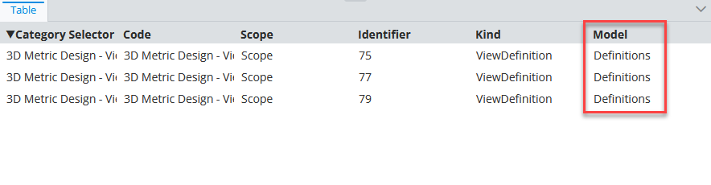        |
| `propertyOverrides` as defined in the above ruleset | 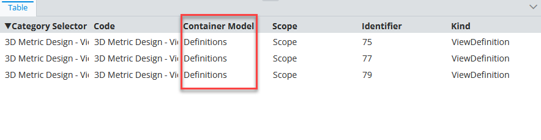 |

### Attribute: `relatedInstances`

Specifications of [related instances](../RelatedInstanceSpecification.md) that can be used when creating the content. There are several use cases when this is useful:

- When there's a need to only load instances that have a related instance. Providing a [related instance](../RelatedInstanceSpecification.md)
  specification with [isRequired](../RelatedInstanceSpecification.md#attribute-isrequired) set to `true` filters-out the instances that don't have the related instance.

- When there's a need to filter instances by a related instance value. The [alias](../RelatedInstanceSpecification.md) attribute may then be used
  in the [`instanceFilter` attribute](#attribute-instancefilter) to reference related instance property values.

- When there's a need to customize content based on related instance property values. Related instance classes are included when looking for [customization rules](../customization/index.md),
  which allows referencing related instances and their properties in [customization rule ECExpressions](../customization/ECExpressions.md#override-value) by their
  [alias](../RelatedInstanceSpecification.md#attribute-alias).

|                   |                                                                        |
| ----------------- | ---------------------------------------------------------------------- |
| **Type**          | [`RelatedInstanceSpecification[]`](../RelatedInstanceSpecification.md) |
| **Is Required**   | No                                                                     |
| **Default Value** | `[]`                                                                   |

```ts
[[include:Presentation.SharedAttributes.RelatedInstances.Ruleset]]
```

|                                                                   | Result                                                                                                                                |
| ----------------------------------------------------------------- | ------------------------------------------------------------------------------------------------------------------------------------- |
| `SpatialViewDefinition` instances                                 | 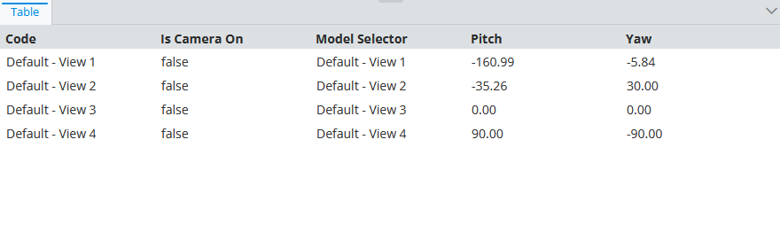                                           |
| `ModelSelector` instances                                         | 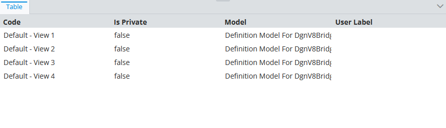                                                    |
| `ModelSelector` instances filtered by `SpatialViewDefinition.Yaw` | 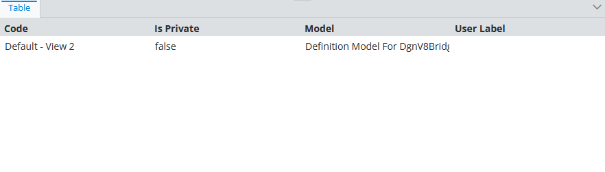 |

## Deprecated attributes

### Attribute: `handleInstancesPolymorphically`

Tells whether selecting instances from ECClasses specified in [`classes`](#attribute-classes) and [`excludedClasses`](#attribute-excludedclasses) attributes should be polymorphic or not.

The attribute was replaced by [MultiSchemaClasses.arePolymorphic](../MultiSchemaClassesSpecification.md#attribute-arepolymorphic) attribute specified individually for each class definition under [`classes`](#attribute-classes)
and [`excludedClasses`](#attribute-excludedclasses) attributes. At the moment, to keep backwards compatibility, this attribute acts as a fallback value in case the flag is not specified individually for a class definition.

|                   |           |
| ----------------- | --------- |
| **Type**          | `boolean` |
| **Is Required**   | No        |
| **Default Value** | `false`   |

### Attribute: `showImages`

Should image IDs be calculated for the returned instances. When `true`, [ImageIdOverride](../customization/ImageIdOverride.md) rules get applied when creating the content.

[ExtendedDataRule](../customization/ExtendedDataRule.md) should be used instead to provide image data to content items created by this specification. See [extended data usage page](../customization/ExtendedDataUsage.md) for more details

|                   |           |
| ----------------- | --------- |
| **Type**          | `boolean` |
| **Is Required**   | No        |
| **Default Value** | `false`   |
