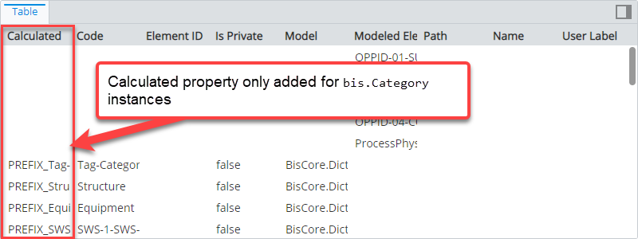
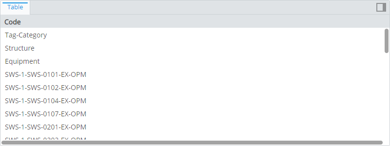
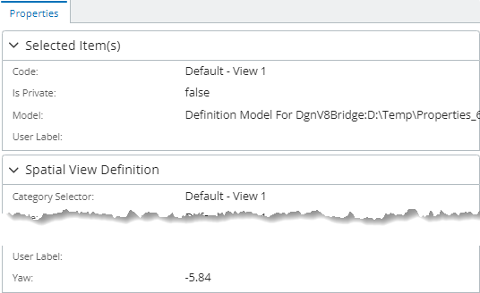
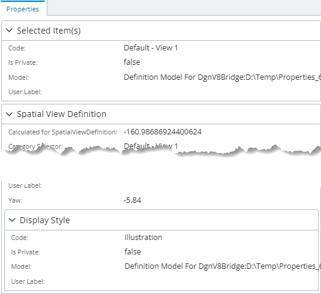
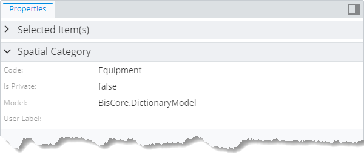
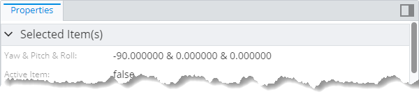
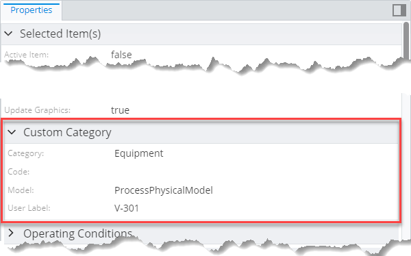
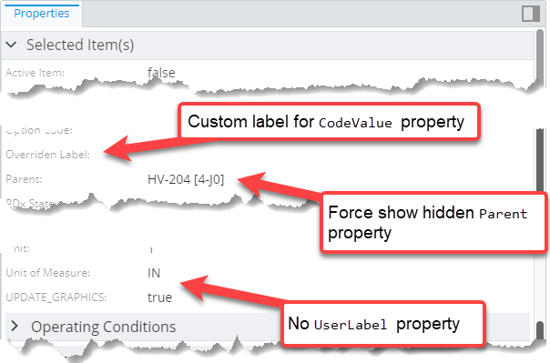

# Content modifier rule

> TypeScript type: [ContentModifier]($presentation-common).

Content modifiers are used to modify how instances of specified ECClasses are displayed in content which is produced using [content rules](./contentRule.md). They do not produce any content by themselves.

## Attributes

| Name                                                      | Required? | Type                                                                            | Default   |
| --------------------------------------------------------- | --------- | ------------------------------------------------------------------------------- | --------- |
| *Picking attributes*                                      |
| [`class`](#attribute-class)                               | No        | [`SingleSchemaClassSpecification`](../SingleSchemaClassSpecification.md)        | Any class |
| [`requiredSchemas`](#attribute-requiredschemas)           | No        | [`RequiredSchemaSpecification[]`](../RequiredSchemaSpecification.md)            | `[]`      |
| [`priority`](#attribute-priority)                         | No        | `number`                                                                        | `1000`    |
| [`applyOnNestedContent`](#attribute-applyonnestedcontent) | No        | `boolean`                                                                       | `false`   |
| *Content Modifiers*                                       |
| [`relatedProperties`](#attribute-relatedproperties)       | No        | [`RelatedPropertiesSpecification[]`](./RelatedPropertiesSpecification.md)       | `[]`      |
| [`calculatedProperties`](#attribute-calculatedproperties) | No        | [`CalculatedPropertiesSpecification[]`](./CalculatedPropertiesSpecification.md) | `[]`      |
| [`propertyCategories`](#attribute-propertycategories)     | No        | [`PropertyCategorySpecification[]`](./PropertyCategorySpecification.md)         | `[]`      |
| [`propertyOverrides`](#attribute-propertyoverrides)       | No        | [`PropertySpecification[]`](./PropertySpecification.md)                         | `[]`      |

### Attribute: `class`

Specification of ECClass whose content should be modified. The modifier applies [property overrides](./PropertySpecification.md) and [property categories](./PropertyCategorySpecification.md) to all content if this attribute is not specified. This attribute must be specified in order to apply [related](./RelatedPropertiesSpecification.md) or [calculated](./CalculatedPropertiesSpecification.md) properties to the content.


|                   |                                                                          |
| ----------------- | ------------------------------------------------------------------------ |
| **Type**          | [`SingleSchemaClassSpecification`](../SingleSchemaClassSpecification.md) |
| **Is Required**   | No                                                                       |
| **Default Value** | Any class                                                                |

```ts
[[include:Presentation.ContentModifier.Class.Ruleset]]
```



### Attribute: `requiredSchemas`

A list of [ECSchema requirements](../RequiredSchemaSpecification.md) that need to be met for the rule to be used.

|                   |                                                                      |
| ----------------- | -------------------------------------------------------------------- |
| **Type**          | [`RequiredSchemaSpecification[]`](../RequiredSchemaSpecification.md) |
| **Is Required**   | No                                                                   |
| **Default Value** | `[]`                                                                 |

```ts
[[include:Presentation.ContentModifier.RequiredSchemas.Ruleset]]
```

### Attribute: `priority`

Defines the order in which rules are handled, higher number means the rule is handled first. If priorities are equal, the rules are handled in the order they're defined.

|                   |          |
| ----------------- | -------- |
| **Type**          | `number` |
| **Is Required**   | No       |
| **Default Value** | `1000`   |

```ts
[[include:Presentation.ContentModifier.Priority.Ruleset]]
```



### Attribute: `applyOnNestedContent`

Specifies whether [calculatedProperties](./CalculatedPropertiesSpecification.md) and [relatedProperties](./RelatedPropertiesSpecification.md) specifications should also be applied on
[nested content](./Terminology.md#nested-content).

|                   |           |
| ----------------- | --------- |
| **Type**          | `boolean` |
| **Is Required**   | No        |
| **Default Value** | `false`   |

```ts
[[include:Presentation.ContentModifier.ApplyOnNestedContent.Ruleset]]
```

| `applyOnNestedContent: false`                                                                                      | `applyOnNestedContent: true`                                                                                   |
| ------------------------------------------------------------------------------------------------------------------ | -------------------------------------------------------------------------------------------------------------- |
|  |  |

### Attribute: `relatedProperties`

Specifications of [related properties](./RelatedPropertiesSpecification.md) which are included in the generated content.

|                   |                                                                           |
| ----------------- | ------------------------------------------------------------------------- |
| **Type**          | [`RelatedPropertiesSpecification[]`](./RelatedPropertiesSpecification.md) |
| **Is Required**   | No                                                                        |
| **Default Value** | `[]`                                                                      |

```ts
[[include:Presentation.ContentModifier.RelatedProperties.Ruleset]]
```



### Attribute: `calculatedProperties`

Specifications of [calculated properties](./CalculatedPropertiesSpecification.md) whose values are generated using provided [ECExpressions](../advanced/ECExpressions.md).

|                   |                                                                                 |
| ----------------- | ------------------------------------------------------------------------------- |
| **Type**          | [`CalculatedPropertiesSpecification[]`](./CalculatedPropertiesSpecification.md) |
| **Is Required**   | No                                                                              |
| **Default Value** | `[]`                                                                            |

```ts
[[include:Presentation.ContentModifier.CalculatedProperties.Ruleset]]
```



### Attribute: `propertyCategories`

Specifications for [custom categories](./PropertyCategorySpecification.md). Simply defining the categories does nothing - they have to be referenced from [property specification](./PropertySpecification.md) defined in [propertyOverrides](#attribute-propertyoverrides) by `id`.

|                   |                                                                         |
| ----------------- | ----------------------------------------------------------------------- |
| **Type**          | [`PropertyCategorySpecification[]`](./PropertyCategorySpecification.md) |
| **Is Required**   | No                                                                      |
| **Default Value** | `[]`                                                                    |

```ts
[[include:Presentation.ContentModifier.PropertyCategories.Ruleset]]
```



### Attribute: `propertyOverrides`

Specifications for various [property overrides](./PropertySpecification.md) that allow customizing property display.

|                   |                                                         |
| ----------------- | ------------------------------------------------------- |
| **Type**          | [`PropertySpecification[]`](./PropertySpecification.md) |
| **Is Required**   | No                                                      |
| **Default Value** | `[]`                                                    |

```ts
[[include:Presentation.ContentModifier.PropertyOverrides.Ruleset]]
```


