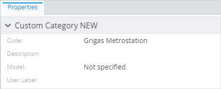
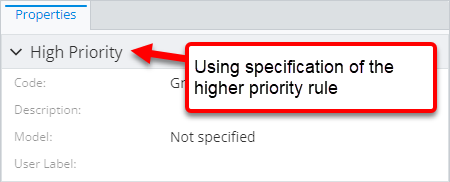
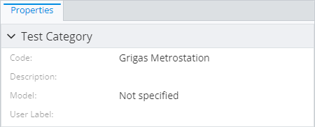

# Default property category override

> TypeScript type: [DefaultPropertyCategoryOverride]($presentation-common).

A rule that allows overriding the default property category.

The default property category is a category that gets assigned to properties that otherwise have no category.

## Attributes

| Name                                            | Required? | Type                                                                  | Default |
| ----------------------------------------------- | --------- | --------------------------------------------------------------------- | ------- |
| *Picking attributes*                            |
| [`requiredSchemas`](#attribute-requiredschemas) | No        | [`RequiredSchemaSpecification[]`](../RequiredSchemaSpecification.md)  | `[]`    |
| [`priority`](#attribute-priority)               | No        | `number`                                                              | `1000`  |
| *Content Modifiers*                             |
| [`specification`](#attribute-specification)     | Yes       | [`PropertyCategorySpecification`](./PropertyCategorySpecification.md) |         |

### Attribute: `requiredSchemas`

Lists [ECSchema requirements](../RequiredSchemaSpecification.md) that need to be met for the rule to take effect.

|                   |                                                                      |
| ----------------- | -------------------------------------------------------------------- |
| **Type**          | [`RequiredSchemaSpecification[]`](../RequiredSchemaSpecification.md) |
| **Is Required**   | No                                                                   |
| **Default Value** | `[]`                                                                 |

```ts
[[include:Presentation.Content.Customization.DefaultPropertyCategoryOverride.RequiredSchemas.Ruleset]]
```



### Attribute: `priority`

Controls rule priority. Because there can only be one default category, default category override with the highest priority value will override all other rules of the same type.

|                   |          |
| ----------------- | -------- |
| **Type**          | `number` |
| **Is Required**   | No       |
| **Default Value** | `1000`   |

```ts
[[include:Presentation.Content.Customization.DefaultPropertyCategoryOverride.Priority.Ruleset]]
```



### Attribute: `specification`

Specification for the custom property category.

|                 |                                                                       |
| --------------- | --------------------------------------------------------------------- |
| **Type**        | [`PropertyCategorySpecification`](./PropertyCategorySpecification.md) |
| **Is Required** | Yes                                                                   |

```ts
[[include:Presentation.Content.Customization.DefaultPropertyCategoryOverride.Specification.Ruleset]]
```


