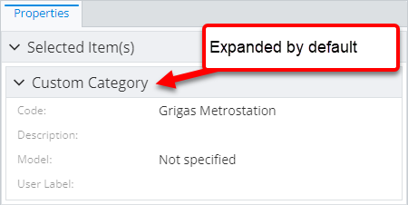

# Property category specification

> TypeScript type: [PropertyCategorySpecification]($presentation-common).

Content modifier for defining custom property categories. Custom categories are not present in the result unless they contain at least one property. One way to assign a property to the category is by using [property overrides](./PropertySpecification.md).

See [property categorization page](./PropertyCategorization.md) for more details.

## Attributes

| Name                                    | Required? | Type                                                  | Default     |
| --------------------------------------- | --------- | ----------------------------------------------------- | ----------- |
| [`id`](#attribute-id)                   | Yes       | `string`                                              |             |
| [`parentId`](#attribute-parentid)       | No        | `string \| CategoryIdentifier`                        |             |
| [`label`](#attribute-label)             | Yes       | `string`                                              |             |
| [`description`](#attribute-description) | No        | `string`                                              | `""`        |
| [`priority`](#attribute-priority)       | No        | `number`                                              | `1000`      |
| [`autoExpand`](#attribute-autoexpand)   | No        | `boolean`                                             | `false`     |
| [`renderer`](#attribute-renderer)       | No        | [`RendererSpecification`](./RendererSpecification.md) | `undefined` |

### Attribute: `id`

Category identifier used to reference the category definition from property overrides or other category definitions. The identifier has to be unique
within the list of category definitions where this specification is used.

|                 |          |
| --------------- | -------- |
| **Type**        | `string` |
| **Is Required** | Yes      |

```ts
[[include:Presentation.Content.Customization.PropertyCategorySpecification.Id.Ruleset]]
```


### Attribute: `parentId`

Identifier of a parent category. When specifying the parent category by ID, it has to be available in the scope of this category definition.

|                   |                                |
| ----------------- | ------------------------------ |
| **Type**          | `string \| CategoryIdentifier` |
| **Is Required**   | No                             |
| **Default Value** | No parent                      |

```ts
[[include:Presentation.Content.Customization.PropertyCategorySpecification.ParentId.Ruleset]]
```


### Attribute: `label`

Display label of the category. May be [localized](../advanced/Localization.md).

|                 |          |
| --------------- | -------- |
| **Type**        | `string` |
| **Is Required** | Yes      |

```ts
[[include:Presentation.Content.Customization.PropertyCategorySpecification.Label.Ruleset]]
```


### Attribute: `description`

Extensive description of the category. The description is assigned to the category object that's set on content fields and
it's up to UI component to decide how the description is displayed.

|                   |          |
| ----------------- | -------- |
| **Type**          | `string` |
| **Is Required**   | No       |
| **Default Value** | `""`     |

```ts
[[include:Presentation.Content.Customization.PropertyCategorySpecification.Description.Ruleset]]
```

```ts
[[include:Presentation.Content.Customization.PropertyCategorySpecification.Description.Result]]
```

### Attribute: `priority`

Assign a custom [CategoryDescription.priority]($presentation-common) to the category. It's up to the UI component to make sure that priority is respected - categories with higher
priority should appear before or above categories with lower priority.

|                   |          |
| ----------------- | -------- |
| **Type**          | `number` |
| **Is Required**   | No       |
| **Default Value** | `1000`   |

```ts
[[include:Presentation.Content.Customization.PropertyCategorySpecification.Priority.Ruleset]]
```

```ts
[[include:Presentation.Content.Customization.PropertyCategorySpecification.Priority.Result]]
```


### Attribute: `autoExpand`

Controls the value of [CategoryDescription.expand]($presentation-common) which tells the UI component displaying the category
to auto-expand the category.

|                   |           |
| ----------------- | --------- |
| **Type**          | `boolean` |
| **Is Required**   | No        |
| **Default Value** | `false`   |

```ts
[[include:Presentation.Content.Customization.PropertyCategorySpecification.AutoExpand.Ruleset]]
```

```ts
[[include:Presentation.Content.Customization.PropertyCategorySpecification.AutoExpand.Result]]
```

| `autoExpand: false`                                                                                                                   | `autoExpand: true`                                                                                                                  |
| ------------------------------------------------------------------------------------------------------------------------------------- | ----------------------------------------------------------------------------------------------------------------------------------- |
|  |  |

### Attribute: `renderer`

Custom category [renderer specification](./RendererSpecification.md) that allows assigning a custom category renderer to be used
in UI. This specification is used to set up [CategoryDescription.renderer]($presentation-common) for this category and it's up to
the UI component to make sure appropriate renderer is used to render the category.

See [Custom property category renderers](./PropertyCategoryRenderers.md) page for information on how custom categories
are handled in our UI components.

|                   |                                                       |
| ----------------- | ----------------------------------------------------- |
| **Type**          | [`RendererSpecification`](./RendererSpecification.md) |
| **Is Required**   | No                                                    |
| **Default Value** | `undefined`                                           |

```ts
[[include:Presentation.Content.Customization.PropertyCategorySpecification.Renderer.Ruleset]]
```

```ts
[[include:Presentation.Content.Customization.PropertyCategorySpecification.Renderer.Result]]
```
