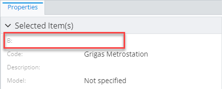
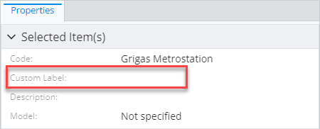
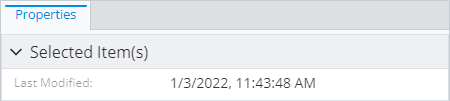
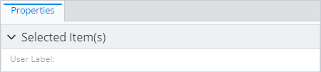
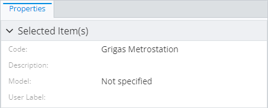
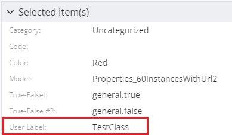
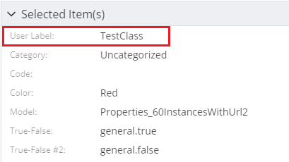

# Property specification

> TypeScript type: [PropertySpecification]($presentation-common).

This specification allows overriding some attributes of specific ECProperty or define how it's displayed.

## Attributes

| Name                                                                                                | Required? | Type                                                              | Default     |
| --------------------------------------------------------------------------------------------------- | --------- | ----------------------------------------------------------------- | ----------- |
| [`name`](#attribute-name)                                                                           | Yes       | `string`                                                          |             |
| [`overridesPriority`](#attribute-overridespriority)                                                 | No        | `number`                                                          | `1000`      |
| [`labelOverride`](#attribute-labeloverride)                                                         | No        | `string`                                                          | No override |
| [`categoryId`](#attribute-categoryid)                                                               | No        | `string \| CategoryIdentifier`                                    | No override |
| [`isDisplayed`](#attribute-isdisplayed)                                                             | No        | `boolean \| string`                                               | No override |
| [`doNotHideOtherPropertiesOnDisplayOverride`](#attribute-donothideotherpropertiesondisplayoverride) | No        | `boolean`                                                         | `false`     |
| [`renderer`](#attribute-renderer)                                                                   | No        | [`RendererSpecification`](./RendererSpecification.md)             | No override |
| [`editor`](#attribute-editor)                                                                       | No        | [`PropertyEditorSpecification`](./PropertyEditorSpecification.md) | No override |
| [`isReadOnly`](#attribute-isreadonly)                                                               | No        | `boolean`                                                         | No override |
| [`priority`](#attribute-priority)                                                                   | No        | `number`                                                          | No override |

### Attribute: `name`

Name of the ECProperty to apply overrides to.

A `[*]` suffix may be used for array properties to target their items rather than arrays themselves, for example: `MyArrayProperty[*]`. In this case, only [`renderer`](#attribute-renderer) and
[`editor`](#attribute-editor) overrides have effect.

A `"*"` may be specified to match all properties in current context. The current context is determined based on where the override is specified:

- When used in a [content modifier](./contentModifier.md#attribute-propertyoverrides), the properties of the ECClass specified by the [`class` attribute](./contentModifier.md#attribute-class) are used.
- When used in one of the [content specifications](./contentRule.md#attribute-specifications), properties produced by that specification are used.

|                 |          |
| --------------- | -------- |
| **Type**        | `string` |
| **Is Required** | Yes      |

### Attribute: `overridesPriority`

There may be multiple property specifications that apply to a single property and there may be conflicts between different attributes. The `overridesPriority` attribute is here to help
solve the problem - if multiple specifications attempt to override the same attribute, the override of specification with highest `overridesPriority` value is used. The order of overrides
from specification with the same `overridesPriority` is defined by the order they appear in the overrides list.

|                   |          |
| ----------------- | -------- |
| **Type**          | `number` |
| **Is Required**   | No       |
| **Default Value** | `1000`   |

```ts
[[include:Presentation.Content.Customization.PropertySpecification.OverridesPriority.Ruleset]]
```



### Attribute: `labelOverride`

This is an attribute that allows overriding the property label. May be [localized](../advanced/Localization.md).

|                   |             |
| ----------------- | ----------- |
| **Type**          | `string`    |
| **Is Required**   | No          |
| **Default Value** | No override |

```ts
[[include:Presentation.Content.Customization.PropertySpecification.LabelOverride.Ruleset]]
```



### Attribute: `categoryId`

The attribute allows moving the property into a different category. There are several options:

- Reference a category by ID used in [`PropertyCategorySpecification`](./PropertyCategorySpecification.md) in the current context.
  The current context contains categories specified in the same [content specification](./index.md#specifications) or
  [content modifiers](./contentModifier.md) that are applied on the same or base ECClass as this property specification.

- Move to `DefaultParent` category. This is useful when using with [related properties](./RelatedPropertiesSpecification.md), to
  avoid putting them inside a special related class category and instead show them next to properties of the source class.

- Move to `Root` category. This is useful when using with [related properties](./RelatedPropertiesSpecification.md), to
  avoid putting them inside a special related class category and instead show them in the root category.

See [property categorization page](./PropertyCategorization.md) for more details.

|                   |                                |
| ----------------- | ------------------------------ |
| **Type**          | `string \| CategoryIdentifier` |
| **Is Required**   | No                             |
| **Default Value** | No override                    |

```ts
[[include:Presentation.Content.Customization.PropertySpecification.CategoryId.Ruleset]]
```


### Attribute: `isDisplayed`

This attribute controls whether the particular property is present in the result, even when it is marked as hidden in the ECSchema. The allowed settings are:

- Omitted or `undefined`: property visibility is controlled by the ECSchema.
- `true`: property is made visible. **Warning:** this will automatically hide all other properties of the same class. If this behavior is not desirable, set [`doNotHideOtherPropertiesOnDisplayOverride` attribute](#attribute-donothideotherpropertiesondisplayoverride) to `true`.
- `false`: property is made hidden.
- The value can be set using an [ECExpression](./ECExpressions.md#property-overrides). **Warning:** this will automatically hide all other properties of the same class, no matter what the expression evaluates to. If this behavior is not desirable, set [`doNotHideOtherPropertiesOnDisplayOverride` attribute](#attribute-donothideotherpropertiesondisplayoverride) to `true`.

|                   |                                                                |
| ----------------- | -------------------------------------------------------------- |
| **Type**          | `boolean` \| [ECExpression](./ECExpressions.md#rule-condition) |
| **Is Required**   | No                                                             |
| **Default Value** | No override                                                    |

#### Using `isDisplayed` attribute with `boolean` value

```ts
[[include:Presentation.Content.Customization.PropertySpecification.IsDisplayedBoolean.Ruleset]]
```



#### Using `isDisplayed` attribute with `ECExpression` value

```ts
[[include:Presentation.Content.Customization.PropertySpecification.IsDisplayedECExpression.Ruleset]]
```

| Ruleset variable values | Result                                                                                                                                                                      |
| ----------------------- | --------------------------------------------------------------------------------------------------------------------------------------------------------------------------- |
| `SHOW_LABEL = false`    |  |
| `SHOW_LABEL = true`     |    |

### Attribute: `doNotHideOtherPropertiesOnDisplayOverride`

This attribute controls whether making the property visible using [`isDisplayed`](#attribute-isdisplayed) should automatically hide all other properties of the same class. When `true`, this behavior is disabled.

|                   |           |
| ----------------- | --------- |
| **Type**          | `boolean` |
| **Is Required**   | No        |
| **Default Value** | `false`   |

```ts
[[include:Presentation.Content.Customization.PropertySpecification.DoNotHideOtherPropertiesOnDisplayOverride.Ruleset]]
```

| `doNotHideOtherPropertiesOnDisplayOverride: false`                                                                                                                                                | `doNotHideOtherPropertiesOnDisplayOverride: true`                                                                                                                                               |
| ------------------------------------------------------------------------------------------------------------------------------------------------------------------------------------------------- | ----------------------------------------------------------------------------------------------------------------------------------------------------------------------------------------------- |
|  |  |

### Attribute: `renderer`

Custom property [renderer specification](./RendererSpecification.md) that allows assigning a custom value renderer to be used in UI. The
specification is used to set up [Field.renderer]($presentation-common) for this property and it's up to the UI component to make sure
appropriate renderer is used to render the property.

See [Custom property value renderers](./PropertyValueRenderers.md) page for a list of available renderers or how to register a custom one.

|                   |                                                       |
| ----------------- | ----------------------------------------------------- |
| **Type**          | [`RendererSpecification`](./RendererSpecification.md) |
| **Is Required**   | No                                                    |
| **Default Value** | No override                                           |

```ts
[[include:Presentation.Content.Customization.PropertySpecification.Renderer.Ruleset]]
```

```ts
[[include:Presentation.Content.Customization.PropertySpecification.Renderer.Result]]
```

### Attribute: `editor`

Custom [property editor specification](./PropertyEditorSpecification) that allows assigning a custom value editor
to be used in UI.

|                   |                                                                   |
| ----------------- | ----------------------------------------------------------------- |
| **Type**          | [`PropertyEditorSpecification`](./PropertyEditorSpecification.md) |
| **Is Required**   | No                                                                |
| **Default Value** | No override                                                       |

```ts
[[include:Presentation.Content.Customization.PropertySpecification.Editor.Ruleset]]
```

```ts
[[include:Presentation.Content.Customization.PropertySpecification.Editor.Result]]
```

### Attribute `isReadOnly`

This attribute controls whether the property field is read-only. If the attribute value is not set, the field is read-only when at least one of the properties is read-only.

|                   |             |
| ----------------- | ----------- |
| **Type**          | `boolean`   |
| **Is Required**   | No          |
| **Default Value** | No override |

```ts
[[include:Presentation.Content.Customization.PropertySpecification.IsReadOnly.Ruleset]]
```

```ts
[[include:Presentation.Content.Customization.PropertySpecification.IsReadOnly.Result]]
```

### Attribute `priority`

This attribute controls the order in which property fields should be displayed. Property fields with higher priority
will appear before property fields with lower priority. If the attribute value is not set, the field's priority
will be the maximum priority of its properties.

|                   |             |
| ----------------- | ----------- |
| **Type**          | `number`    |
| **Is Required**   | No          |
| **Default Value** | No override |

```ts
[[include:Presentation.Content.Customization.PropertySpecification.Priority.Ruleset]]
```

| `priority: 0`                                                                                                       | `priority: 9999`                                                                                                          |
| ------------------------------------------------------------------------------------------------------------------- | ------------------------------------------------------------------------------------------------------------------------- |
|  |  |
