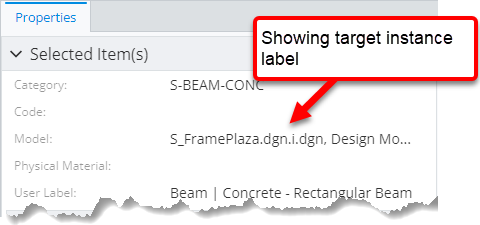
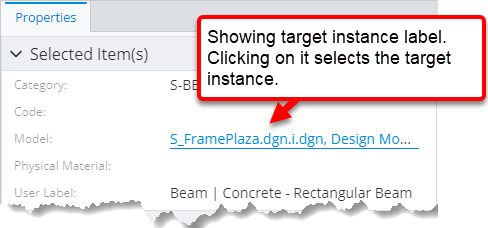
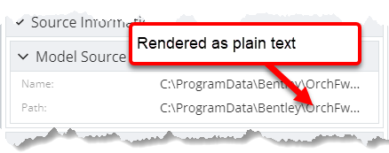
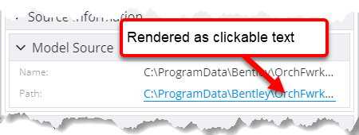
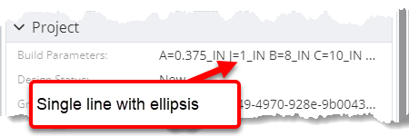
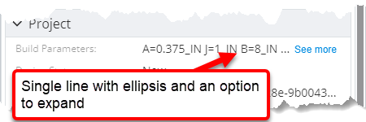
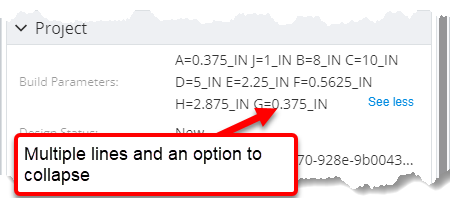
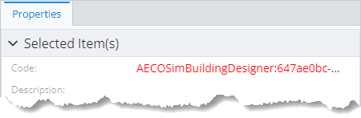

# Custom property value renderers

Generally, data in [Property Grid]($components-react:PropertyGrid) and Table components is rendered by property value renderers. By defining and registering custom renderers, users can extend property rendering system to support new data types and UI interactions.

A custom renderer can be used by assigning it to specific properties through a property override. See [`PropertySpecification.renderer` section](../content/PropertySpecification.md#attribute-renderer) for an example.

## Built-in renderers

iTwin.js UI and presentation packages register some built-in value renderers that can be used out of the box.

### `SelectableInstance`

> **Component:** [InstanceKeyValueRenderer]($presentation-components)
>
> **Prerequisites:**
>
> - Property value type is [Primitives.InstanceKey]($appui-abstract). Generally those are navigation type of properties.
> - The property is rendered within a unified selection context. See [useUnifiedSelectionContext]($presentation-components) for more details.

The renderer renders nothing when property value is `undefined`. When it's defined, the value is rendered as a clickable text.

The property display value is used for the displayed text. If it is not set, then the [TypeConverter]($components-react) system is used to calculate displayed string from the raw property value.

When the clickable text clicked on, the available unified selection context is used to replace active selection with the instance key stored in the value by calling [UnifiedSelectionContext.replaceSelection]($presentation-components).

| Default rendering                                                                                                | `SelectableInstance` rendering                                                                            |
| ---------------------------------------------------------------------------------------------------------------- | --------------------------------------------------------------------------------------------------------- |
|  |  |

### `url`

> **Component:** [UrlPropertyValueRenderer]($components-react)
>
> **Prerequisites:**
>
> - Property type is one of [StandardTypeNames.URL]($appui-abstract), [StandardTypeNames.String]($appui-abstract) or [StandardTypeNames.Text]($appui-abstract).
>
> **Default for:** Properties with [StandardTypeNames.URL]($appui-abstract) type name. Generally those are properties with `"URI"` extended type in ECSchema.

The renderer renders nothing when property value is `undefined`. When it's defined, the value is rendered as a clickable text.

The property value is passed through the [TypeConverter]($components-react) system to calculate displayed string. When the text clicked on, the user is navigated to the URL set to that text. **Note:** the renderer doesn't validate the text to really be a URL.

| Default rendering                                                                                  | `url` rendering                                                           |
| -------------------------------------------------------------------------------------------------- | ------------------------------------------------------------------------- |
|  |  |

### `multiline`

> **Component:** [MultilineTextPropertyValueRenderer]($components-react)
>
> **Prerequisites:**
>
> - Property value is of primitive type.

The renderer renders nothing when property value is `undefined`. When it's defined, the value is passed through the [TypeConverter]($components-react) system to calculate displayed string. The string is rendered in a single line with ellipsis and is allowed to be expanded into multiple lines to fit the whole string.

| Default rendering                                                                                        | `multiline` rendering                                                                                                                                                                                             |
| -------------------------------------------------------------------------------------------------------- | ----------------------------------------------------------------------------------------------------------------------------------------------------------------------------------------------------------------- |
|  |   |

## Adding a custom renderer

A new custom property value renderer can be added by registering a class implementing [IPropertyValueRenderer]($components-react) to the [PropertyValueRendererManager]($components-react):

```tsx
[[include:Presentation.Content.Customization.PropertySpecification.Renderer.Register]]
```

The renderer registered above is used whenever a property with that renderer name is being rendered. The below ruleset demonstrates assigning the renderer to a property:

```ts
[[include:Presentation.Content.Customization.PropertySpecification.Renderer.Ruleset]]
```


