# Related properties specification

> TypeScript type: [RelatedPropertiesSpecification]($presentation-common).

This specification allows including related instance properties into the content.

## Attributes

| Name                                                                              | Required? | Type                                                                    | Default             |
| --------------------------------------------------------------------------------- | --------- | ----------------------------------------------------------------------- | ------------------- |
| [`propertiesSource`](#attribute-propertiessource)                                 | Yes       | [`RelationshipPathSpecification`](../RelationshipPathSpecification.md)  |                     |
| [`instanceFilter`](#attribute-instancefilter)                                     | No        | [ECExpression](./ECExpressions.md#instance-filter)                      | `""`                |
| [`handleTargetClassPolymorphically`](#attribute-handletargetclasspolymorphically) | No        | `boolean`                                                               | `false`             |
| [`relationshipMeaning`](#attribute-relationshipmeaning)                           | No        | `"SameInstance" \| "RelatedInstance"`                                   | `"RelatedInstance"` |
| [`properties`](#attribute-properties)                                             | No        | `Array<string \| PropertySpecification> \| "_none_" \| "*"`             | `"*"`               |
| [`autoExpand`](#attribute-autoexpand)                                             | No        | `boolean`                                                               | `false`             |
| [`skipIfDuplicate`](#attribute-skipifduplicate)                                   | No        | `boolean`                                                               | `false`             |
| [`nestedRelatedProperties`](#attribute-nestedrelatedproperties)                   | No        | [`RelatedPropertiesSpecification[]`](#related-properties-specification) | `[]`                |
| [`relationshipProperties`](#attribute-relationshipproperties)                     | No        | `Array<string \| PropertySpecification> \| "_none_" \| "*"`             | `[]`                |
| [`forceCreateRelationshipCategory`](#attribute-forcecreaterelationshipcategory)   | No        | `boolean`                                                               | `false`             |

### Attribute: `propertiesSource`

Specifies a chain of [relationship path specifications](../RelationshipPathSpecification.md) that forms a path from the content instance to the related instance(s) whose properties should additionally be loaded.

|                 |                                                                        |
| --------------- | ---------------------------------------------------------------------- |
| **Type**        | [`RelationshipPathSpecification`](../RelationshipPathSpecification.md) |
| **Is Required** | Yes                                                                    |

The path may point to more than one related instance, so the result always stores related properties in a form of a struct-array, where each struct represents a single related instance. However, often there's only one related instance and in that case a UI component displaying the result may choose to "destructure" the struct-array. An example of such component is the Property Grid:

```ts
[[include:Presentation.Content.Customization.RelatedPropertiesSpecification.PropertiesSource.Ruleset]]
```

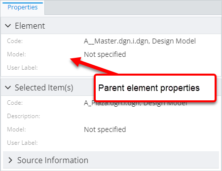

Here's how the result looks like if there's more than one related instance:

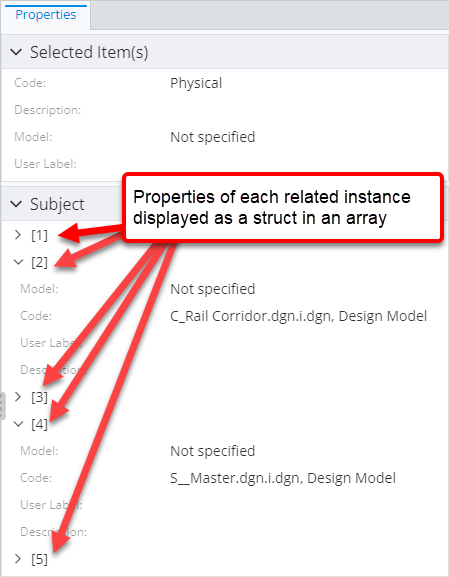

### Attribute: `instanceFilter`

Specifies an [ECExpression](./ECExpressions.md#instance-filter) for filtering instances targeted by the [`propertiesSource` attribute](#attribute-propertiessource).

```ts
[[include:Content.Customization.RelatedPropertiesSpecification.InstanceFilter.Ruleset]]
```

| without filter                                                                                                                       | with filter                                                                                                                    |
| ------------------------------------------------------------------------------------------------------------------------------------ | ------------------------------------------------------------------------------------------------------------------------------ |
| 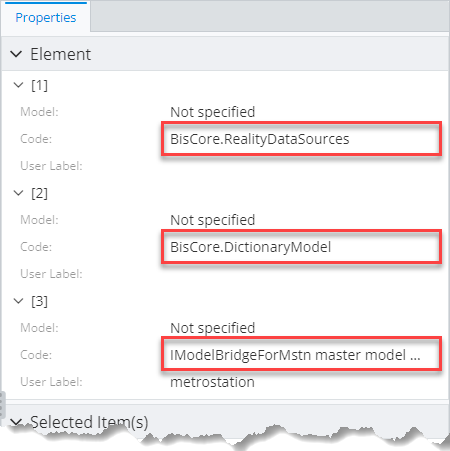 | 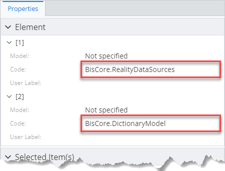 |

**Note:** A specification with higher priority and no instance filter overrides a specification with lower priority whether or not it has a filter.

### Attribute: `handleTargetClassPolymorphically`

The attribute tells whether the target class specified through [`propertiesSource` attribute](#attribute-propertiessource) should be handled
polymorphically. This means properties of the concrete class are loaded in addition to properties of the target class itself.

**Note:** There's a difference between loading properties and instances polymorphically. This attribute
only controls polymorphism of properties, while instances are always looked up in a polymorphic fashion.

|                   |           |
| ----------------- | --------- |
| **Type**          | `boolean` |
| **Is Required**   | No        |
| **Default Value** | `false`   |

```ts
[[include:Presentation.Content.Customization.RelatedPropertiesSpecification.HandleTargetClassPolymorphically.Ruleset]]
```

| `handleTargetClassPolymorphically: false`                                                                                                                                            | `handleTargetClassPolymorphically: true`                                                                                                                                           |
| ------------------------------------------------------------------------------------------------------------------------------------------------------------------------------------ | ---------------------------------------------------------------------------------------------------------------------------------------------------------------------------------- |
| 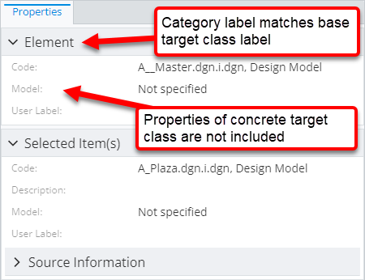 | 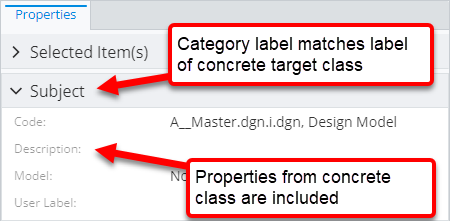 |

### Attribute: `relationshipMeaning`

The attribute describes what the related properties mean to the [primary instance](./Terminology.md#primary-instance) whose properties are
displayed. There are two possible options:

- `RelatedInstance` means that the properties should be distinguished from properties of the [primary instance](./Terminology.md#primary-instance)
  and shown separately to make it clear they belong to another instance. Generally that means they're assigned a separate root category.

- `SameInstance` means that the properties should be displayed as if they belonged to the [primary instance](./Terminology.md#primary-instance). Generally
  that means they assigned a category, that's nested under the default category.

See [property categorization page](./PropertyCategorization.md) page for more details.

|                   |                                       |
| ----------------- | ------------------------------------- |
| **Type**          | `"SameInstance" \| "RelatedInstance"` |
| **Is Required**   | No                                    |
| **Default Value** | `"RelatedInstance"`                   |

```ts
[[include:Presentation.Content.Customization.RelatedPropertiesSpecification.RelationshipMeaning.Ruleset]]
```

| `relationshipMeaning: "RelatedInstance"`                                                                                                                                      | `relationshipMeaning: "SameInstance"`                                                                                                                                   |
| ----------------------------------------------------------------------------------------------------------------------------------------------------------------------------- | ----------------------------------------------------------------------------------------------------------------------------------------------------------------------- |
|  |  |

### Attribute: `properties`

List of names or definitions of related class properties that should be included in the content. In addition, a couple of special values are allowed:

- `"_none_"` means none of the properties should be picked up. Generally this is used in combination with the [`nestedRelatedProperties` attribute](#attribute-nestedrelatedproperties).
- `"*"` means all properties should be picked up.

|                   |                                                             |
| ----------------- | ----------------------------------------------------------- |
| **Type**          | `Array<string \| PropertySpecification> \| "_none_" \| "*"` |
| **Is Required**   | No                                                          |
| **Default Value** | `"*"`                                                       |

```ts
[[include:Presentation.Content.Customization.RelatedPropertiesSpecification.Properties.Ruleset]]
```

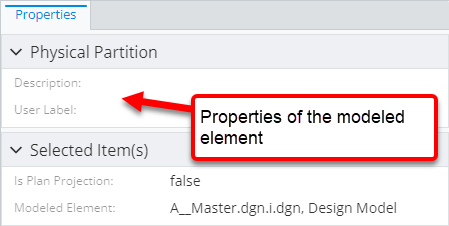

### Attribute: `autoExpand`

The attribute specifies whether the field containing related properties should be assigned the [NestedContentField.autoExpand]($presentation-common)
attribute. The attribute tells UI components showing the properties that they should be initially displayed in the expanded state.

|                   |           |
| ----------------- | --------- |
| **Type**          | `boolean` |
| **Is Required**   | No        |
| **Default Value** | `false`   |

```ts
[[include:Presentation.Content.Customization.RelatedPropertiesSpecification.AutoExpand.Ruleset]]
```

| `autoExpand: false`                                                                                                                    | `autoExpand: true`                                                                                                                   |
| -------------------------------------------------------------------------------------------------------------------------------------- | ------------------------------------------------------------------------------------------------------------------------------------ |
| 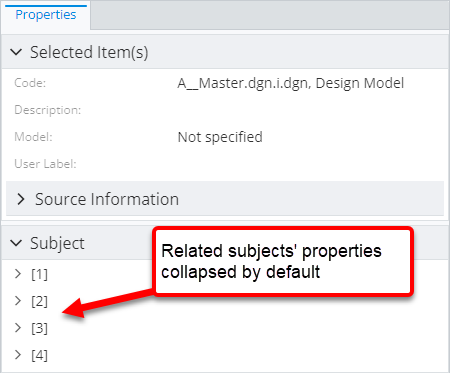 |  |

### Attribute: `skipIfDuplicate`

Specifies whether the specification should be ignored if another higher priority specification for the same relationship already exists.

|                   |           |
| ----------------- | --------- |
| **Type**          | `boolean` |
| **Is Required**   | No        |
| **Default Value** | `false`   |

```ts
[[include:Presentation.Content.Customization.RelatedPropertiesSpecification.SkipIfDuplicate.Ruleset]]
```

| `skipIfDuplicate: false`                                                                                                                          | `skipIfDuplicate: true`                                                                                                                         |
| ------------------------------------------------------------------------------------------------------------------------------------------------- | ----------------------------------------------------------------------------------------------------------------------------------------------- |
| 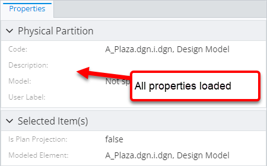 | 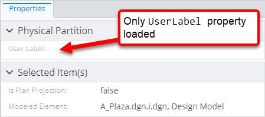 |

### Attribute: `nestedRelatedProperties`

The attribute allows loading additional related properties that are related to the target instance of this specification.

|                   |                                                                         |
| ----------------- | ----------------------------------------------------------------------- |
| **Type**          | [`RelatedPropertiesSpecification[]`](#related-properties-specification) |
| **Is Required**   | No                                                                      |
| **Default Value** | `[]`                                                                    |

```ts
[[include:Presentation.Content.Customization.RelatedPropertiesSpecification.NestedRelatedProperties.Ruleset]]
```

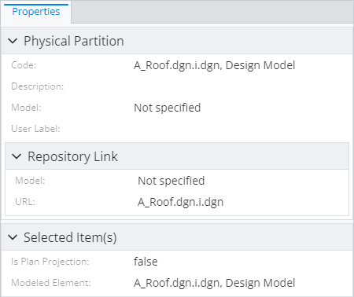

### Attribute: `relationshipProperties`

Lists [ECRelationshipClass](../../bis/ec/ec-relationship-class.md) properties that should be included in the content. Only the properties from the last relationship of [`propertiesSource`](#attribute-propertiessource) path are accessible. In addition, a couple of special values are allowed:

- `"_none_"` means none of the relationship properties should be picked up.
- `"*"` means all relationship properties should be picked up.

|                   |                                                             |
| ----------------- | ----------------------------------------------------------- |
| **Type**          | `Array<string \| PropertySpecification> \| "_none_" \| "*"` |
| **Is Required**   | No                                                          |
| **Default Value** | `[]`                                                        |

```ts
[[include:Presentation.Content.Customization.RelatedPropertiesSpecification.RelationshipProperties.Ruleset]]
```

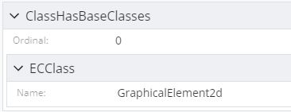

### Attribute: `forceCreateRelationshipCategory`

Specifies whether a relationship category should be created regardless of whether any relationship properties were included.

|                   |           |
| ----------------- | --------- |
| **Type**          | `boolean` |
| **Is Required**   | No        |
| **Default Value** | `false`   |

```ts
[[include:Presentation.Content.Customization.RelatedPropertiesSpecification.ForceCreateRelationshipCategory.Ruleset]]
```

| `forceCreateRelationshipCategory: false`                                                                                                                                               | `forceCreateRelationshipCategory: true`                                                                                                                                              |
| -------------------------------------------------------------------------------------------------------------------------------------------------------------------------------------- | ------------------------------------------------------------------------------------------------------------------------------------------------------------------------------------ |
| 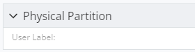 | 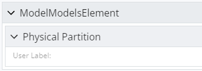 |
