# Instance label override

> TypeScript type: [InstanceLabelOverride]($presentation-common).

Instance label override rule provides a way to set instance label to one of its property values, other attributes and/or combination of them.

## Attributes

| Name                                              | Required? | Type                                                                     | Default |
| ------------------------------------------------- | --------- | ------------------------------------------------------------------------ | ------- |
| *Filtering*                                       |
| [`requiredSchemas`](#attribute-requiredschemas)   | No        | [`RequiredSchemaSpecification[]`](../RequiredSchemaSpecification.md)     | `[]`    |
| [`priority`](#attribute-priority)                 | No        | `number`                                                                 | `1000`  |
| [`onlyIfNotHandled`](#attribute-onlyifnothandled) | No        | `boolean`                                                                | `false` |
| [`class`](#attribute-class)                       | Yes       | [`SingleSchemaClassSpecification`](../SingleSchemaClassSpecification.md) |         |
| *Overrides*                                       |
| [`values`](#attribute-values)                     | Yes       | `InstanceLabelOverrideValueSpecification[]`                              |         |

### Attribute: `requiredSchemas`

A list of [ECSchema requirements](../RequiredSchemaSpecification.md) that need to be met for the rule to be used.

|                   |                                                                      |
| ----------------- | -------------------------------------------------------------------- |
| **Type**          | [`RequiredSchemaSpecification[]`](../RequiredSchemaSpecification.md) |
| **Is Required**   | No                                                                   |
| **Default Value** | `[]`                                                                 |

```ts
[[include:Presentation.InstanceLabelOverride.RequiredSchemas.Ruleset]]
```

### Attribute: `priority`

Defines the order in which rules are handled - higher priority means the rule is handled first. If priorities are equal, the rules are handled in the order they're defined. The attribute may be especially useful when combined with [`onlyIfNotHandled` attribute](#attribute-onlyifnothandled).

|                   |          |
| ----------------- | -------- |
| **Type**          | `number` |
| **Is Required**   | No       |
| **Default Value** | `1000`   |

```ts
[[include:Presentation.InstanceLabelOverride.Priority.Ruleset]]
```

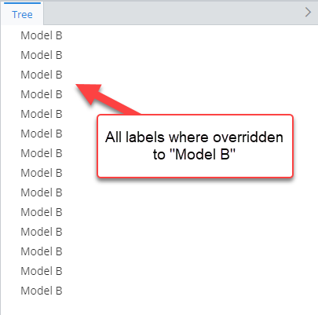

### Attribute: `onlyIfNotHandled`

When `true`, the rule takes effect only when all other instance label overrides with higher priority are ruled out. This attribute is most useful for defining fallback rules.

|                   |           |
| ----------------- | --------- |
| **Type**          | `boolean` |
| **Is Required**   | No        |
| **Default Value** | `false`   |

```ts
[[include:Presentation.InstanceLabelOverride.OnlyIfNotHandled.Ruleset]]
```

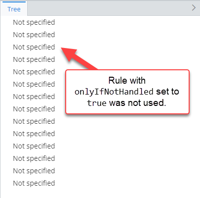

### Attribute: `class`

Specifies the ECClass to apply this rule to.

|                 |                                                                          |
| --------------- | ------------------------------------------------------------------------ |
| **Type**        | [`SingleSchemaClassSpecification`](../SingleSchemaClassSpecification.md) |
| **Is Required** | Yes                                                                      |

```ts
[[include:Presentation.InstanceLabelOverride.Class.Ruleset]]
```

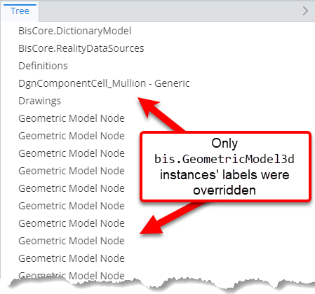

### Attribute: `values`

Specifications of values used to override label. The first non-empty value is used as the actual label. There are 8 types of supported value specifications:

- [Composite value specification](#composite-value-specification)
- [Property value specification](#property-value-specification)
- [String value specification](#string-value-specification)
- [Class name value specification](#class-name-value-specification)
- [Class label value specification](#class-label-value-specification)
- [BriefcaseId value specification](#briefcaseid-value-specification)
- [LocalId value specification](#localid-value-specification)
- [Related instance label value specification](#related-instance-label-value-specification)

|                 |                                             |
| --------------- | ------------------------------------------- |
| **Type**        | `InstanceLabelOverrideValueSpecification[]` |
| **Is Required** | Yes                                         |

#### Composite value specification

Specification allows creating a label value composited using multiple other specifications.

| Name        | Required? | Type                                                                             | Default         | Meaning                                                                                                                                               |
| ----------- | --------- | -------------------------------------------------------------------------------- | --------------- | ----------------------------------------------------------------------------------------------------------------------------------------------------- |
| `parts`     | Yes       | `Array<{ spec: InstanceLabelOverrideValueSpecification; isRequired?: boolean }>` |                 | Parts of the value. If any of the parts with `isRequired` flag evaluate to an empty string, the result of this specification is also an empty string. |
| `separator` | No        | `string`                                                                         | Space character | Separator to use when joining the parts.                                                                                                              |

```ts
[[include:Presentation.InstanceLabelOverride.CompositeValueSpecification.Ruleset]]
```

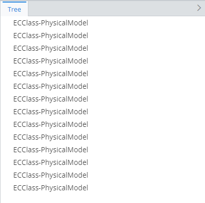

#### Property value specification

Specification uses property value as the label content.

| Name             | Required? | Type                                                                   | Default    | Meaning                                                                                                                                    |
| ---------------- | --------- | ---------------------------------------------------------------------- | ---------- | ------------------------------------------------------------------------------------------------------------------------------------------ |
| `propertyName`   | Yes       | `string`                                                               |            | Name of the property whose value should be used.                                                                                           |
| `propertySource` | No        | [`RelationshipPathSpecification`](../RelationshipPathSpecification.md) | Empty path | [Specification of the relationship path](../RelationshipPathSpecification.md) from `InstanceLabelOverride.class` to class of the property. |

Two types of properties can be used to override label:

- Direct instance properties.

  ```ts
  [[include:Presentation.InstanceLabelOverride.PropertyValueSpecification.Ruleset]]
  ```

  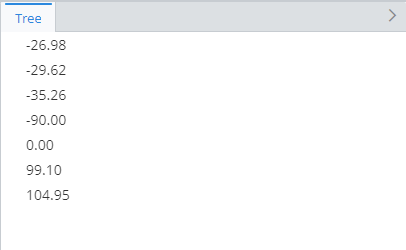

- Properties of related instance.

  ```ts
  [[include:Presentation.InstanceLabelOverride.RelatedPropertyValueSpecification.Ruleset]]
  ```

  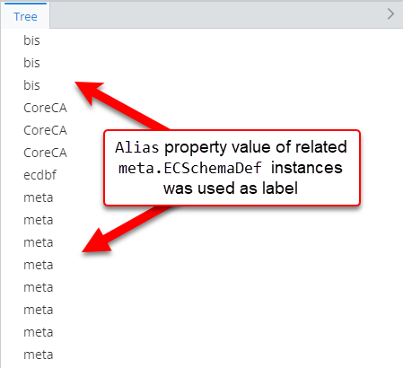

#### String value specification

Specification uses the specified value as the label content.

| Name    | Required? | Type     | Default | Meaning                                |
| ------- | --------- | -------- | ------- | -------------------------------------- |
| `value` | Yes       | `string` |         | The value to use as the label content. |

```ts
[[include:Presentation.InstanceLabelOverride.StringValueSpecification.Ruleset]]
```

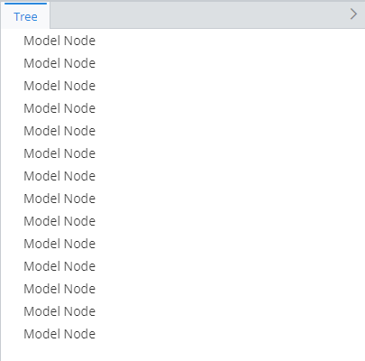

#### Class name value specification

Specification uses ECClass name as the label content.

| Name   | Required? | Type      | Default | Meaning                                                      |
| ------ | --------- | --------- | ------- | ------------------------------------------------------------ |
| `full` | No        | `boolean` | `false` | Should full (`{schemaName}.{className}`) class name be used. |

```ts
[[include:Presentation.InstanceLabelOverride.ClassNameValueSpecification.Ruleset]]
```

|               | Result                                                                                                     |
| ------------- | ---------------------------------------------------------------------------------------------------------- |
| `full: true`  | 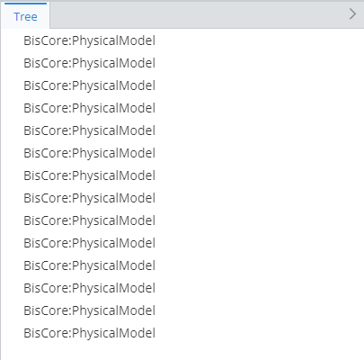 |
| `full: false` | 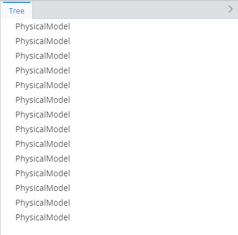      |

#### Class label value specification

Specification uses ECClass display label as the label content. It has no additional attributes.

```ts
[[include:Presentation.InstanceLabelOverride.ClassLabelValueSpecification.Ruleset]]
```

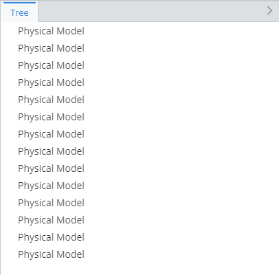

#### BriefcaseId value specification

Specification returns ECInstance's briefcase ID in base36 format. It has no additional attributes.

```ts
[[include:Presentation.InstanceLabelOverride.BriefcaseIdValueSpecification.Ruleset]]
```


#### LocalId value specification

Specification returns ECInstance's local ID in base36 format. It has no additional attributes.

```ts
[[include:Presentation.InstanceLabelOverride.LocalIdValueSpecification.Ruleset]]
```

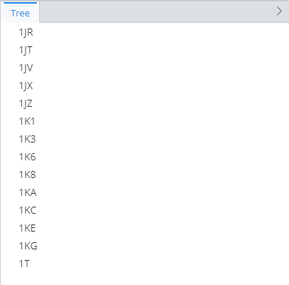

#### Related instance label value specification

Specification uses label of another related instance as the label content.

| Name                    | Required? | Type                                                                   | Default | Meaning                                                                                                                                            |
| ----------------------- | --------- | ---------------------------------------------------------------------- | ------- | -------------------------------------------------------------------------------------------------------------------------------------------------- |
| `pathToRelatedInstance` | Yes       | [`RelationshipPathSpecification`](../RelationshipPathSpecification.md) |         | [Specification of the relationship path](../RelationshipPathSpecification.md) from `InstanceLabelOverride.class` to class of the related instance. |

```ts
[[include:Presentation.InstanceLabelOverride.RelatedInstanceLabelValueSpecification.Ruleset]]
```

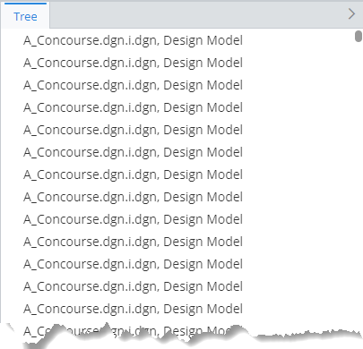
