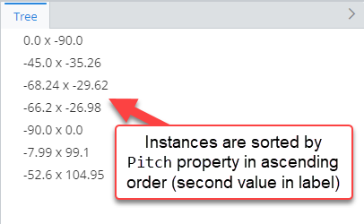
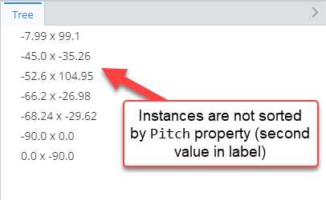
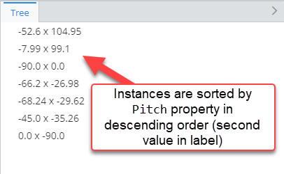
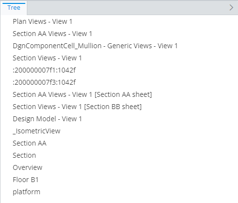
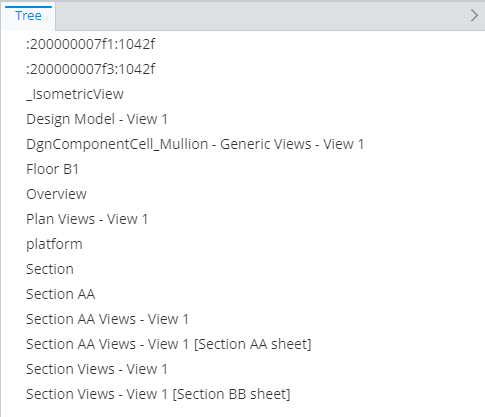
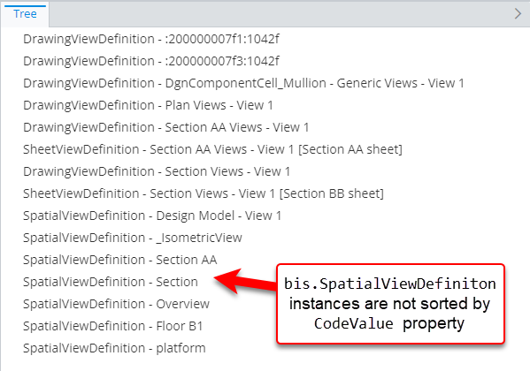
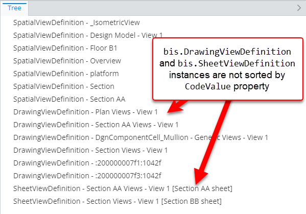

# Sorting rule

> TypeScript type: [SortingRule]($presentation-common).

Sorting rules provide a way to either disable sorting or sort instances by specific properties. There are 2 types of sorting rules for both of these scenarios.

## Property sorting rule

Rule to configure sorting for certain ECInstances in the hierarchy and/or content. It is possible to configure different sorting for different types of ECInstances.

Multiple sorting rules may be applied for the same instances - in this case the
instances are first sorted by the highest priority rule and then the lower priority ones.

> **Note:** This rule is not meant to be used to sort grouping nodes, custom nodes or other non ECInstance type of nodes.

### Attributes

| Name                                            | Required? | Type                                                                     | Default                        |
| ----------------------------------------------- | --------- | ------------------------------------------------------------------------ | ------------------------------ |
| *Filtering*                                     |
| [`requiredSchemas`](#attribute-requiredschemas) | No        | [`RequiredSchemaSpecification[]`](../RequiredSchemaSpecification.md)     | `[]`                           |
| [`priority`](#attribute-priority)               | No        | `number`                                                                 | `1000`                         |
| [`condition`](#attribute-condition)             | No        | [ECExpression](../hierarchies/ECExpressions.md#rule-condition)           | `""`                           |
| [`class`](#attribute-class)                     | No        | [`SingleSchemaClassSpecification`](../SingleSchemaClassSpecification.md) | All classes in current context |
| [`isPolymorphic`](#attribute-ispolymorphic)     | No        | `boolean`                                                                | `false`                        |
| *Sorting*                                       |
| [`propertyName`](#attribute-propertyname)       | Yes       | `string`                                                                 |                                |
| [`sortAscending`](#attribute-sortascending)     | No        | `boolean`                                                                | `true`                         |

### Attribute: `requiredSchemas`

A list of [ECSchema requirements](../RequiredSchemaSpecification.md) that need to be met for the rule to be used.

|                   |                                                                      |
| ----------------- | -------------------------------------------------------------------- |
| **Type**          | [`RequiredSchemaSpecification[]`](../RequiredSchemaSpecification.md) |
| **Is Required**   | No                                                                   |
| **Default Value** | `[]`                                                                 |

```ts
[[include:Presentation.Sorting.RequiredSchemas.Ruleset]]
```

|                     | Result                                                                             |
| ------------------- | ---------------------------------------------------------------------------------- |
| `minVersion: 1.0.2` |  |
| `minVersion: 2.0.2` |    |

### Attribute: `priority`

Defines the order in which rules are handled - higher priority means the rule is handled first. If priorities are equal, the rules are handled in the order they're defined.

|                   |          |
| ----------------- | -------- |
| **Type**          | `number` |
| **Is Required**   | No       |
| **Default Value** | `1000`   |

```ts
[[include:Presentation.PropertySortingRule.Priority.Ruleset]]
```


### Attribute: `condition`

Defines a condition which needs to be met in order for the rule to be used. The condition is an [ECExpression](./ECExpressions.md#rule-condition) which has to evaluate to a boolean value.

|                   |                                                                |
| ----------------- | -------------------------------------------------------------- |
| **Type**          | [ECExpression](../hierarchies/ECExpressions.md#rule-condition) |
| **Is Required**   | No                                                             |
| **Default Value** | `""`                                                           |

```ts
[[include:Presentation.PropertySortingRule.Condition.Ruleset]]
```

| Condition evaluation result | Result                                                                 |
| --------------------------- | ---------------------------------------------------------------------- |
| `true`                      |  |
| `false`                     |    |

### Attribute: `class`

Specifies ECClass whose ECInstances should be sorted.

|                   |                                                                          |
| ----------------- | ------------------------------------------------------------------------ |
| **Type**          | [`SingleSchemaClassSpecification`](../SingleSchemaClassSpecification.md) |
| **Is Required**   | No                                                                       |
| **Default value** | All classes in current context                                           |

```ts
[[include:Presentation.PropertySortingRule.Class.Ruleset]]
```


### Attribute: `isPolymorphic`

Specifies that [`class` attribute](#attribute-class) defined in this rule should be handled polymorphically.

|                   |           |
| ----------------- | --------- |
| **Type**          | `boolean` |
| **Is Required**   | No        |
| **Default Value** | `false`   |

```ts
[[include:Presentation.PropertySortingRule.IsPolymorphic.Ruleset]]
```

|                        | Result                                                                          |
| ---------------------- | ------------------------------------------------------------------------------- |
| `isPolymorphic: true`  |  |
| `isPolymorphic: false` |    |

### Attribute: `propertyName`

Specifies name of the property which should be used for sorting.

|                 |          |
| --------------- | -------- |
| **Type**        | `string` |
| **Is Required** | Yes      |

```ts
[[include:Presentation.PropertySortingRule.PropertyName.Ruleset]]
```


### Attribute: `sortAscending`

Specifies whether instances should be sorted in ascending order or descending.

|                   |           |
| ----------------- | --------- |
| **Type**          | `boolean` |
| **Is Required**   | No        |
| **Default Value** | `true`    |

```ts
[[include:Presentation.PropertySortingRule.SortAscending.Ruleset]]
```

|                        | Result                                                                           |
| ---------------------- | -------------------------------------------------------------------------------- |
| `sortAscending: true`  |   |
| `sortAscending: false` |  |

## Disabled sorting rule

Rule to disable sorting for certain ECInstances in the hierarchy and/or content.

> **Note:** Disabling sorting increases performance

### Attributes

| Name                                              | Required? | Type                                                                     | Default                        |
| ------------------------------------------------- | --------- | ------------------------------------------------------------------------ | ------------------------------ |
| *Filtering*                                       |
| [`requiredSchemas`](#attribute-requiredschemas-1) | No        | [`RequiredSchemaSpecification[]`](../RequiredSchemaSpecification.md)     | `[]`                           |
| [`priority`](#attribute-priority-1)               | No        | `number`                                                                 | `1000`                         |
| [`condition`](#attribute-condition-1)             | No        | [ECExpression](../hierarchies/ECExpressions.md#rule-condition)           | `""`                           |
| [`class`](#attribute-class-1)                     | No        | [`SingleSchemaClassSpecification`](../SingleSchemaClassSpecification.md) | All classes in current context |
| [`isPolymorphic`](#attribute-ispolymorphic-1)     | No        | `boolean`                                                                | `false`                        |

### Attribute: `requiredSchemas`

A list of [ECSchema requirements](../RequiredSchemaSpecification.md) that need to be met for the rule to be used.

|                   |                                                                      |
| ----------------- | -------------------------------------------------------------------- |
| **Type**          | [`RequiredSchemaSpecification[]`](../RequiredSchemaSpecification.md) |
| **Is Required**   | No                                                                   |
| **Default Value** | `[]`                                                                 |

```ts
[[include:Presentation.Sorting.RequiredSchemas.Ruleset]]
```

|                     | Result                                                                             |
| ------------------- | ---------------------------------------------------------------------------------- |
| `minVersion: 1.0.2` |  |
| `minVersion: 2.0.2` |    |

### Attribute: `priority`

Defines the order in which rules are handled - higher priority means the rule is handled first. If priorities are equal, the rules are handled in the order they're defined.

|                   |          |
| ----------------- | -------- |
| **Type**          | `number` |
| **Is Required**   | No       |
| **Default Value** | `1000`   |

```ts
[[include:Presentation.DisabledSortingRule.Priority.Ruleset]]
```


### Attribute: `condition`

Defines a condition which needs to be met in order for the rule to be used. The condition is an [ECExpression](./ECExpressions.md#rule-condition) which has to evaluate to a boolean value.

|                   |                                                                |
| ----------------- | -------------------------------------------------------------- |
| **Type**          | [ECExpression](../hierarchies/ECExpressions.md#rule-condition) |
| **Is Required**   | No                                                             |
| **Default Value** | `""`                                                           |

```ts
[[include:Presentation.DisabledSortingRule.Condition.Ruleset]]
```

| Condition evaluation result | Result                                                                                    |
| --------------------------- | ----------------------------------------------------------------------------------------- |
| `true`                      |   |
| `false`                     |  |

### Attribute: `class`

Specifies ECClass whose instances should not be sorted.

|                   |                                                                          |
| ----------------- | ------------------------------------------------------------------------ |
| **Type**          | [`SingleSchemaClassSpecification`](../SingleSchemaClassSpecification.md) |
| **Is Required**   | No                                                                       |
| **Default value** | All classes in current context                                           |

```ts
[[include:Presentation.DisabledSortingRule.Class.Ruleset]]
```



### Attribute: `isPolymorphic`

Specifies that [`class` attribute](#attribute-class-1) defined in this rule should be handled polymorphically.

|                   |           |
| ----------------- | --------- |
| **Type**          | `boolean` |
| **Is Required**   | No        |
| **Default Value** | `false`   |

```ts
[[include:Presentation.DisabledSortingRule.IsPolymorphic.Ruleset]]
```

|                        | Result                                                                                                 |
| ---------------------- | ------------------------------------------------------------------------------------------------------ |
| `isPolymorphic: true`  |   |
| `isPolymorphic: false` |  |
