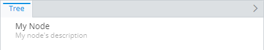
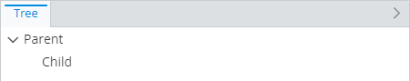
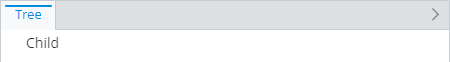
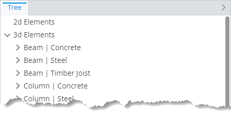
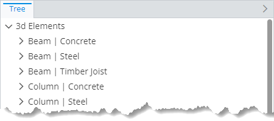
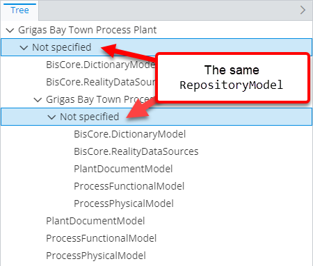
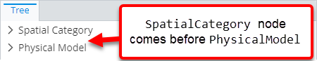
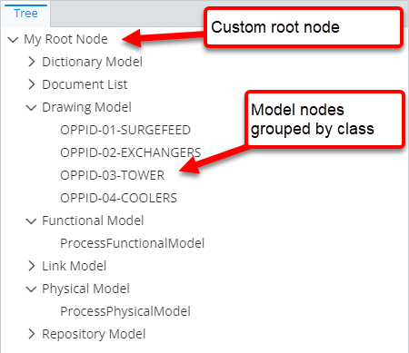
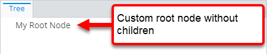
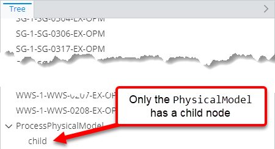

# Custom node specification

> TypeScript type: [CustomNodeSpecification]($presentation-common).

Returns a static custom-defined node that's not based on an ECInstance.

## Attributes

| Name                                                                        | Required? | Type                                             | Default     |
| --------------------------------------------------------------------------- | --------- | ------------------------------------------------ | ----------- |
| *Node values*                                                               |
| [`type`](#attribute-type)                                                   | Yes       | `string`                                         |             |
| [`label`](#attribute-label)                                                 | Yes       | `string`                                         |             |
| [`description`](#attribute-description)                                     | No        | `string`                                         | `""`        |
| [`imageId`](#attribute-imageid)                                             | No        | `string`                                         | `""`        |
| *Filtering*                                                                 |
| [`hideExpression`](#attribute-hideexpression)                               | No        | [ECExpression](./ECExpressions.md#specification) | `""`        |
| [`hideIfNoChildren`](#attribute-hideifnochildren)                           | No        | `boolean`                                        | `false`     |
| [`hideNodesInHierarchy`](#attribute-hidenodesinhierarchy)                   | No        | `boolean`                                        | `false`     |
| [`suppressSimilarAncestorsCheck`](#attribute-suppresssimilarancestorscheck) | No        | `boolean`                                        | `false`     |
| *Ordering*                                                                  |
| [`priority`](#attribute-priority)                                           | No        | `number`                                         | `1000`      |
| *Misc.*                                                                     |
| [`hasChildren`](#attribute-haschildren)                                     | No        | `"Always" \| "Never" \| "Unknown"`               | `"Unknown"` |
| [`nestedRules`](#attribute-nestedrules)                                     | No        | [`ChildNodeRule[]`](./ChildNodeRule.md)          | `[]`        |

### Attribute: `type`

Specifies node type, which is assigned to node's key. The type can be used:

- In [ECExpressions](../advanced/ECExpressions.md) by using the [NavNode.Type](../advanced/ECExpressions.md#navnode) symbol.
- In code through [BaseNodeKey.type]($presentation-common).

The given value is often used in [a condition of another child node rule](./ChildNodeRule.md#attribute-condition) to assign children to this node.

|                 |          |
| --------------- | -------- |
| **Type**        | `string` |
| **Is Required** | Yes      |

```ts
[[include:Presentation.Hierarchies.CustomNodeSpecification.Type.Ruleset]]
```


### Attribute: `label`

Specifies node label. This is a string value that may be [localized](../advanced/Localization.md).

|                 |          |
| --------------- | -------- |
| **Type**        | `string` |
| **Is Required** | Yes      |

```ts
[[include:Presentation.Hierarchies.CustomNodeSpecification.Label.Ruleset]]
```


### Attribute: `description`

Specifies the value of [Node.description]($presentation-common) property, which is a string that may be [localized](../advanced/Localization.md). UI component displaying the node may choose whether and how to surface this information to users.

|                   |          |
| ----------------- | -------- |
| **Type**          | `string` |
| **Is Required**   | No       |
| **Default Value** | `""`     |

```ts
[[include:Presentation.Hierarchies.CustomNodeSpecification.Description.Ruleset]]
```



### Attribute: `imageId`

Specifies node's image ID. If set, the ID is assigned to [Node.imageId]($presentation-common) and it's up to the UI component
to decide what to do with it.

|                   |          |
| ----------------- | -------- |
| **Type**          | `string` |
| **Is Required**   | No       |
| **Default Value** | `""`     |

```ts
[[include:Presentation.Hierarchies.CustomNodeSpecification.ImageId.Ruleset]]
```

```ts
[[include:Presentation.Hierarchies.CustomNodeSpecification.ImageId.Result]]
```

### Attribute: `hideNodesInHierarchy`

When `true`, nodes produced by this specification are omitted and their children appear one hierarchy level higher.

|                   |           |
| ----------------- | --------- |
| **Type**          | `boolean` |
| **Is Required**   | No        |
| **Default Value** | `false`   |

```ts
[[include:Presentation.Hierarchies.CustomNodeSpecification.HideNodesInHierarchy.Ruleset]]
```

| `hideNodesInHierarchy: false`                                                                                                                                   | `hideNodesInHierarchy: true`                                                                                                                                  |
| --------------------------------------------------------------------------------------------------------------------------------------------------------------- | ------------------------------------------------------------------------------------------------------------------------------------------------------------- |
|  |  |

### Attribute: `hideIfNoChildren`

Specifies whether the node created through this specification should be hidden if it has no child nodes.

|                   |           |
| ----------------- | --------- |
| **Type**          | `boolean` |
| **Is Required**   | No        |
| **Default Value** | `false`   |

```ts
[[include:Presentation.Hierarchies.Specification.HideIfNoChildren.Ruleset]]
```

| `hideIfNoChildren: false`                                                                                                                     | `hideIfNoChildren: true`                                                                                                                    |
| --------------------------------------------------------------------------------------------------------------------------------------------- | ------------------------------------------------------------------------------------------------------------------------------------------- |
|  |  |

### Attribute: `hideExpression`

When specified [ECExpression](./ECExpressions.md#specification) evaluates to `true`, nodes produced by this specification are omitted and their children appear one hierarchy level higher.

|                   |                                                  |
| ----------------- | ------------------------------------------------ |
| **Type**          | [ECExpression](./ECExpressions.md#specification) |
| **Is Required**   | No                                               |
| **Default Value** | `""`                                             |

```ts
[[include:Presentation.Hierarchies.Specification.HideExpression.Ruleset]]
```

| `hideExpression` evaluates to `false`                                                                                                          | `hideExpression` evaluates to `true`                                                                                                         |
| ---------------------------------------------------------------------------------------------------------------------------------------------- | -------------------------------------------------------------------------------------------------------------------------------------------- |
|  |  |

### Attribute: `suppressSimilarAncestorsCheck`

Specifies whether similar ancestor nodes' checking should be suppressed when creating nodes based on this specification. See more in [Infinite Hierarchies Prevention page](./InfiniteHierarchiesPrevention.md).

|                   |           |
| ----------------- | --------- |
| **Type**          | `boolean` |
| **Is Required**   | No        |
| **Default Value** | `false`   |

```ts
[[include:Presentation.Hierarchies.Specification.SuppressSimilarAncestorsCheck.Ruleset]]
```



### Attribute: `priority`

Controls the order in which specifications are handled — specification with higher priority value is handled first. If priorities are equal, the specifications are handled in the order they appear in the ruleset.

|                   |          |
| ----------------- | -------- |
| **Type**          | `number` |
| **Is Required**   | No       |
| **Default Value** | `1000`   |

```ts
[[include:Presentation.Hierarchies.Specification.Priority.Ruleset]]
```



### Attribute: `hasChildren`

Generally, when a node is created, the rules engine has to determine whether it has children before returning it. This requires
evaluating child node rules and, usually, executing additional queries. This attribute allows telling the engine that nodes created
by this specification always or never have children, which may substantially improve performance of creating nodes in cases when
getting child nodes is expensive.

In case when the attribute value "lies":

- When set to `Always`, the returned nodes always have [Node.hasChildren]($presentation-common) set to `true`. Requesting children for such nodes returns
empty list. It's up to the UI component to handle the case of parent node saying it has children but data source not returning any.

- When set to `Never`, the returned nodes always have [Node.hasChildren]($presentation-common) set to `false`. Requesting children for such nodes returns empty
list even if there are child node rules that define children for it.

|                   |                                    |
| ----------------- | ---------------------------------- |
| **Type**          | `"Always" \| "Never" \| "Unknown"` |
| **Is Required**   | No                                 |
| **Default Value** | `"Unknown"`                        |

```ts
[[include:Presentation.Hierarchies.Specification.HasChildren.Ruleset]]
```

| `hasChildren: "Always"`                                                                                                             | `hasChildren: "Never"`                                                                                                            |
| ----------------------------------------------------------------------------------------------------------------------------------- | --------------------------------------------------------------------------------------------------------------------------------- |
|  |  |

### Attribute: `nestedRules`

Specifications of [nested child node rules](./Terminology.md#nested-rule) that allow creating child nodes without the need of supplying a condition to
match the parent node.

This is useful when the same instance node at different hierarchy levels needs to have different child nodes. Specifying a [child node rule](./ChildNodeRule.md)
at the root level with condition to match the instance ECClass makes the rule create children for all nodes of that ECClass. When that's not desired, different
[child node rules](./ChildNodeRule.md) may be specified as nested rules for specifications that return instance nodes of the same ECClass - that makes them have
different children.

|                   |                                         |
| ----------------- | --------------------------------------- |
| **Type**          | [`ChildNodeRule[]`](./ChildNodeRule.md) |
| **Is Required**   | No                                      |
| **Default Value** | `[]`                                    |

```ts
[[include:Presentation.Hierarchies.Specification.NestedRules.Ruleset]]
```


