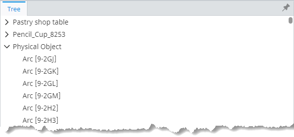
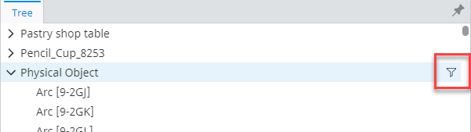
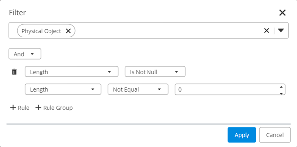
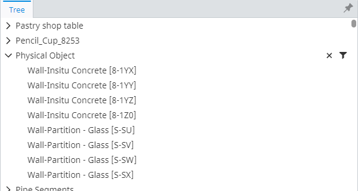
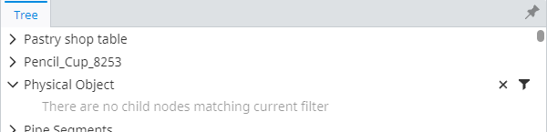
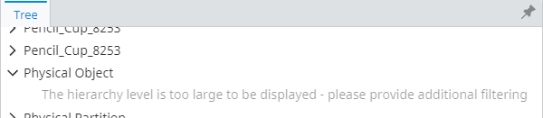

# Hierarchy level filtering and size limiting

Depending on the size of an iModel and presentation rules to create a hierarchy, the amount of nodes in a single hierarchy level might become huge - thousands or even millions of nodes. Creating such hierarchy levels not only requires huge amounts of resources, but also has usability problems - finding something in such a hierarchy level becomes nearly impossible.



*Notice the scrollbar size in the above picture - the "Physical Object" node has more than 94 thousand child nodes there.*

To help end users find what they're looking for, all presentation-driven hierarchies support [hierarchy level filtering](#filtering). With that in mind, assuming hierarchy levels need to be filtered down to be useful, presentation-driven hierarchies also support [hierarchy level size limiting](#size-limiting).

## Filtering

As mentioned in the previous section, the amount of nodes in a hierarchy level could be huge, which makes it useless to end users as it's impossible to find anything there. To help with the problem, hierarchies support hierarchy level filtering, which helps reduce the amount of nodes being displayed in a single hierarchy level by applying users' supplied filters.

The filter applies to a single hierarchy level and doesn't filter the whole sub-tree.

### Workflow

1. Hierarchy levels that support filtering have a filter icon at the right of the parent node when it's hovered:

   

2. When the button is pressed, the filtering dialog shows up:

   

   The dialog allows filtering the results by class and properties of elements which the hierarchy level consists of and doesn't display properties of classes that don't exist in the hierarchy level. In addition, selecting a class filters the available property list to show only properties for that class of elements. And it works in the opposite direction too - selecting a property filters the classes to show only the ones that have the property.

3. Pressing the "Apply" button filters the child hierarchy level:

   

   Note that after applying the filter the parent node has the highlighted "filter" and "clear filter" buttons displayed at the right even when the node is not hovered.

4. In case the filter results in 0 nodes, the "no matches" message is displayed:

   

   The "clear filter" button can be pressed to return to initial, unfiltered state. The "filter" button can be pressed to edit the applied filter.

### Limitations

There's a limited set of presentation rules, their attributes or attribute values that don't allow us to efficiently apply the filter:

- `hideExpression` attribute on the hierarchy specifications [Instance nodes of specific classes](./InstanceNodesOfSpecificClasses.md#attribute-hideexpression), [Related instance nodes](./RelatedInstanceNodes.md#attribute-hideexpression) and [Custom query instance nodes](./CustomQueryInstanceNodes.md#attribute-hideexpression).

- Usage of some deprecated, undocumented rules or attributes.

When any of the above is used to create a hierarchy level, filtering for that level is going to be disabled.

### Setting up hierarchy level filtering

Setting up hierarchy level filtering is as simple as supplying a presentation-specific tree renderer to the [ControlledTree]($components-react) component:

```tsx
[[include:Presentation.Components.HierarchyLevelFiltering]]
```

## Size limiting

While filtering helps users reduce the number of nodes after they see the massive hierarchy level, it doesn't help us avoid uselessly creating it. This is particularly frustrating, because creating such hierarchy levels is generally very expensive due to sorting - we only load a few nodes of all the hierarchy level, but at the database level that requires sorting it all first and that is usually very costly, making users wait needlessly.

Our solution to that is hierarchy level size limiting, which basically just puts a limit to how many ECInstances we're willing to load before we decide that its not worth it:



**Note:** In case the hierarchy level is not filterable (see [limitations section](#limitations)), limiting is not applied to avoid making it impossible to traverse it.

### Setting up hierarchy level limiting

Hierarchy level limiting is an opt-in feature that has to be turned on when creating a node loader for the presentation-driven tree component:

```tsx
[[include:Presentation.Components.HierarchyLevelLimiting]]
```

**Note:** While limiting is not going to be applied to unfilterable hierarchy levels, the library has no control over consumer code, which is responsible for making filtering possible by supplying a proper tree renderer. Consumers should make sure [PresentationTreeRenderer]($presentation-components) or an alternative, supporting hierarchy level filtering, is used in combination with hierarchy level limiting.
