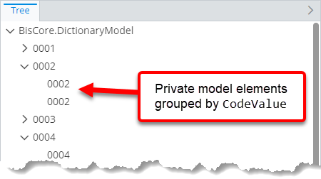
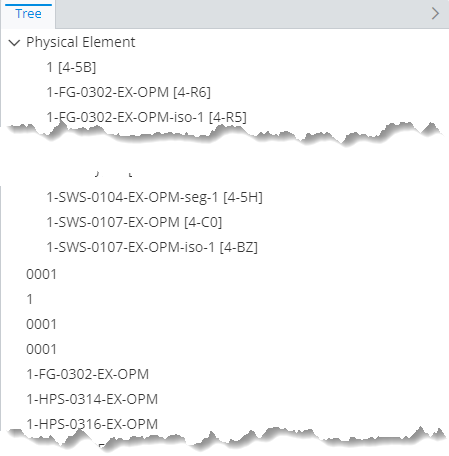
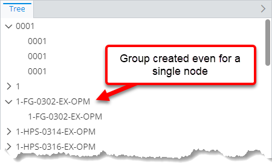
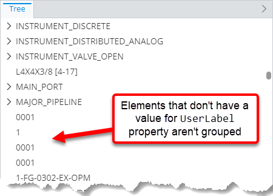
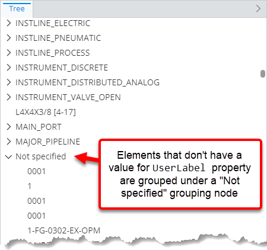
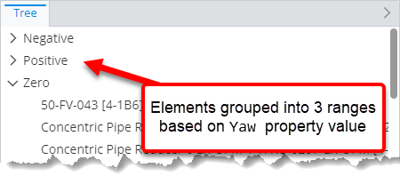
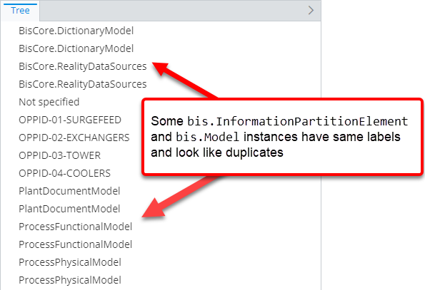
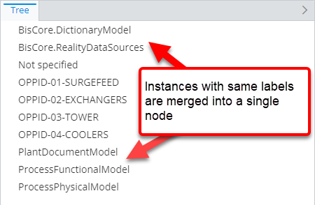

# Grouping rule

> TypeScript type: [GroupingRule]($presentation-common).

Grouping rules provide advanced ways to group instances when creating hierarchies.

It allows to define these types of groupings:

- Group by base class.
- Group by any property of the class by a common value or a range of values.
- Group multiple instances with the same label into one ECInstance node. This can be used in cases when these instances represent the same object for the user.

The rule works in conjunction with other grouping options available in [hierarchy specifications](./ChildNodeRule.md#attribute-specifications): `groupByClass` and `groupByLabel`. All grouping rules are
applied in this priority:

1. [Base class grouping](#base-class-grouping) specified using base class grouping specification through a grouping rule.
2. Direct class grouping specified using `groupByClass` attribute at specification level.
3. [Property grouping](#property-grouping) specified using property grouping specification through a grouping rule.
4. Display label grouping specified using `groupByLabel` attribute at specification level.
5. [Same label grouping](#same-label-instance-grouping) specified using same label instance grouping specification through a grouping rule.

The rule itself works in a similar way as hierarchy rules - *rule* identifies *what* to group and it has *specifications* which tell *how* the grouping should be done.

## Attributes

| Name                                              | Required? | Type                                                                     | Default |
| ------------------------------------------------- | --------- | ------------------------------------------------------------------------ | ------- |
| *Filtering*                                       |
| [`class`](#attribute-class)                       | Yes       | [`SingleSchemaClassSpecification`](../SingleSchemaClassSpecification.md) |         |
| [`requiredSchemas`](#attribute-requiredschemas)   | No        | [`RequiredSchemaSpecification[]`](../RequiredSchemaSpecification.md)     | `[]`    |
| [`condition`](#attribute-condition)               | No        | [ECExpression](./ECExpressions.md#rule-condition)                        | `""`    |
| [`priority`](#attribute-priority)                 | No        | `number`                                                                 | `1000`  |
| [`onlyIfNotHandled`](#attribute-onlyifnothandled) | No        | `boolean`                                                                | `false` |
| *Grouping*                                        |
| [`groups`](#attribute-groups)                     | Yes       | `GroupingSpecification[]`                                                |         |

### Attribute: `class`

Specification of ECClass which should be grouped using this rule.

|                 |                                                                          |
| --------------- | ------------------------------------------------------------------------ |
| **Type**        | [`SingleSchemaClassSpecification`](../SingleSchemaClassSpecification.md) |
| **Is Required** | Yes                                                                      |

### Attribute: `condition`

An [ECExpression](./ECExpressions.md#rule-condition) that results in a boolean value. If specified, the grouping rule applies only to instance nodes that cause the condition to evaluate to `true`.

|                   |                                                   |
| ----------------- | ------------------------------------------------- |
| **Type**          | [ECExpression](./ECExpressions.md#rule-condition) |
| **Is Required**   | No                                                |
| **Default Value** | `""`                                              |

```ts
[[include:Presentation.Hierarchies.Grouping.Condition.Ruleset]]
```



### Attribute: `requiredSchemas`

A list of [ECSchema requirements](../RequiredSchemaSpecification.md) that need to be met for the rule to be used.

|                   |                                                                      |
| ----------------- | -------------------------------------------------------------------- |
| **Type**          | [`RequiredSchemaSpecification[]`](../RequiredSchemaSpecification.md) |
| **Is Required**   | No                                                                   |
| **Default Value** | `[]`                                                                 |

```ts
[[include:Presentation.Hierarchies.RequiredSchemas.Ruleset]]
```

### Attribute: `priority`

Controls the order in which specifications are handled — specification with higher priority value is handled first. If priorities are equal, the specifications are handled in the order they appear in the ruleset.

|                   |          |
| ----------------- | -------- |
| **Type**          | `number` |
| **Is Required**   | No       |
| **Default Value** | `1000`   |

```ts
[[include:Presentation.Hierarchies.Priority.Ruleset]]
```


### Attribute: `onlyIfNotHandled`

When `true`, the rule takes effect only when all other grouping rules with higher priority are ruled out. This attribute is most useful for defining fallback rules.

|                   |           |
| ----------------- | --------- |
| **Type**          | `boolean` |
| **Is Required**   | No        |
| **Default Value** | `false`   |

```ts
[[include:Presentation.Hierarchies.OnlyIfNotHandled.Ruleset]]
```


### Attribute: `groups`

Specifies a list of [grouping specifications](#grouping-specifications) which describe the kind of grouping that should be applied. There are 3 types of supported grouping:

- [Base class grouping](#base-class-grouping)
- [Property grouping](#property-grouping)
- [Same label instance grouping](#same-label-instance-grouping)

|                 |                                                       |
| --------------- | ----------------------------------------------------- |
| **Type**        | [`GroupingSpecification[]`](#grouping-specifications) |
| **Is Required** | Yes                                                   |

## Grouping specifications

### Base class grouping

Base class grouping allows grouping ECInstance nodes by their base class (as opposed to the hierarchy specifications' `groupByClass` attribute, which
always groups by direct class).

Multiple levels of base class grouping may be constructed by specifying multiple rules for ECClasses in the same class hierarchy. In that case
the order of the rules has to match the order of the class hierarchy - from the most base class to the most derived one. If the rules can't be
defined in required order, the actual order may be adjusted using the [`priority` attribute](#attribute-priority).

| Name                                                              | Required? | Type                                                                     | Default                                               |
| ----------------------------------------------------------------- | --------- | ------------------------------------------------------------------------ | ----------------------------------------------------- |
| [`baseClass`](#attribute-baseclass)                               | No        | [`SingleSchemaClassSpecification`](../SingleSchemaClassSpecification.md) | Value of [rule's `class` attribute](#attribute-class) |
| [`createGroupForSingleItem`](#attribute-creategroupforsingleitem) | No        | `boolean`                                                                | `false`                                               |

#### Attribute: `baseClass`

Specification of the base ECClass to group by. If specified, allows grouping by a subclass of the class specified by [rule's `class` attribute](#attribute-class).

|                   |                                                                          |
| ----------------- | ------------------------------------------------------------------------ |
| **Type**          | [`SingleSchemaClassSpecification`](../SingleSchemaClassSpecification.md) |
| **Is Required**   | No                                                                       |
| **Default Value** | Value of [rule's `class` attribute](#attribute-class)                    |

```ts
[[include:Presentation.Hierarchies.Grouping.ClassGroup.BaseClass.Ruleset]]
```



#### Attribute: `createGroupForSingleItem`

Specifies whether a grouping node should be created if there is only one item in that group.

|                   |           |
| ----------------- | --------- |
| **Type**          | `boolean` |
| **Is Required**   | No        |
| **Default Value** | `false`   |

```ts
[[include:Presentation.Hierarchies.Grouping.Specification.CreateGroupForSingleItem.Ruleset]]
```



### Property grouping

Property grouping allows grouping by a property of the instance by value or by given ranges of values.

Property grouping nodes always appear under class grouping nodes (if any).

Multiple levels of property grouping may be constructed by specifying multiple rules. The order of grouping matches the order of grouping rules.
If the rules can't be defined in required order, the actual order may be adjusted using the [`priority` attribute](#attribute-priority).

| Name                                                                            | Required? | Type                                | Default |
| ------------------------------------------------------------------------------- | --------- | ----------------------------------- | ------- |
| [`propertyName`](#attribute-propertyname)                                       | Yes       | `string`                            |         |
| [`createGroupForSingleItem`](#attribute-creategroupforsingleitem)               | No        | `boolean`                           | `false` |
| [`createGroupForUnspecifiedValues`](#attribute-creategroupforunspecifiedvalues) | No        | `boolean`                           | `true`  |
| [`imageId`](#attribute-imageid)                                                 | No        | `string`                            | `""`    |
| [`ranges`](#attribute-ranges)                                                   | No        | `PropertyRangeGroupSpecification[]` | `[]`    |

#### Attribute: `propertyName`

Name of the ECProperty which is used for grouping. The property must exist on the ECClass specified by the [rule's `class` attribute](#attribute-class) and it must be
of either a primitive or a navigation type.

|                 |          |
| --------------- | -------- |
| **Type**        | `string` |
| **Is Required** | Yes      |

#### Attribute: `createGroupForSingleItem`

Specifies whether a grouping node should be created if there is only one item in that group.

|                   |           |
| ----------------- | --------- |
| **Type**          | `boolean` |
| **Is Required**   | No        |
| **Default Value** | `false`   |

```ts
[[include:Presentation.Hierarchies.Grouping.Specification.CreateGroupForSingleItem.Ruleset]]
```


#### Attribute: `createGroupForUnspecifiedValues`

Should a separate grouping node be created for nodes whose grouping value is not set or is set to an empty string.

|                   |           |
| ----------------- | --------- |
| **Type**          | `boolean` |
| **Is Required**   | No        |
| **Default Value** | `true`    |

```ts
[[include:Presentation.Hierarchies.Grouping.PropertyGroup.CreateGroupForUnspecifiedValues.Ruleset]]
```

| `createGroupForUnspecifiedValues: false`                                                                                                                          | `createGroupForUnspecifiedValues: true`                                                                                                                                  |
| ----------------------------------------------------------------------------------------------------------------------------------------------------------------- | ------------------------------------------------------------------------------------------------------------------------------------------------------------------------ |
|  |  |

#### Attribute: `imageId`

Specifies grouping node's image ID. If set, the ID is assigned to [Node.imageId]($presentation-common) and it's up to the UI component
to decide what to do with it.

|                   |          |
| ----------------- | -------- |
| **Type**          | `string` |
| **Is Required**   | No       |
| **Default Value** | `""`     |

```ts
[[include:Presentation.Hierarchies.Grouping.PropertyGroup.ImageId.Ruleset]]
```

```ts
[[include:Presentation.Hierarchies.Grouping.PropertyGroup.ImageId.Result]]
```

#### Attribute: `ranges`

Ranges into which the grouping values are divided. Instances are grouped by value if no ranges are specified.

|                   |                                     |
| ----------------- | ----------------------------------- |
| **Type**          | `PropertyRangeGroupSpecification[]` |
| **Is Required**   | No                                  |
| **Default Value** | `[]`                                |

| Name        | Required? | Type     | Default                                                             | Meaning                                                                 |
| ----------- | --------- | -------- | ------------------------------------------------------------------- | ----------------------------------------------------------------------- |
| `fromValue` | Yes       | `string` |                                                                     | Value that defines the range start (inclusive)                          |
| `toValue`   | Yes       | `string` |                                                                     | Value that defines the range end (inclusive)                            |
| `imageId`   | No        | `string` | [`imageId` of the property group specification](#attribute-imageid) | Identifier of an image to use for the grouping node.                    |
| `label`     | No        | `string` | `"{from value} - {to value}"`                                       | Grouping node's label. May be [localized](../advanced/Localization.md). |

Range [`fromValue`, `toValue`] is inclusive on both sides. If a value falls into more than one range, the first listed range that contains the value is chosen.

```ts
[[include:Presentation.Hierarchies.Grouping.PropertyGroup.Ranges.Ruleset]]
```



#### Deprecated attribute: `groupingValue`

Specifies whether instances should be grouped using property's display or raw value.

> **Note:** Grouping by property value is required if the display label is overridden to display grouped instances count.
>
> **Warning:** Grouping by label and sorting by property value is not possible.

Display value should always be used for grouping. In cases when there's a need to show grouped instances count suffix, that
can be achieved at the UI component layer by composing UI node's label from node's display label and [GroupingNodeKey.groupedInstancesCount]($presentation-common).

|                   |                                     |
| ----------------- | ----------------------------------- |
| **Type**          | `"PropertyValue" \| "DisplayLabel"` |
| **Is Required**   | No                                  |
| **Default Value** | `"DisplayLabel"`                    |

#### Deprecated attribute: `sortingValue`

Specifies whether nodes should be sorted by their display label or the grouping property's value. In most cases the result is the same,
unless a [label override rule](../customization/LabelOverride.md) is used to change node's display label.

> **Note:** Sorting by property value only makes sense when instances are grouped by property value as well.
>
> **Warning:** Grouping by label and sorting by property value is not possible.

|                   |                                     |
| ----------------- | ----------------------------------- |
| **Type**          | `"PropertyValue" \| "DisplayLabel"` |
| **Is Required**   | No                                  |
| **Default Value** | `"DisplayLabel"`                    |

### Same label instance grouping

Allows grouping multiple instances with the same label into one ECInstances type of node. Similar to display label grouping, but instead of showing a grouping
node with multiple grouped ECInstance nodes, it shows a single ECInstances node which represents multiple ECInstances.

| Name                                              | Required? | Type                       | Default   |
| ------------------------------------------------- | --------- | -------------------------- | --------- |
| [`applicationStage`](#attribute-applicationstage) | No        | `"Query" \| "PostProcess"` | `"Query"` |

#### Attribute: `applicationStage`

Grouping nodes by label is an expensive operation because it requires the whole hierarchy level to be created before even the first grouped node can be produced. To alleviate the performance impact when this specification is used, two `applicationStage` settings have been introduced:

- `"Query"` groups instances during ECSql query, which can often make use of database indices and is generally fairly quick. It is chosen as the default option, however, it fails to produce grouping nodes when certain ruleset specifications are involved.
- `"PostProcess"` groups instances after the whole hierarchy level is built. It incurs a large performance penalty, but it will produce the expected result in all cases.

|                   |                            |
| ----------------- | -------------------------- |
| **Type**          | `"Query" \| "PostProcess"` |
| **Is Required**   | No                         |
| **Default Value** | `"Query"`                  |

#### Choosing between `"Query"` and `"PostProcess"`

Always prefer `"Query"` unless any of the following conditions apply to the hierarchy level that is being grouped:

- The hierarchy level is built out of instances that do not share a common base class.
- The hierarchy level aggregates nodes that have been produced by more than one specification.
- The hierarchy level contains nodes that have been merged from a nested hierarchy level as a result of [`hideNodesInHierarchy`](./InstanceNodesOfSpecificClasses.md#attribute-hidenodesinhierarchy) or [`hideExpression`](./InstanceNodesOfSpecificClasses.md#attribute-hideexpression) attributes.

On the other hand, `"PostProcess"` can be applied to any hierarchy level, regardless of its composition, but at a cost to performance.

#### Example

```ts
[[include:Presentation.Hierarchies.Grouping.SameLabelInstanceGroup.ApplicationStage.PostProcess.Ruleset]]
```

| `applicationStage: "Query"`                                                                                                            | `applicationStage: "PostProcess"`                                                                                                                   |
| -------------------------------------------------------------------------------------------------------------------------------------- | --------------------------------------------------------------------------------------------------------------------------------------------------- |
|  |  |
