# Instance nodes of specific classes specification

> TypeScript type: [InstanceNodesOfSpecificClassesSpecification]($presentation-common).

Returns nodes for instances of specific ECClasses.

## Attributes

| Name                                                                        | Required? | Type                                                                                                            | Default     |
| --------------------------------------------------------------------------- | --------- | --------------------------------------------------------------------------------------------------------------- | ----------- |
| *Filtering*                                                                 |
| [`classes`](#attribute-classes)                                             | Yes       | [`MultiSchemaClassesSpecification \| MultiSchemaClassesSpecification[]`](../MultiSchemaClassesSpecification.md) |             |
| [`excludedClasses`](#attribute-excludedclasses)                             | No        | [`MultiSchemaClassesSpecification \| MultiSchemaClassesSpecification[]`](../MultiSchemaClassesSpecification.md) | `[]`        |
| [`instanceFilter`](#attribute-instancefilter)                               | No        | [ECExpression](./ECExpressions.md#instance-filter)                                                              | `""`        |
| [`hideNodesInHierarchy`](#attribute-hidenodesinhierarchy)                   | No        | `boolean`                                                                                                       | `false`     |
| [`hideIfNoChildren`](#attribute-hideifnochildren)                           | No        | `boolean`                                                                                                       | `false`     |
| [`hideExpression`](#attribute-hideexpression)                               | No        | [ECExpression](./ECExpressions.md#specification)                                                                | `""`        |
| [`suppressSimilarAncestorsCheck`](#attribute-suppresssimilarancestorscheck) | No        | `boolean`                                                                                                       | `false`     |
| *Ordering*                                                                  |
| [`priority`](#attribute-priority)                                           | No        | `number`                                                                                                        | `1000`      |
| [`doNotSort`](#attribute-donotsort)                                         | No        | `boolean`                                                                                                       | `false`     |
| *Grouping*                                                                  |
| [`groupByClass`](#attribute-groupbyclass)                                   | No        | `boolean`                                                                                                       | `true`      |
| [`groupByLabel`](#attribute-groupbylabel)                                   | No        | `boolean`                                                                                                       | `true`      |
| *Misc.*                                                                     |
| [`hasChildren`](#attribute-haschildren)                                     | No        | `"Always" \| "Never" \| "Unknown"`                                                                              | `"Unknown"` |
| [`relatedInstances`](#attribute-relatedinstances)                           | No        | [`RelatedInstanceSpecification[]`](../RelatedInstanceSpecification.md)                                          | `[]`        |
| [`nestedRules`](#attribute-nestedrules)                                     | No        | [`ChildNodeRule[]`](./ChildNodeRule.md)                                                                         | `[]`        |

### Attribute: `classes`

Defines a set of [multi schema classes](../MultiSchemaClassesSpecification.md) that specify which ECClasses need to be selected to form the result.

|                 |                                                                                                                 |
| --------------- | --------------------------------------------------------------------------------------------------------------- |
| **Type**        | [`MultiSchemaClassesSpecification \| MultiSchemaClassesSpecification[]`](../MultiSchemaClassesSpecification.md) |
| **Is Required** | Yes                                                                                                             |

```ts
[[include:Presentation.Hierarchies.InstanceNodesOfSpecificClassesSpecification.Classes.Ruleset]]
```

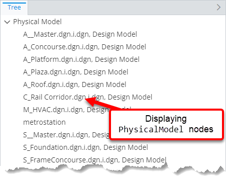

### Attribute: `excludedClasses`

Defines a set of [multi schema classes](../MultiSchemaClassesSpecification.md) that prevents specified ECClasses and subclasses from being selected by [`classes` attribute](#attribute-classes).

|                   |                                                                                                                 |
| ----------------- | --------------------------------------------------------------------------------------------------------------- |
| **Type**          | [`MultiSchemaClassesSpecification \| MultiSchemaClassesSpecification[]`](../MultiSchemaClassesSpecification.md) |
| **Is Required**   | No                                                                                                              |
| **Default Value** | `[]`                                                                                                            |

```ts
[[include:Presentation.Hierarchies.InstanceNodesOfSpecificClassesSpecification.ExcludedClasses.Ruleset]]
```

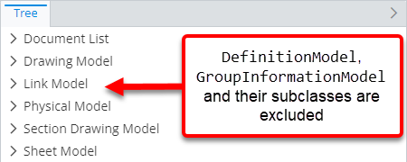

### Attribute: `instanceFilter`

Specifies an [ECExpression](./ECExpressions.md#instance-filter) for filtering instances of ECClasses specified through the [`classes` attribute](#attribute-classes).

|                   |                                                    |
| ----------------- | -------------------------------------------------- |
| **Type**          | [ECExpression](./ECExpressions.md#instance-filter) |
| **Is Required**   | No                                                 |
| **Default Value** | `""`                                               |

```ts
[[include:Presentation.Hierarchies.InstanceNodesOfSpecificClassesSpecification.InstanceFilter.Ruleset]]
```

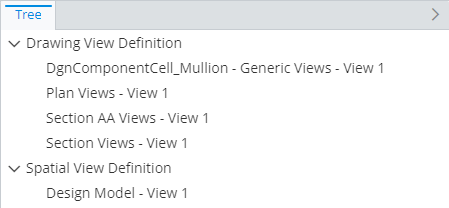

### Attribute: `hideNodesInHierarchy`

When `true`, instances nodes produced by this specification are omitted and their children appear one hierarchy level higher. **Note:** only instance nodes are hidden - grouping nodes are not affected by this attribute.

|                   |           |
| ----------------- | --------- |
| **Type**          | `boolean` |
| **Is Required**   | No        |
| **Default Value** | `false`   |

```ts
[[include:Presentation.Hierarchies.Specification.HideNodesInHierarchy.Ruleset]]
```

| `hideNodesInHierarchy: false`                                                                                                                         | `hideNodesInHierarchy: true`                                                                                                                        |
| ----------------------------------------------------------------------------------------------------------------------------------------------------- | --------------------------------------------------------------------------------------------------------------------------------------------------- |
| 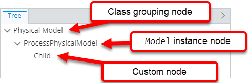 | 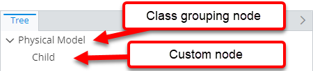 |

### Attribute: `hideIfNoChildren`

Specifies whether nodes created through this specification should be hidden if they have no child nodes.

|                   |           |
| ----------------- | --------- |
| **Type**          | `boolean` |
| **Is Required**   | No        |
| **Default Value** | `false`   |

```ts
[[include:Presentation.Hierarchies.Specification.HideIfNoChildren.Ruleset]]
```

| `hideIfNoChildren: false`                                                                                                                     | `hideIfNoChildren: true`                                                                                                                    |
| --------------------------------------------------------------------------------------------------------------------------------------------- | ------------------------------------------------------------------------------------------------------------------------------------------- |
|  |  |

### Attribute: `hideExpression`

When specified [ECExpression](./ECExpressions.md#specification) evaluates to `true`, nodes produced by this specification are omitted and their children appear one hierarchy level higher.

|                   |                                                  |
| ----------------- | ------------------------------------------------ |
| **Type**          | [ECExpression](./ECExpressions.md#specification) |
| **Is Required**   | No                                               |
| **Default Value** | `""`                                             |

```ts
[[include:Presentation.Hierarchies.Specification.HideExpression.Ruleset]]
```

| `hideExpression` evaluates to `false`                                                                                                          | `hideExpression` evaluates to `true`                                                                                                         |
| ---------------------------------------------------------------------------------------------------------------------------------------------- | -------------------------------------------------------------------------------------------------------------------------------------------- |
|  |  |

### Attribute: `suppressSimilarAncestorsCheck`

Specifies whether similar ancestor nodes' checking should be suppressed when creating nodes based on this specification. See more in [Infinite Hierarchies Prevention page](./InfiniteHierarchiesPrevention.md).

|                   |           |
| ----------------- | --------- |
| **Type**          | `boolean` |
| **Is Required**   | No        |
| **Default Value** | `false`   |

```ts
[[include:Presentation.Hierarchies.Specification.SuppressSimilarAncestorsCheck.Ruleset]]
```


### Attribute: `priority`

Controls the order in which specifications are handled — specification with higher priority value is handled first. If priorities are equal, the specifications are handled in the order they appear in the ruleset.

|                   |          |
| ----------------- | -------- |
| **Type**          | `number` |
| **Is Required**   | No       |
| **Default Value** | `1000`   |

```ts
[[include:Presentation.Hierarchies.Specification.Priority.Ruleset]]
```


### Attribute: `doNotSort`

By default, nodes are sorted by their display label. This attribute allows suppressing sorting of nodes returned by this specification,
which can substantially improve performance when large numbers of nodes are involved. With this attribute set to `true`, the order of
returned nodes is undefined.

|                   |           |
| ----------------- | --------- |
| **Type**          | `boolean` |
| **Is Required**   | No        |
| **Default Value** | `false`   |

```ts
[[include:Presentation.Hierarchies.Specification.DoNotSort.Ruleset]]
```

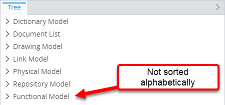

### Attribute: `groupByClass`

Controls whether returned instances should be grouped by ECClass.

|                   |           |
| ----------------- | --------- |
| **Type**          | `boolean` |
| **Is Required**   | No        |
| **Default Value** | `true`    |

```ts
[[include:Presentation.Hierarchies.Specification.GroupByClass.Ruleset]]
```

| `groupByClass: false`                                                                                                          | `groupByClass: true`                                                                                                                  |
| ------------------------------------------------------------------------------------------------------------------------------ | ------------------------------------------------------------------------------------------------------------------------------------- |
| 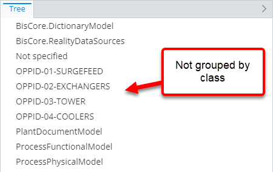 | 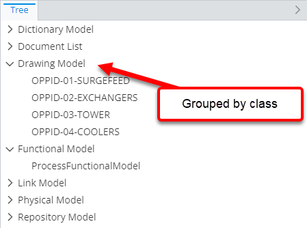 |

### Attribute: `groupByLabel`

Controls whether returned instances should be grouped by label.

Label grouping node is created only if all of these conditions match:

- There are at least two nodes with the same label.
- There's at least one sibling node with a different label.

|                   |           |
| ----------------- | --------- |
| **Type**          | `boolean` |
| **Is Required**   | No        |
| **Default Value** | `true`    |

```ts
[[include:Presentation.Hierarchies.Specification.GroupByLabel.Ruleset]]
```

| `groupByLabel: false`                                                                                                          | `groupByLabel: true`                                                                                                                  |
| ------------------------------------------------------------------------------------------------------------------------------ | ------------------------------------------------------------------------------------------------------------------------------------- |
| 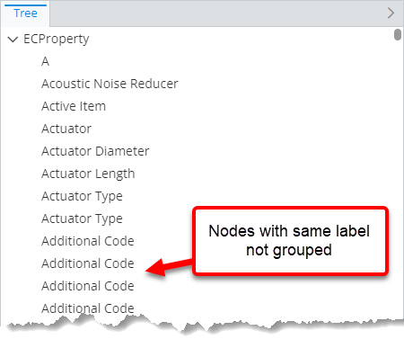 | 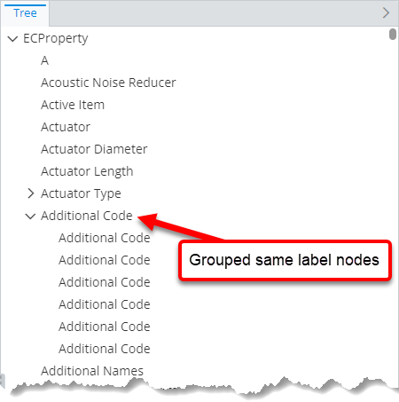 |

### Attribute: `hasChildren`

Generally, when a node is created, the rules engine has to determine whether it has children before returning it. This requires
evaluating child node rules and, usually, executing additional queries. This attribute allows telling the engine that nodes created
by this specification always or never have children, which may substantially improve performance of creating nodes in cases when
getting child nodes is expensive.

In case when the attribute value "lies":

- When set to `Always`, the returned nodes always have `hasChildren` flag set to `true`. Requesting children for such nodes returns
empty list. It's up to the UI component to handle the case of parent node saying it has children but data source not returning any.

- When set to `Never`, the returned nodes always have `hasChildren` set to `false`. Requesting children for such nodes returns empty
list even if there are child node rules that define children for it.

|                   |                                    |
| ----------------- | ---------------------------------- |
| **Type**          | `"Always" \| "Never" \| "Unknown"` |
| **Is Required**   | No                                 |
| **Default Value** | `"Unknown"`                        |

```ts
[[include:Presentation.Hierarchies.Specification.HasChildren.Ruleset]]
```

| `hasChildren: "Always"`                                                                                                             | `hasChildren: "Never"`                                                                                                            |
| ----------------------------------------------------------------------------------------------------------------------------------- | --------------------------------------------------------------------------------------------------------------------------------- |
|  |  |

### Attribute: `relatedInstances`

Specifications of [related instances](../RelatedInstanceSpecification.md) that can be used when creating the nodes. There
are several use cases when this is useful:

- When there's a need to only load instances that have a related instance. Providing a [related instance](../RelatedInstanceSpecification.md)
  specification with [isRequired](../RelatedInstanceSpecification.md#attribute-isrequired) set to `true` filters-out the instances that don't have the related instance.

- When there's a need to filter instances by a related instance value. The [alias](../RelatedInstanceSpecification.md#attribute-alias) attribute may then be used
  in the [`instanceFilter` attribute](#attribute-instancefilter) to reference related instance property values.

- When there's a need to group by related instance property values. Related instance classes are included when looking for [grouping rules](./GroupingRule.md), which allows
  using related instance values for [property grouping](./GroupingRule.md#property-grouping).

- When there's a need to customize nodes based on related instance property values. Related instance classes are included when looking for [customization rules](../customization/index.md),
  which allows referencing related instances and their properties in [customization rule ECExpressions](../customization/ECExpressions.md#override-value) by their
  [alias](../RelatedInstanceSpecification.md#attribute-alias).

|                   |                                                                        |
| ----------------- | ---------------------------------------------------------------------- |
| **Type**          | [`RelatedInstanceSpecification[]`](../RelatedInstanceSpecification.md) |
| **Is Required**   | No                                                                     |
| **Default Value** | `[]`                                                                   |

```ts
[[include:Presentation.Hierarchies.Specification.RelatedInstances.Ruleset]]
```

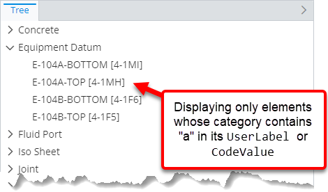

### Attribute: `nestedRules`

Specifications of [nested child node rules](./Terminology.md#nested-rule) that allow creating child nodes without the need of supplying a condition to
match the parent node.

This is useful when the same instance node at different hierarchy levels needs to have different child nodes. Specifying a [child node rule](./ChildNodeRule.md)
at the root level with condition to match the instance ECClass makes the rule create children for all nodes of that ECClass. When that's not desired, different
[child node rules](./ChildNodeRule.md) may be specified as nested rules for specifications that return instance nodes of the same ECClass - that makes them have
different children.

|                   |                                         |
| ----------------- | --------------------------------------- |
| **Type**          | [`ChildNodeRule[]`](./ChildNodeRule.md) |
| **Is Required**   | No                                      |
| **Default Value** | `[]`                                    |

```ts
[[include:Presentation.Hierarchies.Specification.NestedRules.Ruleset]]
```


## Deprecated attributes

### Attribute: `arePolymorphic`

Tells whether selecting instances from ECClasses specified in [`classes`](#attribute-classes) and [`excludedClasses`](#attribute-excludedclasses)
attributes should be polymorphic or not.

The attribute was replaced by `arePolymorphic` attribute specified individually for each class definition
under [`classes`](#attribute-classes) and [`excludedClasses`](#attribute-excludedclasses) attributes. At the moment, to keep
backwards compatibility, this attribute acts as a fallback value in case the flag is not specified individually
for a class definition.

|                   |           |
| ----------------- | --------- |
| **Type**          | `boolean` |
| **Is Required**   | No        |
| **Default Value** | `false`   |
