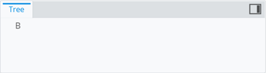

# Node artifacts rule

> TypeScript type: [NodeArtifactsRule]($presentation-common).

> **Note:** The rule is costly performance-wise and should only be used in very limited amount of specific cases where
> hidden child nodes need to be used to determine parent node's visibility.

Node artifacts rules are used to create and assign artifacts to specific nodes. The artifacts can be
accessed when evaluating parent node's `hideExpression` to decide whether it should be hidden or not.

## Typical use case

The hierarchy consists of *Subject* nodes and each *Subject* may or may not have child *Model* nodes. There are 2 types of *Models*: *A* & *B*, we want *ModelA* nodes to be visible and *ModelB* ones to be hidden. We want *Subject* node to be visible only if it has a *Model* (either *A* or *B*).

### Problem

In this case we can't use `hideIfNoChildren` flag on *Subjects*, because a *Subject* node may only have a related *ModelB* which means *Subject* doesn't have children and should be displayed as a leaf node.

### Solution

Use `NodeArtifacts` on the *ModelB* nodes and a `hideExpression` on *Subject* nodes. The expression can access artifacts created by child *ModelB* nodes: `NOT ThisNode.HasChildren AND NOT ThisNode.ChildrenArtifacts.AnyMatches(x => x.IsModelB)`.

## Attributes

| Name                                               | Required? | Type                                                                 | Default |
| -------------------------------------------------- | --------- | -------------------------------------------------------------------- | ------- |
| *Filtering*                                        |
| [`condition`](#attributer-condition)               | No        | [ECExpression](../customization/ECExpressions.md#rule-condition)     | `""`    |
| [`requiredSchemas`](#attributer-requiredschemas)   | No        | [`RequiredSchemaSpecification[]`](../RequiredSchemaSpecification.md) | `[]`    |
| [`priority`](#attributer-priority)                 | No        | `number`                                                             | `1000`  |
| [`onlyIfNotHandled`](#attributer-onlyifnothandled) | No        | `boolean`                                                            | `false` |
| *Artifacts*                                        |
| [`items`](#attribute-items)                        | Yes       | `{ [key: string]: ECExpression }`                                    |         |

### Attribute: `condition`

Specifies an [ECExpression](../customization/ECExpressions.md#rule-condition) that allows applying node artifacts based on evaluation result, e.g. by some property of the parent node.

|                   |                                                                  |
| ----------------- | ---------------------------------------------------------------- |
| **Type**          | [ECExpression](../customization/ECExpressions.md#rule-condition) |
| **Is Required**   | No                                                               |
| **Default Value** | `""`                                                             |

```ts
[[include:Presentation.Hierarchies.NodeArtifacts.Condition.Ruleset]]
```

```ts
[[include:Presentation.Hierarchies.NodeArtifacts.Condition.Result]]
```

### Attribute: `requiredSchemas`

A list of [ECSchema requirements](../RequiredSchemaSpecification.md) that need to be met for the rule to be used.

|                   |                                                                      |
| ----------------- | -------------------------------------------------------------------- |
| **Type**          | [`RequiredSchemaSpecification[]`](../RequiredSchemaSpecification.md) |
| **Is Required**   | No                                                                   |
| **Default Value** | `[]`                                                                 |

```ts
[[include:Presentation.Hierarchies.RequiredSchemas.Ruleset]]
```

### Attribute: `priority`

Defines the order in which rules are handled, higher number means the rule is handled first. If priorities are equal, the rules are handled in the order they're defined. The attribute may be especially useful when combined with [`onlyIfNotHandled` attribute](#attribute-onlyifnothandled).

|                   |          |
| ----------------- | -------- |
| **Type**          | `number` |
| **Is Required**   | No       |
| **Default Value** | `1000`   |

```ts
[[include:Presentation.Hierarchies.Priority.Ruleset]]
```


### Attribute: `onlyIfNotHandled`

When `true`, the rule takes effect only when all other node artifact rules with higher priority are ruled out. This attribute is most useful for defining fallback rules.

|                   |           |
| ----------------- | --------- |
| **Type**          | `boolean` |
| **Is Required**   | No        |
| **Default Value** | `false`   |

```ts
[[include:Presentation.Hierarchies.OnlyIfNotHandled.Ruleset]]
```



### Attribute: `items`

A map of [ECExpressions](./ECExpressions.md#specification) whose evaluation results are used as artifact values.

|                 |                                   |
| --------------- | --------------------------------- |
| **Type**        | `{ [key: string]: ECExpression }` |
| **Is Required** | Yes                               |

```ts
[[include:Presentation.Hierarchies.NodeArtifacts.Items.Ruleset]]
```

```ts
[[include:Presentation.Hierarchies.NodeArtifacts.Items.Result]]
```
