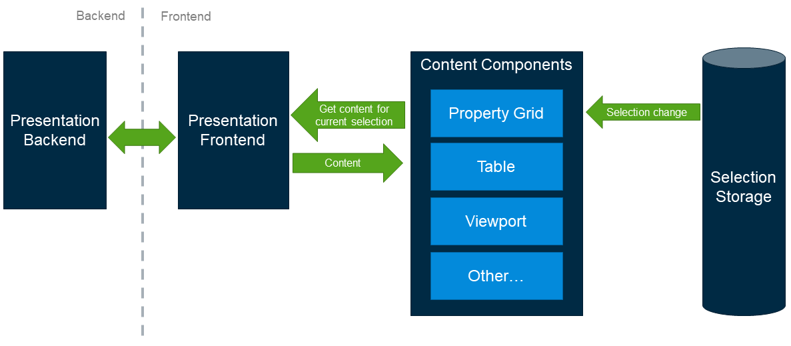

# Unified Selection: Content Components

Content components may react to selection changes in two ways:
- Request and display content for current selection
- Highlight / distinguish current selection in currently displayed content

The decision on which path to take is made based on component type and
[selection level](./Terminology#selection-level).

