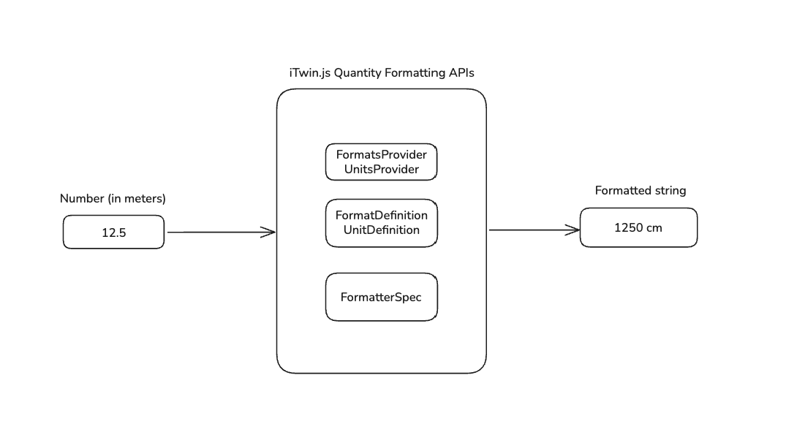

# Quantity Formatting and Parsing

Quantity formatting ensures consistent, user-friendly display of measurements across your application, respecting unit systems and format preferences.

iTwin.js provides quantity formatting through two packages: @itwin/core-quantity for formatting and parsing operations, and @itwin/ecschema-metadata for schema-based format and unit providers. Together, they convert numeric values into formatted display strings with appropriate units, and parse user input strings back into numeric values.

## Getting Started

Quantity formatting is organized into two main areas:

[!iui tile heading="Definitions" linkTo="index path=quantity-formatting/definitions/index subPath=/definitions" contents="Learn about units, formats, and format sets - the specifications that define how quantities are displayed and persisted" icon="measure.svg"]
[!iui tile heading="Usage" linkTo="index path=quantity-formatting/usage/index subPath=/usage" contents="Learn how to apply format definitions at runtime using providers, formatters, and parsers in your iTwin applications" icon="developer.svg"]

## Quick Links

- [Units](./definitions/Units.md) - Understanding units, phenomena, and persistence units
- [Formats](./definitions/Formats.md) - Complete FormatProps reference including decimal, fractional, scientific, station, and ratio formats
- [Format Sets](./definitions/FormatSets.md) - Application-level format persistence and overrides
- [Providers](./usage/Providers.md) - Setting up UnitsProvider and FormatsProvider for your application
- [Parsing and Formatting](./usage/ParsingAndFormatting.md) - Using FormatterSpec and ParserSpec to format values and parse user input
- [Unit Conversion](./usage/UnitConversion.md) - How unit conversions work during formatting and parsing operations
- [QuantityFormatter Integration](./usage/ParsingAndFormatting.md#usage-in-itwin-tools-and-components) - Integrating with IModelApp.quantityFormatter
- [Migrating from QuantityType to KindOfQuantity](./usage/ParsingAndFormatting.md#migrating-from-quantitytype-to-kindofquantity) - Moving to schema-based formatting
- [core-quantity API](https://www.itwinjs.org/reference/core-quantity/quantity/) - Formatter, Parser, FormatterSpec, ParserSpec classes
- [ecschema-metadata API](https://www.itwinjs.org/reference/ecschema-metadata/) - Format, SchemaUnitProvider, SchemaFormatsProvider classes
