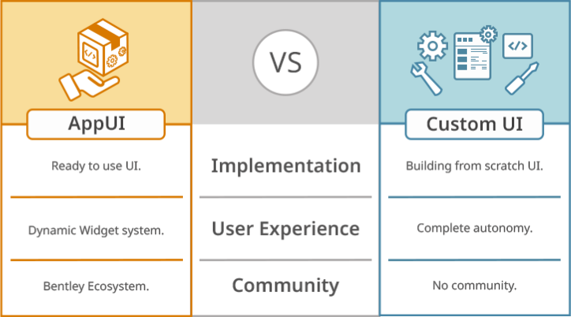

# User Interface

iTwin.js [frontend](../learning/frontend/index.md) provide a set of API to display iTwin and iModel graphical content to a div by writing to its canvas directly, and will catch mouse movement to make the tool works.

Everything else displayed on the screen will be the User Interface (UI) and needs to be built using other tools.

This can be done directly in javascript, html and css or with any UI framework your teams prefer.

## AppUI

AppUI is a framework that provides a set of React components to build UI for iTwin.js applications. It organize the workflows in frontstages displaying a central content (typically the iTwin.js canvas) surrounded by tool settings, toolbars, status bar and widgets to have a uniform look and feel.

Widgets can be docked, floated, resized, moved, etc. by the user at runtime allowing them to configure their UI to their liking.

The configuration of the frontstages can be done through easily sharable [UiItemsProvider]($appui-react) which can be used to build a UI for a specific workflow and then reused in other applications or frontstages.

It also handle switching between frontstages and content, and provide a set of standard element for common workflows.

You can get more information in the [AppUI documentation](/ui/appui).

## Custom UI

If the features provided by AppUI are not sufficient, it is possible to build a custom UI using any UI framework. The only need in that case is a reference to a `div` element, which will be used as the container for the iTwin.js canvas. For an example, see [Typescript Viewer Sample](https://github.com/iTwin/viewer-sample-typescript).
