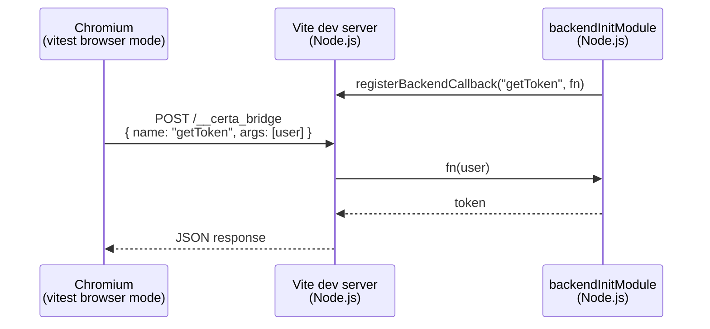
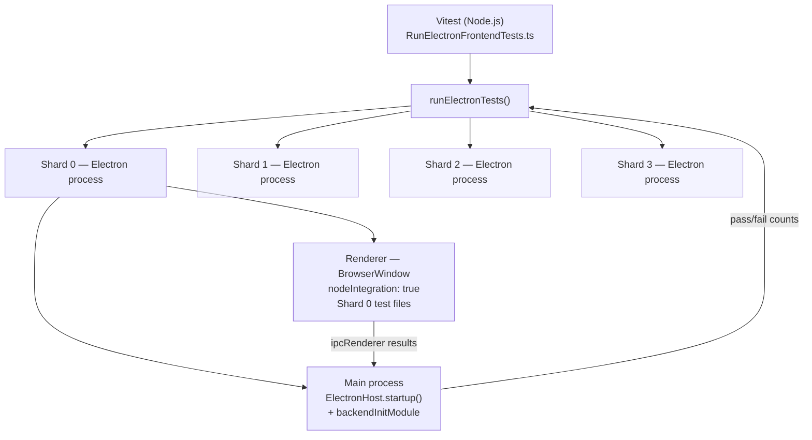

# @itwin/vitest-certa-bridge

A Vitest plugin for running integration and end-to-end tests that need a live Node.js backend alongside browser or Electron renderer code. Plugs natively into `vitest run` with zero webpack configuration.

---

## The problem it solves

Full-stack applications — especially Electron apps — have tests that can't run in a browser alone. They need a real backend: opening databases, making IPC/RPC calls, authenticating against identity providers, loading native addons. The standard approaches are painful:

- **Webpack + custom runner**: Requires a separate build step, custom test harness, and doesn't integrate with Vitest tooling (coverage, reporters, IDE test runners)
- **Manual IPC glue**: Each project reinvents browser ↔ Node.js communication for test callbacks
- **Sequential execution**: Tests run one at a time in a single process, making CI slow

`@itwin/vitest-certa-bridge` solves all three:

| Problem | Solution |
|---|---|
| Backend callbacks from browser/renderer code | `executeBackendCallback(name, ...args)` — one API, works in both Chrome and Electron |
| Electron testing at scale | Parallel sharded Electron processes — 4 shards run 378 tests in ~36s instead of ~15min |
| Vitest integration | Standard `vitest run` — coverage, reporters, IDE runners, `--testNamePattern` all work |
| App-specific renderer setup | Configurable hooks (`importRewritePatterns`, `rendererSetup`) — no forking required |

---

## Who should use this

- **iTwin.js packages** migrating from `@itwin/certa` — drop-in replacement with identical callback signatures
- **Electron apps** that need integration tests exercising real IPC, native addons, or app startup/shutdown lifecycles
- **Any Vitest project** where browser tests need to call Node.js functions — database seeding, credential management, file system access

The plugin is **framework-agnostic**. All iTwin-specific code (import rewrite patterns, TestUtility patches) lives in the consuming test file, not in the plugin.

---

## What it provides

| Feature | How |
|---|---|
| Backend callbacks from browser code | `executeBackendCallback(name, ...args)` — works in both Chrome and Electron |
| Chrome / Playwright browser mode | `certaBridge()` Vite plugin — HTTP middleware on the Vite dev server |
| Electron renderer mode | `runElectronTests()` — spawns N parallel shards, each with its own Electron process + backend |
| Configurable import rewriting | `importRewritePatterns` — rewrites `import()` → `require()` for packages that break under Chromium's ESM loader |
| App-specific renderer setup | `rendererSetup` — inject JS code to monkey-patch modules before tests execute |
| Node.js module stubbing | `nullLoader(patterns)` — replaces webpack `null-loader` |
| ESM-first resolution | `preferEsm()` — resolves `.js` extensions to source `.ts` for workspace packages |
| Drop-in Certa compat | Registers `window._CertaSendToBackend` — existing code using Certa's global works without changes |

---

## Package exports

```
@itwin/vitest-certa-bridge            → Vite plugin + shared utilities
@itwin/vitest-certa-bridge/client     → executeBackendCallback() (browser-side)
@itwin/vitest-certa-bridge/callbackRegistry → registerBackendCallback() (backend-side)
@itwin/vitest-certa-bridge/electron   → runElectronTests() (Electron orchestrator)
@itwin/vitest-certa-bridge/electron-main → Electron main-process IPC bridge helper
```

---

## Mode 1 — Chrome / Playwright browser tests with a backend

Use this when your tests run in a Chromium browser (via `@vitest/browser`) and need to call Node.js functions — for example, to authenticate, seed data, or reach an RPC backend over HTTP.

### Architecture



The Vite plugin injects `window._CertaSendToBackend` and `window.__CERTA_BRIDGE_TOKEN__` into the test HTML page. Every `executeBackendCallback()` call becomes an authenticated `fetch("/__certa_bridge")` to the Vite dev server's middleware, which looks up and runs the registered callback in Node.js.

### Setup

**`vitest.config.mts`**
```ts
import { defineConfig } from "vitest/config";
import { certaBridge, nullLoader } from "@itwin/vitest-certa-bridge";

export default defineConfig({
  plugins: [
    certaBridge({
      // Node.js module that registers backend callbacks (runs in Vite's Node process)
      backendInitModule: "./src/test/backend/backendInit.ts",
      // Forward /ipc WebSocket traffic to your backend server port (if using IPC)
      backendPort: 5010,
      // Prevent Vite from pre-bundling monorepo workspace packages
      workspacePackages: ["@itwin/core-backend", "@itwin/core-common"],
    }),
    // Stub Node.js-only packages that appear in shared code
    nullLoader([/azure-storage/, /^ws$/, /dotenv/]),
  ],
  test: {
    browser: {
      provider: "playwright",
      enabled: true,
      instances: [{ browser: "chromium" }],
    },
  },
});
```

**`src/test/backend/backendInit.ts`** (runs in Node.js, not the browser)
```ts
import { registerBackendCallback } from "@itwin/vitest-certa-bridge/callbackRegistry";
import { IModelHost } from "@itwin/core-backend";

// Called once before any tests run
await IModelHost.startup();

registerBackendCallback("getAccessToken", async (user) => {
  // ... OIDC sign-in, return token string
});

registerBackendCallback("createTestIModel", async (name: string) => {
  // ... create a test iModel, return its id
});

// Return a cleanup function (called when Vite dev server shuts down)
export default async function cleanup() {
  await IModelHost.shutdown();
}
```

**In your test file** (runs in the browser)
```ts
import { executeBackendCallback } from "@itwin/vitest-certa-bridge/client";

it("opens an iModel from the backend", async () => {
  const token = await executeBackendCallback("getAccessToken", testUser);
  const iModelId = await executeBackendCallback("createTestIModel", "my-test");
  // ... use token + iModelId in frontend code
});
```

---

## Mode 2 — Electron renderer tests with a backend

Use this when your tests must run inside an actual Electron `BrowserWindow` — for example, when testing `ElectronApp.startup()`, IPC channels, native addons, or anything that requires the real Electron environment.

### Architecture



Each shard gets:
- Its own Electron main process running the backend
- Its own `BrowserWindow` renderer running a subset of test files
- Its own IModel cache directory (no cross-shard file conflicts)
- Full isolation — a crash in one shard doesn't affect others

All 4 shards run in parallel. On `full-stack-tests/core`, this brings 378 tests from ~15 minutes (sequential Certa) down to **~36 seconds**.

### Setup

**`src/electron/RunElectronFrontendTests.ts`**
```ts
import { assert, describe, it } from "vitest";
import { runElectronTests } from "@itwin/vitest-certa-bridge/electron";
import * as path from "path";

// Exclude cloud-dependent tests by default
const grepPattern = process.env.VITEST_ELECTRON_GREP ?? "#integration|#performance";
const invertGrep = process.env.VITEST_ELECTRON_INVERT !== "false";

describe("Full-Stack Tests (Electron Renderer)", () => {
  it("should pass all Electron renderer tests", async () => {
    const results = await runElectronTests({
      backendInitModule: path.resolve(process.cwd(), "lib/backend/backend"),
      setupFile: path.resolve(process.cwd(), "lib/frontend/vitest.setup.js"),
      testDir: path.resolve(process.cwd(), "lib/frontend"),
      envFile: path.resolve(process.cwd(), ".env"),
      grepPattern,
      invertGrep,
      shardCount: 4,

      // App-specific: rewrite import() to require() for packages that break
      // under Chromium's ESM loader in nodeIntegration mode
      importRewritePatterns: ["@myorg/electron-backend/[^\"']+"],

      // App-specific: monkey-patch loaded modules before tests execute
      rendererSetup: `
        const mod = Object.keys(require.cache).find(m => m.endsWith("MyTestUtil.js"));
        if (mod) {
          const original = require.cache[mod].exports.MyTestUtil;
          original.startup = async () => { /* Electron-specific init */ };
        }
      `,

      env: {
        MY_APP_ROOT: path.resolve(process.cwd(), "../.."),
      },
    });

    if (results.failed > 0) {
      const shards = results.failedShards.map((i) => `shard-${i}`).join(", ");
      assert.fail(`${results.failed}/${results.shardCount} shards failed: ${shards}`);
    }
  }, 1_200_000); // 20 min total timeout
});
```

**`vitest.electron.config.mts`**
```ts
import { defineConfig } from "vitest/config";

export default defineConfig({
  test: {
    include: ["src/electron/RunElectronFrontendTests.ts"],
    pool: "forks",  // Electron orchestrator runs in Node.js, not in a browser
  },
});
```

**npm scripts**
```json
{
  "test:electron": "cross-env VITEST_ELECTRON_GREP=\"#integration|#performance\" VITEST_ELECTRON_INVERT=true vitest run --config vitest.electron.config.mts",
  "test:integration:electron": "cross-env VITEST_ELECTRON_GREP=\"#integration\" vitest run --config vitest.electron.config.mts"
}
```

### How the renderer harness works

The renderer harness is a self-contained JavaScript string injected into each `BrowserWindow`. It:

1. **Installs a CJS `import()` → `require()` transform** via `Module._extensions['.js']`. In Electron with `nodeIntegration: true`, dynamic `import()` goes through Chromium's ESM loader which can't resolve Node.js bare specifiers. Rewriting to `require()` bypasses this.

2. **Shims `require("vitest")`** to return a lightweight CJS object that exposes `describe`, `it`, `expect`, `beforeAll`, `afterAll`, `beforeEach`, `afterEach`, `vi` (fake timers + spies via `@sinonjs/fake-timers` + `sinon`). Test files written for Vitest work without changes.

3. **Tracks `currentExecutingSuite`** so that hooks registered *inside* a test body (e.g. `afterAll(() => vi.useRealTimers())` called from within an `it()`) are honoured correctly — matching Vitest's actual behaviour.

4. **Loads and executes test files** via `require()`, collects `describe`/`it` registrations, then runs them with per-test and per-hook timeouts.

5. **Reports results** via `ipcRenderer.send("electron-test-results", { passed, failed, errors })` back to the Electron main process, which forwards them to Vitest.

---

## API reference

### `certaBridge(opts?)` — Vite plugin

```ts
import { certaBridge } from "@itwin/vitest-certa-bridge";
```

| Option | Type | Description |
|---|---|---|
| `backendInitModule` | `string` | Path to a Node.js module loaded before tests. Register callbacks here. May export a cleanup function. |
| `backendPort` | `number` | If set, proxies `/ipc` WebSocket traffic to `ws://localhost:<port>`. |
| `workspacePackages` | `string[]` | Package names to exclude from Vite's dep pre-bundling and add to `resolve.dedupe`. |

### `registerBackendCallback(name, fn)` — backend side

```ts
import { registerBackendCallback } from "@itwin/vitest-certa-bridge/callbackRegistry";

registerBackendCallback("myCallback", async (arg1: string, arg2: number) => {
  return "result";
});
```

Uses `globalThis` as storage, so CJS and ESM module instances share the same registry (no dual-package hazard).

### `executeBackendCallback(name, ...args)` — browser/renderer side

```ts
import { executeBackendCallback } from "@itwin/vitest-certa-bridge/client";

const result = await executeBackendCallback("myCallback", "hello", 42);
```

Automatically uses the correct transport:
- **Chrome mode**: `fetch("/__certa_bridge")` to the Vite dev server
- **Electron mode**: `window._CertaSendToBackend()` → IPC to main process

### `runElectronTests(opts)` — Electron orchestrator

```ts
import { runElectronTests } from "@itwin/vitest-certa-bridge/electron";
```

| Option | Type | Default | Description |
|---|---|---|---|
| `backendInitModule` | `string` | *required* | Absolute path to the backend init module (loaded in each Electron main process). |
| `setupFile` | `string` | *required* | Absolute path to the Vitest setup file (loaded in renderer before test files). |
| `testDir` | `string` | *required* | Absolute path to the directory containing compiled test files. |
| `testGlob` | `string` | `"**/*.test.js"` | Glob pattern for test files within `testDir`. |
| `shardCount` | `number` | `4` | Number of parallel Electron processes. |
| `grepPattern` | `string` | — | Regex pattern to filter test names. |
| `invertGrep` | `boolean` | `false` | Invert the grep pattern (exclude matching tests). |
| `envFile` | `string` | — | Absolute path to a `.env` file to load before spawning. |
| `timeout` | `number` | `600000` | Per-shard timeout in milliseconds. |
| `testTimeout` | `number` | `240000` | Per-test timeout in milliseconds. |
| `hookTimeout` | `number` | `240000` | Per-hook (`beforeAll`/`afterAll`) timeout in milliseconds. |
| `env` | `Record<string, string>` | — | Extra environment variables for each Electron process. |
| `importRewritePatterns` | `string[]` | — | Regex patterns for `import()` → `require()` rewriting in the renderer. Each string is compiled into a `RegExp`. Use when packages break under Chromium's ESM loader in `nodeIntegration` mode. |
| `rendererSetup` | `string` | — | Raw JavaScript injected after test files load but before suite execution. Runs in the renderer scope with access to `require`, `require.cache`, `window`, and all Node.js APIs. Use for monkey-patching loaded modules or configuring globals. |

Returns `ElectronTestResults` with `passed`, `failed`, `skipped`, `shardCount`, `failedShards`, and per-shard `shardResults`.

### `nullLoader(patterns)` — Vite plugin

```ts
import { nullLoader } from "@itwin/vitest-certa-bridge";

nullLoader([/azure-storage/, /^ws$/, /dotenv/])
```

Returns an empty module (`export default {}; export {};`) for any import matching the given patterns. Equivalent to webpack's `null-loader`. Use it to stub Node.js-only packages referenced by shared code that can't be bundled for the browser.

### `preferEsm()` — Vite plugin

Adjusts Vite's resolver to prefer `.ts` source files over `.js` build output when resolving workspace packages. Useful during development when source maps need to point at TypeScript.

---

## Migrating from `@itwin/certa`

> This section is for iTwin.js packages migrating from the legacy `@itwin/certa` test runner. If you're starting fresh, skip to the setup examples above.

| Certa concept | Bridge equivalent |
|---|---|
| `certa.json` + `certa -r chrome` | `certaBridge()` in `vitest.config.mts` + `vitest run` |
| `certa.json` + `certa -r electron` | `runElectronTests()` in a Vitest test file |
| `webpack.config.js` + `webpack:test` build step | Removed — Vite handles bundling at test time |
| `executeBackendCallback` from `@itwin/certa/src/utils/CallbackUtils` | `executeBackendCallback` from `@itwin/vitest-certa-bridge/client` — same signature |
| `registerBackendCallback` from `@itwin/certa` | `registerBackendCallback` from `@itwin/vitest-certa-bridge/callbackRegistry` — same signature |
| `window._CertaSendToBackend` global | Injected automatically by the plugin — no change needed |
| `null-loader` webpack plugin | `nullLoader([...patterns])` from `@itwin/vitest-certa-bridge` |
| Backend init module (`--backend` flag) | `backendInitModule` option in `certaBridge()` or `runElectronTests()` |
| `--grep` / `--invert` flags | `grepPattern` / `invertGrep` options in `runElectronTests()`, or standard `--testNamePattern` in Chrome mode |

Most test files require **no changes** — `executeBackendCallback` and `registerBackendCallback` are drop-in replacements with the same signatures.

The main change is replacing `certa.json`, `webpack.config.js`, and the `webpack:test` build step with a `vitest.config.mts` that uses the plugin.

---

## Source structure

```
tools/vitest-certa-bridge/src/
├── index.ts              # Main entry — exports certaBridge(), nullLoader(), preferEsm()
├── plugin.ts             # certaBridgePlugin(): Vite plugin with middleware + backend loading
├── callbackRegistry.ts   # registerBackendCallback() / executeRegisteredCallback()
├── client.ts             # executeBackendCallback() — browser-side transport abstraction
├── types.ts              # Shared TypeScript interfaces
├── nullLoader.ts         # nullLoader() Vite plugin
├── preferEsm.ts          # preferEsm() Vite plugin
├── electron-main.ts      # Electron main-process IPC bridge (receives renderer callbacks)
└── electron/
    ├── index.ts           # Exports runElectronTests()
    ├── runner.ts          # File discovery, sharding, parallel shard coordination
    ├── session.ts         # Single Electron process lifecycle: spawn → run → collect results
    ├── renderer-harness.ts# Injected renderer script: Mocha globals, vitest shim, test engine
    └── types.ts           # ElectronTestRunnerOptions, ElectronTestResults, etc.
```
